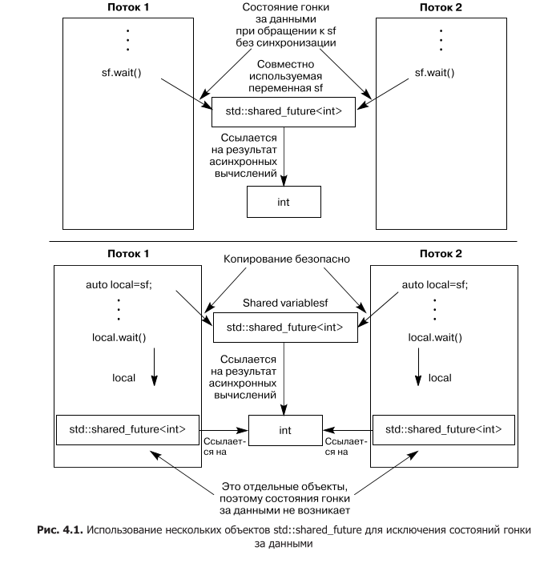
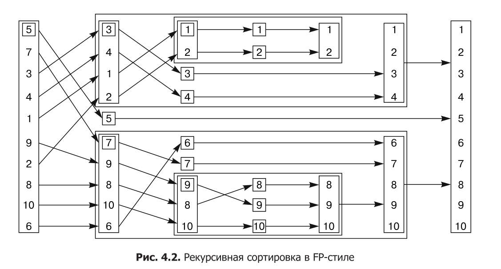
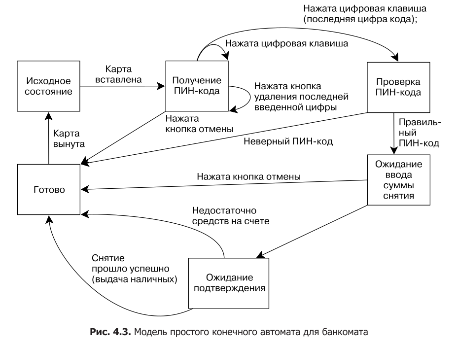

# Модуль 4. Синхронизация конкурентных операций

## Лекция

### Зачем это нужно

До сих пор мы умели защищать разделяемые данные мьютексами (глава 3), но
защита данных — это ещё не вся синхронизация. Очень часто потокам нужно не
просто не мешать друг другу, а **дожидаться друг друга**: один поток должен
дождаться, пока другой подготовит данные, прежде чем начать их обрабатывать.
Представьте конвейер: поток-производитель создаёт порции данных, поток-потребитель
их обрабатывает. Как потребитель узнает, что данные готовы?

Первый наивный способ — **постоянный опрос**: потребитель в цикле проверяет
флаг «есть данные» в разделяемой памяти под мьютексом. Разберём
этот вариант подробно и посмотрим, почему он плох:

- пока потребитель проверяет флаг, он впустую жжёт процессорное время — он
  крутится в цикле, хотя ему нечего делать;
- пока потребитель держит мьютекс (на время проверки), производитель не может
  захватить его, чтобы положить данные и поднять флаг. Получается замкнутый
  круг: потребитель ждёт данные, а производитель не может их отдать, потому что
  потребитель всё время держит мьютекс.

Второй способ — опрос с паузами через `std::this_thread::sleep_for()`: потребитель
проверяет флаг, а между проверками спит небольшой интервал. Уже лучше: поток не
жжёт процессор непрерывно. Но интервал подобрать трудно — слишком короткий снова
тратит процессор на частые проверки, слишком длинный добавляет задержку: даже
когда данные уже готовы, потребитель просыпается не сразу. В реальном времени
это могут быть пропущенные кадры или сорванные дедлайны.

Третий, правильный способ — **не опрашивать, а ждать события**. Поток засыпает
по-настоящему и просыпается ровно тогда, когда событие наступило. Для этого
в C++ есть **условные переменные** (`std::condition_variable`). А если нужно
дождаться не «события», а конкретного **результата** вычисления (значение,
которое посчитает другой поток), удобнее **фьючерсы** (`std::future`) и
`std::async`. Эта глава — про оба механизма, а также про то, как ждать
с ограничением по времени.

### Как это работает

#### Условные переменные

Условная переменная концептуально связана с событием или условием. Один или
несколько потоков ждут выполнения условия; когда условие выполнено, поток,
который это заметил, уведомляет ожидающих — и они просыпаются и продолжают
работу.

В C++ есть два класса: `std::condition_variable` (работает только со `std::mutex`)
и `std::condition_variable_any` (работает с любым типом, похожим на мьютекс, —
отсюда суффикс `_any`). `condition_variable_any` универсальнее, но за гибкость
платишь размером и производительностью, поэтому по умолчанию выбирают
`std::condition_variable`.

Механика проста:

- **`wait(lock)`** — поток засыпает, ожидая уведомления. Важно: `lock` должен
  быть `std::unique_lock`, а не `std::lock_guard`. Почему — ключевой момент:
  пока поток спит, мьютекс должен быть **разблокирован** (иначе производитель
  не сможет захватить его и положить данные). `wait` делает это сам: снимает
  блокировку перед сном и заново захватывает после пробуждения. `std::lock_guard`
  не умеет снимать и снова захватывать мьютекс — он только блокирует при создании
  и разблокирует при уничтожении.
- **`notify_one()`** — разбудить один ожидающий поток (если такой есть).
- **`notify_all()`** — разбудить все ожидающие потоки.

Классический сценарий — очередь данных между потоками:

#### Листинг 4.1. Ожидание завершения обработки данных с помощью std::condition_variable

```cpp
std::mutex mut;
std::queue<data_chunk> data_queue;
std::condition_variable data_cond;

void data_preparation_thread() {
    while (more_data_to_prepare()) {
        data_chunk const data = prepare_data();
        {
            std::lock_guard<std::mutex> lk(mut);
            data_queue.push(data);
        }
        data_cond.notify_one();   // уведомляем ПОСЛЕ разблокировки мьютекса
    }
}

void data_processing_thread() {
    while (true) {
        std::unique_lock<std::mutex> lk(mut);
        data_cond.wait(lk, [] { return !data_queue.empty(); });
        data_chunk data = data_queue.front();
        data_queue.pop();
        lk.unlock();              // разблокируем до долгой обработки
        process(data);
        if (is_last_chunk(data)) break;
    }
}
```

Разберём важные детали листинга:

1. **`notify_one()` вызывается после разблокировки мьютекста.** Код помещения
   в очередь заключён в узкую область видимости. Если бы уведомление шло при
   захваченном мьютексе, разбуженный потребитель немедленно попытался бы снова
   захватить мьютекс, а он занят — потребитель снова заснул бы в ожидании
   блокировки. Разблокировка до `notify_one()` даёт потребителю шанс сразу
   захватить мьютекс.
2. **`wait` принимает предикат** — лямбду, проверяющую условие. Это
   не случайность, а защита от **ложного пробуждения** (spurious wakeup).
   Реализация `wait` может разбудить поток и без уведомления; кроме того,
   между пробуждением и повторной проверкой условие может снова измениться.
   Поэтому `wait(lock, pred)` эквивалентен циклу:

   ```cpp
   while (!pred()) {
       lk.unlock();
       lk.lock();
   }
   ```

   Код должен корректно работать и с таким «минимальным» `wait`. Поэтому
   предикат обязан быть чистым (без побочных эффектов) — он может вызываться
   многократно.
3. **`unique_lock` нужен для `wait`, а для остального хватает `lock_guard`.**
   `wait` снимает блокировку во сне и захватывает после пробуждения — это
   умеет только `unique_lock`. А `lk.unlock()` перед долгой обработкой — это
   детализация блокировки из главы 3: не держать мьютекс дольше необходимого.

#### Потокобезопасная очередь

Сценарий «производитель-потребитель» настолько типичен, что его обобщают
в класс `threadsafe_queue`. Как и в случае со стеком в главе 3, интерфейс
перепроектируется, чтобы не было интерфейсных гонок: вместо раздельных
`front()` + `pop()` — единая операция извлечения. Плюс два варианта: `try_pop()`
(попытаться извлечь, вернуть false, если пусто) и `wait_and_pop()` (ждать, пока
появится элемент). Полная реализация:

#### Листинг 4.5. Полное определение класса потокобезопасной очереди, использующей условные переменные

```cpp
template<typename T>
class threadsafe_queue {
private:
    mutable std::mutex mut;
    std::queue<T> data_queue;
    std::condition_variable data_cond;
public:
    threadsafe_queue() {}
    threadsafe_queue(threadsafe_queue const& other) {
        std::lock_guard<std::mutex> lk(other.mut);
        data_queue = other.data_queue;
    }

    void push(T new_value) {
        std::lock_guard<std::mutex> lk(mut);
        data_queue.push(new_value);
        data_cond.notify_one();
    }

    void wait_and_pop(T& value) {
        std::unique_lock<std::mutex> lk(mut);
        data_cond.wait(lk, [this] { return !data_queue.empty(); });
        value = data_queue.front();
        data_queue.pop();
    }

    std::shared_ptr<T> wait_and_pop() {
        std::unique_lock<std::mutex> lk(mut);
        data_cond.wait(lk, [this] { return !data_queue.empty(); });
        auto res = std::make_shared<T>(data_queue.front());
        data_queue.pop();
        return res;
    }

    bool try_pop(T& value) {
        std::lock_guard<std::mutex> lk(mut);
        if (data_queue.empty()) return false;
        value = data_queue.front();
        data_queue.pop();
        return true;
    }

    std::shared_ptr<T> try_pop() {
        std::lock_guard<std::mutex> lk(mut);
        if (data_queue.empty()) return std::shared_ptr<T>();
        auto res = std::make_shared<T>(data_queue.front());
        data_queue.pop();
        return res;
    }

    bool empty() const {
        std::lock_guard<std::mutex> lk(mut);
        return data_queue.empty();
    }
};
```

Обрати внимание на `mutable std::mutex`: мьютекс блокируется в `empty() const`
и в копирующем конструкторе — блокировка не меняет логическое состояние, поэтому
поле помечено `mutable` (мы уже видели этот приём в главе 3).

`notify_one()` при `push` будит один поток-потребитель. Если потребителей
несколько и каждый обрабатывает свою порцию данных, `notify_one` достаточно:
будет разбужен один, он заберёт элемент из очереди. Гарантий, какой именно
поток проснётся, нет; более того, может не быть ни одного ожидающего (все заняты
обработкой) — тогда уведомление просто теряется, но это не страшно: элемент
лежит в очереди, и следующий `wait` увидит его по предикату.

Если же наступление события нужно **всем** ожидающим потокам (например, данные
инициализированы, и все потребители могут начинать), используют `notify_all()`:
все потоки, находящиеся в `wait`, проснутся и проверят условие.

Когда данных ждёт один поток ровно один раз — удобнее фьючерсы.

#### Фьючерсы

Фьючерс (`std::future`) — это «обещание» результата, который появится позже.
Он моделирует **единичное событие**: поток каким-то образом получает фьючерс,
связанный с событием, и может:

- дождаться его — `wait()` (блокирующе);
- дождаться с таймаутом — `wait_for()`/`wait_until()`;
- получить значение — `get()` (ждёт готовности и забирает результат).

Фьючерсы бывают уникальные (`std::future`) и разделяемые (`std::shared_future`),
по аналогии с `unique_ptr`/`shared_ptr`: у `std::future` результат может забрать
только один поток (после `get()` значения больше нет), а `std::shared_future`
можно копировать, и каждый поток читает собственный экземпляр.

Самый простой способ получить фьючерс — `std::async`:

#### Листинг 4.6. Использование std::future для получения значения, возвращаемого задачей, выполняемой в асинхронном режиме

```cpp
#include <future>
#include <iostream>

int find_the_answer_to_ltuae();

int main() {
    std::future<int> the_answer = std::async(find_the_answer_to_ltuae);
    do_other_stuff();
    std::cout << "The answer is " << the_answer.get() << std::endl;
}
```

`std::async` запускает задачу (обычно в отдельном потоке) и сразу возвращает
`std::future<int>`. Пока задача выполняется, главный поток делает свои дела
(`do_other_stuff()`). Когда понадобится результат — вызывается `get()`, который
блокирует поток до готовности фьючерса и возвращает значение.

`std::async` умеет передавать аргументы, как и `std::thread`:
`std::async(&X::foo, &x, 42, "hello")`, `std::async(Y(), 3.141)`,
`std::async(baz, std::ref(x))`. Move-only аргументы передаются через `std::move`.

Есть важная деталь: **от реализации зависит**, запустит ли `std::async` новый
поток или выполнит задачу синхронно. Управлять этим можно флагом `std::launch`:

- `std::launch::async` — задача обязательно запускается в отдельном потоке;
- `std::launch::deferred` — задача откладывается и выполнится при вызове
  `wait()` или `get()` в вызывающем потоке (а может не выполниться вообще);
- `std::launch::async | std::launch::deferred` — выбор за реализацией
  (это значение по умолчанию).

Это важно для понимания `wait_for()`: у отложенной задачи `wait_for` сразу
вернёт `std::future_status::deferred`.

Как ещё можно создать фьючерс? Тремя способами:

1. **`std::async`** — задача выполняется «где-то», результат придёт сам.
2. **`std::packaged_task`** — функция упаковывается в вызываемый объект,
   который при вызове сохраняет результат в связанный фьючерс. Это строительный
   блок для пулов потоков и очередей задач.
3. **`std::promise`** — низкоуровневый способ: поток сам явно кладёт значение
   (`set_value()`) или исключение (`set_exception()`) в фьючерс в любой момент.

`std::packaged_task<Signature>` параметризуется сигнатурой. Вызвал объект —
фьючерс стал готовым. Классическое применение — очередь задач для GUI-потока
(листинг 4.9): GUI-обновления разрешены только из строго определённого потока,
поэтому другие потоки не рисуют сами, а кладут задачу в очередь; GUI-поток
достаёт задачу и выполняет её:

#### Листинг 4.9. Запуск кода в GUI-потоке с помощью std::packaged_task

```cpp
std::mutex m;
std::deque<std::packaged_task<void()>> tasks;

bool gui_shutdown_message_received();
void get_and_process_gui_message();

void gui_thread() {
    while (!gui_shutdown_message_received()) {
        get_and_process_gui_message();
        std::packaged_task<void()> task;
        {
            std::lock_guard<std::mutex> lk(m);
            if (tasks.empty())
                continue;
            task = std::move(tasks.front());
            tasks.pop_front();
        }
        task();   // выполнить задачу: связанный фьючерс станет готовым
    }
}

std::thread gui_bg_thread(gui_thread);

template<typename Func>
std::future<void> post_task_for_gui_thread(Func f) {
    std::packaged_task<void()> task(f);
    std::future<void> res = task.get_future();
    std::lock_guard<std::mutex> lk(m);
    tasks.push_back(std::move(task));
    return res;
}
```

Как это работает:

- `post_task_for_gui_thread` упаковывает переданную функцию в
  `packaged_task<void()>`, забирает фьючерс через `get_future()` и кладёт задачу
  в общую очередь под мьютексом. Возвращённый `std::future<void>` — «расписка»
  для отправителя: он может ждать завершения задачи или проигнорировать фьючерс;
- `gui_thread` в цикле обрабатывает сообщения GUI, затем берёт задачу из очереди
  (снова под мьютексом) и **вне** блокировки вызывает её — `task()`. Когда
  задача отработает, связанный фьючерс станет готовым;
- `std::packaged_task<void()>` — самая простая сигнатура: «ничего не принимает,
  возвращает void». Изменив сигнатуру шаблона, можно получать из GUI-потока
  значения или аргументы задач.

`std::promise<T>` — пара к `std::future<T>`: `promise.get_future()` даёт
фьючерс, а `promise.set_value(v)` делает его готовым. Если promise уничтожается
без установки значения, в фьючерс сохраняется исключение `std::future_error`
с кодом `std::future_errc::broken_promise` — «обещание нарушено», и ожидающий
поток не зависнет навсегда, а узнает об ошибке.

`std::promise` незаменим, когда результат приходит не из простого вызова
функции, а из нескольких мест. Пример — один поток обслуживает много сетевых
соединений: для каждого исходящего пакета заводится `std::promise<bool>`
(флаг успеха отправки), а для каждого входящего — `std::promise<payload>`
(полезная нагрузка). Когда пакет отправлен или данные получены, соответствующий
промис получает значение, и фьючерс становится готовым:

#### Листинг 4.10. Обработка с помощью промисов сразу нескольких подключений в одном потоке

```cpp
void process_connections(connection_set& connections) {
    while (!done(connections)) {
        for (connection_iterator connection = connections.begin(),
                 end = connections.end(); connection != end; ++connection) {
            if (connection->has_incoming_data()) {
                data_packet data = connection->incoming();
                std::promise<payload_type>& p =
                    connection->get_promise(data.id);
                p.set_value(data.payload);
            }
            if (connection->has_outgoing_data()) {
                outgoing_packet data =
                    connection->top_of_outgoing_queue();
                connection->send(data.payload);
                data.promise.set_value(true);
            }
        }
    }
}
```

Здесь каждый `std::promise` связан с конкретным соединением (по id пакета —
для входящих, через объект пакета — для исходящих). Код, ожидающий успешной
отправки или получения конкретных данных, просто вызывает `get()` на фьючерсе
этого промиса — и его поток блокируется до нужного события, не мешая одному
потоку обслуживать десятки соединений.

**Исключения через фьючерсы.** Если функция, запущенная через `std::async`,
бросила исключение, оно сохраняется во фьючерсе вместо значения, и `get()`
повторно выбрасывает его в ожидающем потоке. То же самое для `packaged_task`.
Для `promise` исключение кладут явно:

```cpp
try {
    some_promise.set_value(calculate_value());
} catch (...) {
    some_promise.set_exception(std::current_exception());
}
```

`std::current_exception()` захватывает текущее исключение в `exception_ptr`,
а `std::make_exception_ptr(std::logic_error("foo"))` создаёт исключение напрямую
без блока `try` — читается яснее.

**`std::shared_future`** — для ожидания одного события из нескольких потоков.
У каждого потока должна быть собственная копия `shared_future`, тогда доступ
безопасен без дополнительных мьютексов. Получается из `std::future` через
`std::move` или метод `share()`:

```cpp
std::promise<int> p;
auto sf = p.get_future().share();   // std::shared_future<int>
```

#### Рисунок 4.1. Несколько объектов std::shared_future — один на поток



На этом рисунке показано: несколько потоков, у каждого собственная копия
`std::shared_future`, все они ссылаются на одно асинхронное состояние, и каждый
читает результат из своей копии без общих мьютексов.

#### Ожидание с ограничением по времени

Иногда ждать бесконечно нельзя: нужно отдать «сигнал жизни», дать пользователю
отменить операцию или просто не блокировать поток навсегда. Для этого у функций
ожидания есть варианты с суффиксами:

- **`_for(duration)`** — ждать указанную продолжительность (например, 30 мс);
- **`_until(time_point)`** — ждать до абсолютного момента времени.

Разберёмся со временем в C++ — это `<chrono>`.

**Часы (clocks).** Класс часов даёт текущее время (`now()`), тип момента
(`time_point`), период такта (`period`) и признак стабильности (`is_steady`).
Три стандартных часов:

- `std::chrono::system_clock` — системные часы реального времени; могут
  подводиться, поэтому `is_steady == false`;
- `std::chrono::steady_clock` — монотонные, никогда не идут назад и не
  подводятся; именно их используют для таймаутов;
- `std::chrono::high_resolution_clock` — «самые точные» из имеющихся.

**Продолжительность (duration).** `std::chrono::duration<Rep, Period>` — это
количество тактов `Rep` по `Period` секунд. Готовые типы: `nanoseconds`,
`microseconds`, `milliseconds`, `seconds`, `minutes`, `hours`. В C++14 есть
литералы: `24h`, `30min`, `30ms`, `15ns`. Преобразования — через
`duration_cast`:

```cpp
std::chrono::milliseconds ms(54802);
std::chrono::seconds s = std::chrono::duration_cast<std::chrono::seconds>(ms);
// s == 54 (усечение, не округление)
```

**Моменты времени (time_point).** `std::chrono::time_point<Clock, Duration>` —
момент на оси времени конкретных часов. `time_point + duration` даёт новый
момент, `time_point - time_point` — продолжительность. Так считают таймауты:

```cpp
auto const timeout = std::chrono::steady_clock::now() +
                     std::chrono::milliseconds(500);
```

**Таймауты в условных переменных.** `wait_for`/`wait_until` возвращают
`std::cv_status::timeout` или `std::cv_status::no_timeout`. Важный
совет: если используешь `wait` без предиката, в цикле применяй `wait_until`
с **абсолютным** моментом, а не `wait_for`. Иначе при повторном проходе цикла
(после ложного пробуждения) отсчёт времени начнётся заново, и ожидание может
продлиться произвольно долго:

#### Листинг 4.11. Ожидание условной переменной с указанием определенного срока

```cpp
bool wait_loop() {
    auto const timeout = std::chrono::steady_clock::now() +
                         std::chrono::milliseconds(500);
    std::unique_lock<std::mutex> lk(m);
    while (!done) {
        if (cv.wait_until(lk, timeout) == std::cv_status::timeout)
            break;
    }
    return done;
}
```

**Другие функции с таймаутами.** `std::this_thread::sleep_for(duration)` /
`sleep_until(time_point)` — усыпить поток. Timed-мьютексы (`std::timed_mutex`,
`std::recursive_timed_mutex`, `std::shared_timed_mutex`) дают
`try_lock_for()`/`try_lock_until()` (и `try_lock_shared_for/until` у shared) —
попытка захватить блокировку в течение лимита, возврат `bool`. У `std::future`
есть `wait_for`/`wait_until`, возвращающие `std::future_status`:
`ready` (готов), `timeout` (истёк), `deferred` (задача отложена).

### Подходы к организации синхронизации

Глава 4 — это ещё и три способа **мыслить** о конкурентности, которые упрощают
код. Их важно понимать, даже если в повседневной работе используются более
низкоуровневые примитивы.

#### Функциональный стиль (FP)

В функциональном программировании результат функции зависит только от её
аргументов и не зависит от внешнего состояния — у чистой функции нет побочных
эффектов, кроме возвращаемого значения. В конкурентном коде это золото: если
потоки не разделяют изменяемое состояние, нет и гонок, и мьютексы не нужны.
C++ поддерживает такой стиль, а фьючерсы завершают картину: результат одного
вычисления можно передать другому через фьючерс, не обращаясь к общей памяти.

Пример — быстрая сортировка в FP-стиле. Сначала последовательная
версия на `std::list`:

#### Листинг 4.12. Последовательная реализация Quicksort

```cpp
template<typename T>
std::list<T> sequential_quick_sort(std::list<T> input) {
    if (input.empty()) return input;
    std::list<T> result;
    result.splice(result.begin(), input, input.begin());
    T const& pivot = *result.begin();
    auto divide_point = std::partition(input.begin(), input.end(),
        [&](T const& t) { return t < pivot; });
    std::list<T> lower_part;
    lower_part.splice(lower_part.end(), input, input.begin(), divide_point);
    auto new_lower = sequential_quick_sort(std::move(lower_part));
    auto new_higher = sequential_quick_sort(std::move(input));
    result.splice(result.end(), new_higher);
    result.splice(result.begin(), new_lower);
    return result;
}
```

`std::list::splice` переносит элементы без копирования, а `std::partition`
разбивает список на «меньше опорного» и «не меньше». Параллельная версия
меняется минимально — одна из рекурсий уходит в `std::async`:

#### Листинг 4.13. Параллельная быстрая сортировка Quicksort с использованием фьючерсов

```cpp
template<typename T>
std::list<T> parallel_quick_sort(std::list<T> input) {
    if (input.empty()) return input;
    std::list<T> result;
    result.splice(result.begin(), input, input.begin());
    T const& pivot = *result.begin();
    auto divide_point = std::partition(input.begin(), input.end(),
        [&](T const& t) { return t < pivot; });
    std::list<T> lower_part;
    lower_part.splice(lower_part.end(), input, input.begin(), divide_point);
    std::future<std::list<T>> new_lower(
        std::async(&parallel_quick_sort<T>, std::move(lower_part)));
    auto new_higher = parallel_quick_sort(std::move(input));
    result.splice(result.end(), new_higher);
    result.splice(result.begin(), new_lower.get());
    return result;
}
```

Отличие всего в паре строк: `new_lower` теперь не список, а фьючерс, а перед
`result.splice(result.begin(), new_lower)` стоит `new_lower.get()` — дождаться
результата фоновой сортировки. Так фьючерсы позволяют строить рекурсивный
параллелизм почти без изменения структуры кода.

#### Рисунок 4.2. Рекурсивная сортировка в FP-стиле


#### Передача сообщений (CSP)

Другой способ убрать общую память — **передача сообщений** (Communicating
Sequential Processes, CSP). Потоки концептуально полностью изолированы и
общаются только через каналы сообщений. Каждый поток — это конечный автомат:
получил сообщение — обновил состояние — возможно, отправил сообщения дальше.
Такую модель используют Erlang и MPI. В C++ нет встроенных каналов, но очередь
сообщений легко построить самому (это и есть наша `threadsafe_queue`), а
ответственность «не разделять данные» берёт на себя программист.

#### Рисунок 4.3. Модель простого конечного автомата для банкомата



Пример — логика банкомата: поток ждёт сообщения «карта вставлена»,
потом «цифра ПИН-кода», «проверить ПИН», «выбрана сумма», «подтверждение из
банка» и т.д. Каждое состояние — метод, который ждёт допустимые сообщения и
переходит в следующее состояние. Такой стиль (акторы) разгружает от забот о
синхронизации: надо лишь думать, какие сообщения можно получить в этом месте.

Логика банкомата моделируется как конечный автомат, а поток — это цикл,
вызывающий функцию текущего состояния. Каждое состояние ждёт допустимый набор
сообщений через `incoming.wait().handle<ТипСообщения>(обработчик)` и меняет
`state` на следующее состояние (листинг 4.15 — первое состояние «ждём карту»
и главный цикл):

#### Листинг 4.15. Простая реализация класса логики банкомата

```cpp
class atm {
    messaging::receiver incoming;
    messaging::sender bank;
    messaging::sender interface_hardware;
    void (atm::*state)();
    std::string account;
    std::string pin;

    void waiting_for_card() {
        interface_hardware.send(display_enter_card());
        incoming.wait()
            .handle<card_inserted>(
                [&](card_inserted const& msg) {
                    account = msg.account;
                    pin = "";
                    interface_hardware.send(display_enter_pin());
                    state = &atm::getting_pin;
                });
    }

    void getting_pin();

public:
    void run() {
        state = &atm::waiting_for_card;
        try {
            for (;;) {
                (this->*state)();   // выполнить функцию текущего состояния
            }
        } catch (messaging::close_queue const&) {
        }
    }
};
```

`messaging::receiver`/`sender` — очередь сообщений: вся синхронизация спрятана
внутри неё, а логика банкомата не знает о мьютексах вообще. `incoming.wait().handle<card_inserted>(lambda)` означает:
«ждать сообщение типа `card_inserted` и обработать его; сообщения других типов
игнорировать». Состояние `getting_pin` обрабатывает уже три типа сообщений —
цифру, стирание и отмену (листинг 4.16):

#### Листинг 4.16. Функция состояния getting_pin для простой реализации логики банкомата

```cpp
void atm::getting_pin() {
    incoming.wait()
        .handle<digit_pressed>(
            [&](digit_pressed const& msg) {
                unsigned const pin_length = 4;
                pin += msg.digit;
                if (pin.length() == pin_length) {
                    bank.send(verify_pin(account, pin, incoming));
                    state = &atm::verifying_pin;
                }
            })
        .handle<clear_last_pressed>(
            [&](clear_last_pressed const& msg) {
                if (!pin.empty()) {
                    pin.resize(pin.length() - 1);
                }
            })
        .handle<cancel_pressed>(
            [&](cancel_pressed const& msg) {
                state = &atm::done_processing;
            });
}
```

Обрати внимание: получение цифры не обязательно меняет состояние — пока не
набраны четыре цифры ПИН-кода, цикл снова вызывает `getting_pin()`, ожидая
следующее сообщение. Так каждый прямоугольник на рисунке 4.3 превращается в
функцию-состояние, а переходы — в смену `state`. Программировать такой поток —
значит думать только о сообщениях: какие можно получить здесь и какие отправить
дальше. Это модель **акторов**: каждый актор работает в своём потоке и общается
с другими только через сообщения, без разделяемого изменяемого состояния.

#### Продолжения и Concurrency TS

В стандартной библиотеке C++17 фьючерсы «пассивные»: чтобы получить результат,
поток сам вызывает `get()`/`wait()` и блокируется. Существует и более
продвинутый подход — **продолжения** (continuations), которые живут в
**Concurrency TS** (`std::experimental`): к фьючерсу прикрепляют функцию,
которая запустится автоматически, когда фьючерс станет готовым, — и ни один
поток при этом не блокируется.

Концептуально это выражается одной фразой: «по готовности данных — обработай
их». Метод, добавляющий продолжение, называется `then()`:

```cpp
std::experimental::future<int> fut = find_the_answer();
auto fut2 = fut.then(find_the_question);
assert(!fut.valid());   // исходный фьючерс опустошён
assert(fut2.valid());   // фьючерс продолжения валиден
```

Обрати внимание на важный момент: `then()` возвращает **новый** фьючерс
`fut2`, а исходный `fut` становится недействительным (`valid()` → `false`).
Причина та же, что и у `get()` в обычном `std::future`: результат извлекается
ровно один раз. Значение забирает продолжение, поэтому другому коду оно уже
не достанется.

Продолжению передаётся не значение напрямую, а готовый фьючерс:

```cpp
std::string find_the_question(std::experimental::future<int> the_answer);
```

Почему не разыменовать фьючерс и не передать `int`? Потому что фьючерс может
содержать и исключение. Передав фьючерс, мы даём продолжению самому решить:
вызвать `the_answer.get()` (тогда исключение распространится из продолжения
и сохранится в его фьючерсе) или обработать его. Так исключения аккуратно
текут по всей цепочке продолжений.

**Где взять такой фьючерс?** В TS нет готового эквивалента `std::async`, но
написать его несложно — на `std::experimental::promise` и отдельном потоке:

#### Листинг 4.17. Простой эквивалент std::async для фьючерсов Concurrency TS

```cpp
template<typename Func>
std::experimental::future<decltype(std::declval<Func>()())>
spawn_async(Func&& func) {
    std::experimental::promise<decltype(std::declval<Func>()())> p;
    auto res = p.get_future();
    std::thread t(
        [p = std::move(p), f = std::decay_t<Func>(func)]() mutable {
            try {
                p.set_value_at_thread_exit(f());
            } catch (...) {
                p.set_exception_at_thread_exit(std::current_exception());
            }
        });
    t.detach();
    return res;
}
```

Разбор деталей, на которые стоит обратить внимание:

- тип результата выводится через `decltype(std::declval<Func>()())` — «тип,
  который вернёт `func`, если её вызвать без аргументов»;
- лямбда захватывает промис и функцию по значению (`p = std::move(p)`,
  `f = std::decay_t<Func>(func)`) и помечена `mutable`, чтобы можно было
  вызывать `set_value_at_thread_exit` — это не-const метод;
- **`set_value_at_thread_exit`** / **`set_exception_at_thread_exit`** — особая
  пара: значение (или исключение) устанавливается в фьючерс **в момент
  завершения потока**, после разрушения `thread_local` переменных. Это
  гарантирует, что к моменту готовности фьючерса локальные данные потока уже
  корректно очищены;
- `t.detach()` — поток выполняется в фоне, а фьючерс возвращается вызывающему.

**Цепочки продолжений.** Классический пример — обработка входа
пользователя. Сначала последовательная версия (всё в одном потоке, понятно,
но блокирует поток на время каждого сетевого вызова):

#### Листинг 4.18. Простая последовательная функция обработки входа зарегистрированного пользователя

```cpp
void process_login(std::string const& username, std::string const& password) {
    try {
        user_id const id = backend.authenticate_user(username, password);
        user_data const info_to_display = backend.request_current_info(id);
        update_display(info_to_display);
    } catch (std::exception& e) {
        display_error(e);
    }
}
```

Первое «улучшение» — всё это уходит в один фоновый поток через `std::async`:

#### Листинг 4.19. Обработка входных данных пользователя с помощью одной асинхронной задачи

```cpp
std::future<void> process_login(
    std::string const& username, std::string const& password) {
    return std::async(std::launch::async, [=] {
        try {
            user_id const id = backend.authenticate_user(username, password);
            user_data const info_to_display = backend.request_current_info(id);
            update_display(info_to_display);
        } catch (std::exception& e) {
            display_error(e);
        }
    });
}
```

Но у этого подхода есть минус: фоновый поток **блокируется**, пока ждёт каждый
сетевой вызов. При множестве задач мы получаем много потоков, которые почти
ничего не делают, кроме ожидания. Решение — разбить цепочку на продолжения,
чтобы каждая следующая задача стартовала только по готовности предыдущей:

#### Листинг 4.20. Функция обработки входных данных пользователя с продолжениями

```cpp
std::experimental::future<void> process_login(
    std::string const& username, std::string const& password) {
    return spawn_async([=] {
        return backend.authenticate_user(username, password);
    }).then([](std::experimental::future<user_id> id) {
        return backend.request_current_info(id.get());
    }).then([](std::experimental::future<user_data> info_to_display) {
        try {
            update_display(info_to_display.get());
        } catch (std::exception& e) {
            display_error(e);
        }
    });
}
```

Теперь `spawn_async` запускает только аутентификацию; по её готовности
запускается второе продолжение (запрос данных), и только когда те готовы —
третье (обновление дисплея). Каждое продолжение получает фьючерс и вызывает
`get()`, поэтому исключение из любого звена распространяется до конца цепочки
и обрабатывается финальным блоком `catch`.

Если серверные вызовы **сами** возвращают фьючерсы (`async_authenticate_user`
→ `std::experimental::future<user_id>`), код почти не меняется благодаря
**будущему разворачиванию** (future-unwrapping): если продолжение возвращает
`future<some_type>`, то и `then()` возвращает `future<some_type>`, а не
`future<future<some_type>>`:

#### Листинг 4.21. Функция обработки входных данных пользователя с полностью асинхронными операциями

```cpp
std::experimental::future<void> process_login(
    std::string const& username, std::string const& password) {
    return backend.async_authenticate_user(username, password).then(
        [](std::experimental::future<user_id> id) {
            return backend.async_request_current_info(id.get());
        }).then([](std::experimental::future<user_data> info_to_display) {
            try {
                update_display(info_to_display.get());
            } catch (std::exception& e) {
                display_error(e);
            }
        });
}
```

Этот код по структуре почти повторяет последовательный [листинг 4.18], но ни
один поток нигде не блокируется на сетевом вызове — вся цепочка планируется
«по готовности». С обобщёнными лямбдами C++14 можно писать ещё короче:
`.then([](auto id) { return backend.async_request_current_info(id.get()); })`.

**`std::experimental::shared_future`** тоже поддерживает продолжения, причём
у него может быть **несколько** продолжений (иначе два потока не смогли бы
добавить свои продолжения без гонки). Продолжение получает
`std::experimental::shared_future` (значение общее, поэтому его можно передать
нескольким продолжениям):

```cpp
auto fut = spawn_async(some_function).share();
auto fut2 = fut.then([](std::experimental::shared_future<some_data> data) {
    do_stuff(data);
});
auto fut3 = fut.then([](std::experimental::shared_future<some_data> data) {
    return do_other_stuff(data);
});
```

Здесь `fut2` и `fut3` — обычные `std::experimental::future` (результаты
продолжений не разделяются, пока это не сделано явно).

**Ожидание набора фьючерсов.** Допустим, данные разбиты на чанки, каждый
обработан асинхронно, и нужно собрать результаты. Обычный `std::future`-путь
(листинг 4.22) порождает задачу-«агрегатор», которая по очереди `get()`-ает
каждый фьючерс. Проблема: поток агрегатора просыпается по готовности каждого
чанка, обнаруживает, что другие ещё не готовы, и засыпает снова — лишние
переключения контекста.

#### Листинг 4.22. Сбор результатов из фьючерсов с помощью std::async

```cpp
std::future<FinalResult> process_data(std::vector<MyData>& vec) {
    size_t const chunk_size = whatever;
    std::vector<std::future<ChunkResult>> results;
    for (auto begin = vec.begin(), end = vec.end(); begin != end;) {
        size_t const remaining_size = end - begin;
        size_t const this_chunk_size = std::min(remaining_size, chunk_size);
        results.push_back(
            std::async(process_chunk, begin, begin + this_chunk_size));
        begin += this_chunk_size;
    }
    return std::async([all_results = std::move(results)]() {
        std::vector<ChunkResult> v;
        v.reserve(all_results.size());
        for (auto& f : all_results) {
            v.push_back(f.get());
        }
        return gather_results(v);
    });
}
```

`std::experimental::when_all` решает это элегантно: он принимает набор фьючерсов
и возвращает **один** фьючерс, который становится готовым, когда готовы **все**
исходные. Дальше к нему можно прицепить продолжение — без отдельного
ожидающего потока:

#### Листинг 4.23. Сбор результатов из фьючерсов с использованием std::experimental::when_all

```cpp
std::experimental::future<FinalResult> process_data(
    std::vector<MyData>& vec) {
    size_t const chunk_size = whatever;
    std::vector<std::experimental::future<ChunkResult>> results;
    for (auto begin = vec.begin(), end = vec.end(); begin != end;) {
        size_t const remaining_size = end - begin;
        size_t const this_chunk_size = std::min(remaining_size, chunk_size);
        results.push_back(
            spawn_async(process_chunk, begin, begin + this_chunk_size));
        begin += this_chunk_size;
    }
    return std::experimental::when_all(
        results.begin(), results.end()).then(
        [](std::future<std::vector<
             std::experimental::future<ChunkResult>>> ready_results) {
            std::vector<std::experimental::future<ChunkResult>>
                all_results = ready_results.get();
            std::vector<ChunkResult> v;
            v.reserve(all_results.size());
            for (auto& f : all_results) {
                v.push_back(f.get());
            }
            return gather_results(v);
        });
}
```

Внутри продолжения `ready_results.get()` **не блокируется** — к этому моменту
все фьючерсы уже готовы, потому что `when_all` сработал. Поэтому сборка идёт
сразу. Разница с [листингом 4.22] — отсутствие потока, который просыпался бы
по каждому чанку впустую.

**`when_any`.** Обратная ситуация — нужно дождаться готовности **любого**
фьючерса из набора. Пример — параллельный поиск значения в данных:
несколько задач ищут по своим чанкам, и как только одна нашла — обрабатываем.
`when_any` возвращает фьючерс со структурой `when_any_result`, где лежат все
фьючерсы и `index` того, который сработал первым:

#### Листинг 4.24. Использование std::experimental::when_any для обработки первого же найденного значения

```cpp
struct DoneCheck {
    std::shared_ptr<std::experimental::promise<FinalResult>> final_result;

    explicit DoneCheck(
        std::shared_ptr<std::experimental::promise<FinalResult>> fr)
        : final_result(std::move(fr)) {}

    void operator()(
        std::experimental::future<std::experimental::when_any_result<
            std::vector<std::experimental::future<MyData*>>>> results_param) {
        auto results = results_param.get();
        MyData* const ready_result = results.futures[results.index].get();
        if (ready_result) {
            final_result->set_value(process_found_value(*ready_result));
        } else {
            results.futures.erase(results.futures.begin() + results.index);
            if (!results.futures.empty()) {
                std::experimental::when_any(
                    results.futures.begin(), results.futures.end())
                    .then(std::move(*this));
            } else {
                final_result->set_exception(
                    std::make_exception_ptr(std::runtime_error("Not found")));
            }
        }
    }
};

std::experimental::future<FinalResult>
find_and_process_value(std::vector<MyData>& data) {
    unsigned const concurrency = std::thread::hardware_concurrency();
    unsigned const num_tasks = (concurrency > 0) ? concurrency : 2;
    std::vector<std::experimental::future<MyData*>> results;
    auto const chunk_size = (data.size() + num_tasks - 1) / num_tasks;
    auto chunk_begin = data.begin();
    std::shared_ptr<std::atomic<bool>> done_flag =
        std::make_shared<std::atomic<bool>>(false);
    for (unsigned i = 0; i < num_tasks; ++i) {
        auto chunk_end =
            (i < (num_tasks - 1)) ? chunk_begin + chunk_size : data.end();
        results.push_back(std::experimental::async([=] {
            for (auto entry = chunk_begin; !*done_flag && entry != chunk_end;
                 ++entry) {
                if (matches_find_criteria(*entry)) {
                    *done_flag = true;
                    return &*entry;
                }
            }
            return (MyData*)nullptr;
        }));
        chunk_begin = chunk_end;
    }
    std::shared_ptr<std::experimental::promise<FinalResult>> final_result =
        std::make_shared<std::experimental::promise<FinalResult>>();
    std::experimental::when_any(results.begin(), results.end())
        .then(DoneCheck(final_result));
    return final_result->get_future();
}
```

Идея:

- запускается `num_tasks` задач; каждая ищет в своём чанке и, найдя значение,
  ставит общий `done_flag` (чтобы остальные прекратили поиск) и возвращает
  указатель на найденный элемент; если не нашла — `nullptr`;
- `when_any(...).then(DoneCheck(...))` — как только любой фьючерс готов,
  `DoneCheck` смотрит: нашёл ли кто-то значение. Если да — кладёт результат
  в `final_result` (через `set_value`). Если нет — выбрасывает готовый фьючерс
  из набора и, если фьючерсы остались, снова вызывает `when_any` (рекурсивно
  через `std::move(*this)`); когда фьючерсов не осталось — кладёт исключение
  `"Not found"` через `set_exception`.

Такой рекурсивный `when_any`-поиск — характерный приём TS-стиля: обработка
«первого готового» сама себя перепланирует, не блокируя потоков.

Замечание про `when_all`/`when_any`: у обоих есть вариативная форма (передать
фьючерсы прямо аргументами — результат будет содержать `std::tuple`), и обе
принимают фьючерсы **по значению**, поэтому фьючерсы нужно перемещать в них
(`std::move`).

**Защёлки и барьеры.** Concurrency TS даёт ещё два примитива для ожидания
«нескольких потоков в одной точке». Разница между ними принципиальная:

- **Защёлка** (`std::experimental::latch`) — одноразовая: считает события вниз;
  когда счётчик дошёл до нуля — состояние готовности фиксируется навсегда.
  Считает неважно кто: один поток несколько раз или много потоков по одному.
- **Барьер** (`std::experimental::barrier`) — переиспользуемый: каждый поток
  «доходит» до барьера и ждёт остальных; когда собрались все — все освобождаются,
  и барьер перезапускается для следующего цикла. Подходит для итеративных
  фазовых вычислений.

`std::experimental::latch` умеет `count_down()`, `wait()`, `is_ready()` и
`count_down_and_wait()`. Классический сценарий (листинг 4.25): несколько задач
параллельно готовят данные, а основной поток ждёт, пока все данные готовы,
прежде чем начать их обрабатывать:

#### Листинг 4.25. Ожидание наступления событий с использованием std::experimental::latch

```cpp
void foo() {
    unsigned const thread_count = /* число потоков */;
    latch done(thread_count);
    my_data data[thread_count];
    std::vector<std::future<void>> threads;
    for (unsigned i = 0; i < thread_count; ++i) {
        threads.push_back(std::async(std::launch::async, [&, i] {
            data[i] = make_data(i);
            done.count_down();   // данные готовы
            do_more_stuff();     // дальше можно и подождать
        }));
    }
    done.wait();   // ждём, пока все данные готовы
    process_data(data, thread_count);
}
```

Важные детали:

- лямбда захватывает `i` **по значению** (иначе гонка за счётчик цикла), а
  `data` и `done` — по ссылке (общие);
- `done.wait()` возвращается, когда все задачи сделали `count_down()`, — то
  есть когда все данные готовы. При этом задачи могут ещё выполнять
  `do_more_stuff()` — это нормально, данные-то готовы;
- `process_data` безопасен: `count_down()` в одной задаче синхронизируется с
  `wait()` в основной — все изменения `data`, сделанные до `count_down()`,
  гарантированно видны после `wait()` (формально это отношение
  «синхронизируется с», подробно — в главе 5).

`std::experimental::barrier` умеет `arrive_and_wait()` (дойти и ждать остальных)
и `arrive_and_drop()` (покинуть группу — в следующем цикле барьер будет ждать
на одного меньше). Пример (листинг 4.26) — обработка потока данных группой
потоков: блок разбивается на чанки, каждый поток обрабатывает свой чанк,
затем все синхронизируются на барьере, первый поток записывает результат,
снова синхронизация — и так на каждом блоке:

#### Листинг 4.26. Использование std::experimental::barrier

```cpp
void process_data(data_source& source, data_sink& sink) {
    unsigned const concurrency = std::thread::hardware_concurrency();
    unsigned const num_threads = (concurrency > 0) ? concurrency : 2;

    std::experimental::barrier sync(num_threads);
    std::vector<joining_thread> threads(num_threads);

    std::vector<data_chunk> chunks;
    result_block result;

    for (unsigned i = 0; i < num_threads; ++i) {
        threads[i] = joining_thread([&, i] {
            while (!source.done()) {
                if (!i) {   // только первый поток читает источник
                    data_block current_block = source.get_next_data_block();
                    chunks = divide_into_chunks(current_block, num_threads);
                }
                sync.arrive_and_wait();   // все ждут, пока блок разбит
                result.set_chunk(i, num_threads, process(chunks[i]));
                sync.arrive_and_wait();   // все ждут, пока обработан свой чанк
                if (!i) {   // снова только первый пишет результат
                    sink.write_data(std::move(result));
                }
            }
        });
    }
}
```

Последовательные участки (чтение источника, запись результата) выполняет только
поток с номером 0; остальные ждут на барьере. Барьер — это жёсткая линия:
ни один поток не переступает её, пока все не готовы. Благодаря двум
`arrive_and_wait()` на каждой итерации у всех потоков всегда согласованное
состояние `chunks` и `result`.

`std::experimental::flex_barrier` — гибкий вариант барьера: в конструктор
помимо числа потоков передаётся **функция завершения**, которая запускается в
одном потоке, когда все дошли до барьера (идеально для последовательных
участков), и может изменить число потоков следующего цикла (вернуть `-1` —
не менять, `0` и больше — новое число потоков). Пример (листинг 4.27):

#### Листинг 4.27. Применение std::experimental::flex_barrier для выполнения области последовательного кода

```cpp
void process_data(data_source& source, data_sink& sink) {
    unsigned const concurrency = std::thread::hardware_concurrency();
    unsigned const num_threads = (concurrency > 0) ? concurrency : 2;

    std::vector<data_chunk> chunks;

    auto split_source = [&] {
        if (!source.done()) {
            data_block current_block = source.get_next_data_block();
            chunks = divide_into_chunks(current_block, num_threads);
        }
    };

    split_source();

    result_block result;

    std::experimental::flex_barrier sync(num_threads, [&] {
        sink.write_data(std::move(result));   // последовательная область
        split_source();                        // в конце каждого цикла
        return -1;                             // число потоков не меняем
    });
    std::vector<joining_thread> threads(num_threads);

    for (unsigned i = 0; i < num_threads; ++i) {
        threads[i] = joining_thread([&, i] {
            while (!source.done()) {
                result.set_chunk(i, num_threads, process(chunks[i]));
                sync.arrive_and_wait();
            }
        });
    }
}
```

В `flex_barrier` последовательный код вынесен в функцию завершения: запись
результата и разбиение следующего блока происходят «внутри» барьера, когда
все потоки уже дошли. Тело каждого потока упростилось до одного
`process(chunks[i])` + `arrive_and_wait()`.

Все перечисленные средства (продолжения, `when_all`/`when_any`, защёлки и
барьеры) на момент C++17 живут в
`std::experimental` и доступны не во всех компиляторах, поэтому в лабораториях
мы их не используем (лабораторные программы собираются только стандартными
примитивами C++17). В C++20 те же идеи вошли в стандарт как `std::latch` и
`std::barrier`, но по правилам курса C++20+ API мы не применяем.

### Минимальные примеры

Самые короткие заготовки, которые можно собрать и запустить. Полные разборы —
в разделе «Как это работает».

**Условная переменная — минимум:**

```cpp
std::mutex m;
std::condition_variable cv;
bool ready = false;

// поток-производитель:
{
    std::lock_guard<std::mutex> lk(m);
    ready = true;
}
cv.notify_one();

// поток-потребитель:
std::unique_lock<std::mutex> lk(m);
cv.wait(lk, [] { return ready; });   // просыпается, только когда ready
```

**promise — минимум (передача значения из потока):**

```cpp
std::promise<int> p;
auto f = p.get_future();
std::thread t([&p] { p.set_value(7); });
int v = f.get();                     // 7
t.join();
```

**future с таймаутом — минимум:**

```cpp
auto f = std::async(std::launch::async, [] { return 42; });
if (f.wait_for(std::chrono::milliseconds(35)) == std::future_status::ready) {
    int v = f.get();
}
```

### Типичные ошибки

**`wait` без предиката + потерянное уведомление.** Если уведомление (`notify_one`)
пришло до того, как поток вошёл в `wait`, оно теряется — поток заснёт навсегда.
Предикат в `wait` не защищает от этого напрямую, но помогает проверить условие
сразу: если оно уже выполнено, `wait` вообще не засыпает. Проектируй так, чтобы
условие проверялось в предикате, а не «надеялся на уведомление».

**Использовал `lock_guard` вместо `unique_lock` в `wait`.** `wait` обязан снимать
и снова захватывать мьютекс — это умеет только `unique_lock`. `lock_guard` даже
не скомпилируется в этой роли (или упадёт с ошибкой).

**Забыл `notify_one()`.** Данные положил, а уведомление не послал — потребитель
спит вечно. `notify_one()` после записи данных обязателен.

**`get()` дважды.** `std::future::get()` можно вызвать только один раз: после
первого вызова значения в фьючерсе больше нет. Для нескольких читателей —
`shared_future`.

**`broken_promise`.** Промис уничтожен без `set_value`/`set_exception` —
ожидающий получает исключение `broken_promise`. Гарантируй, что значение или
исключение будет установлено на всех путях (в том числе при исключениях —
через `try/catch` или `set_value_at_thread_exit`).

**Сон как механизм синхронизации.** `sleep_for` не синхронизирует — он лишь
пауза. Использовать сон вместо условной переменной/фьючерса — значит вносить
непредсказуемые задержки. Сон допустим только в демонстрационных целях (или
когда действительно нужно «подождать время»), с объясняющим комментарием.

**`wait_for` в цикле без предиката.** Отсчёт времени перезапускается каждую
итерацию — итоговое ожидание может сильно превысить лимит. Используй
`wait_until` с абсолютным моментом.

### Шпаргалка

| Что | Как | Смысл |
|-----|-----|-------|
| Ждать событие | `cv.wait(lk, pred)` | уснуть до выполнения условия; `lk` — `unique_lock` |
| Уведомить | `cv.notify_one()` / `cv.notify_all()` | разбудить одного / всех ожидающих |
| Таймаут cv | `cv.wait_for(lk, d, pred)` / `cv.wait_until(lk, tp, pred)` | `cv_status::timeout` / `no_timeout` |
| Запустить задачу | `std::async(launch, fn, args...)` | возвращает `std::future<T>` |
| Получить результат | `fut.get()` | блокирует до готовности, отдаёт значение/исключение |
| Проверить готовность | `fut.wait_for(ms)` | `future_status::ready/timeout/deferred` |
| Пара promise | `std::promise<T>` + `get_future()` | явно положить значение/исключение |
| Обещание нарушено | уничтожение promise без set | `broken_promise` у ожидающего |
| Упаковать задачу | `std::packaged_task<R(Args...)>` | вызов → фьючерс готов |
| Несколько читателей | `std::shared_future` / `fut.share()` | копия на поток |
| Продолжительность | `std::chrono::milliseconds(30)`, `30ms` | интервал времени |
| Момент | `steady_clock::now() + 30ms` | абсолютный срок ожидания |
| Сон | `std::this_thread::sleep_for(d)` / `sleep_until(tp)` | пауза (не синхронизация!) |
| Timed-мьютекс | `timed_mutex::try_lock_for(d)` / `try_lock_until(tp)` | блокировка с лимитом |

## Лаборатории модуля

| Лаба | Тип | Сложность | Суть одной строкой |
|------|-----|-----------|--------------------|
| [4.1. Производитель-потребитель](labs/lab-04-01-producer-consumer/task.md) | допиши TODO | средняя | потокобезопасная очередь с `condition_variable`: `wait` с предикатом и `notify_one` |
| [4.2. Параллельная сумма через async](labs/lab-04-02-async-parallel-sum/task.md) | напиши с нуля | базовая | разбей диапазон на блоки, запусти `std::async`, собери через `future.get()` |
| [4.3. Почини broken_promise](labs/lab-04-03-promise-exception/task.md) | найди и почини | средняя | гарантируй установку значения/исключения в `std::promise` на всех путях |