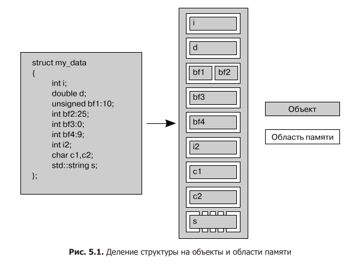
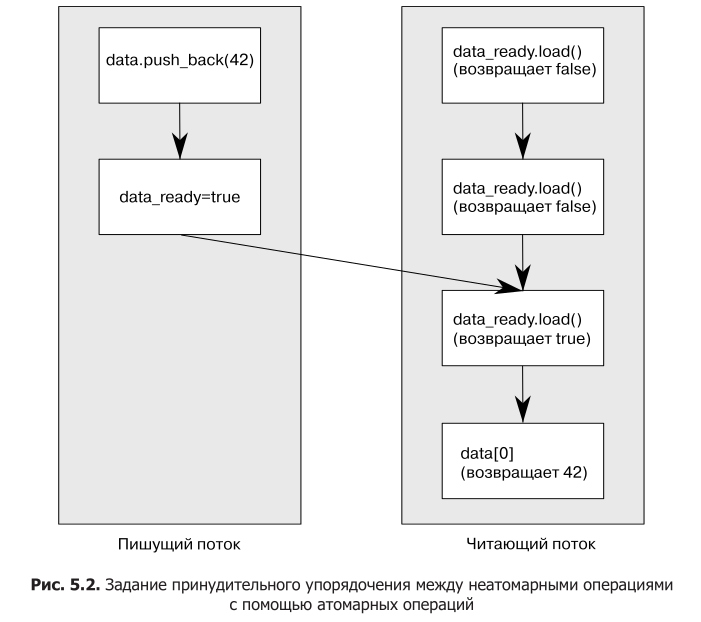
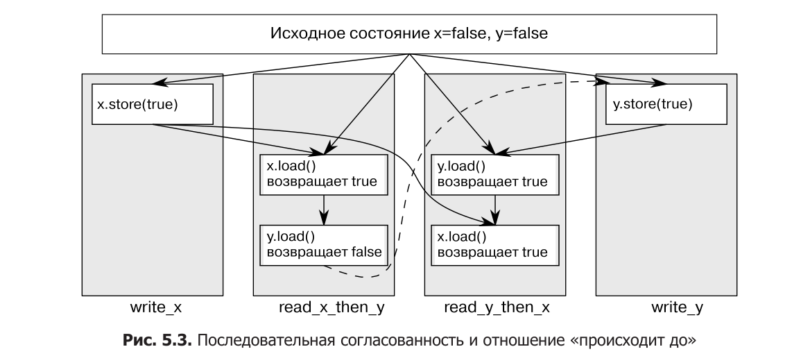
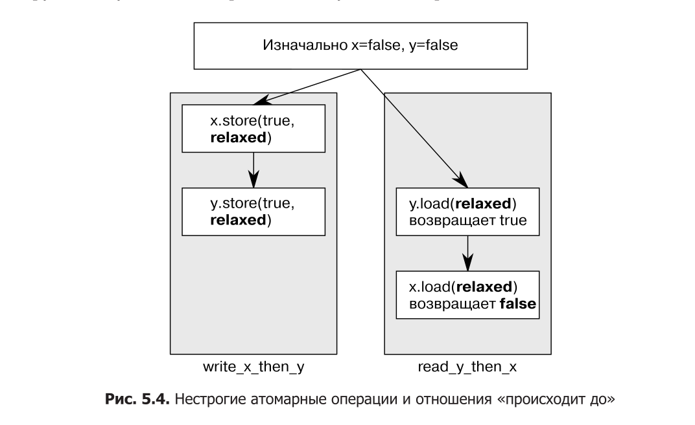
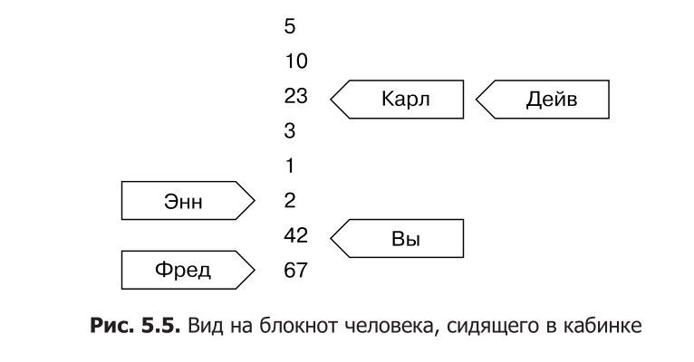
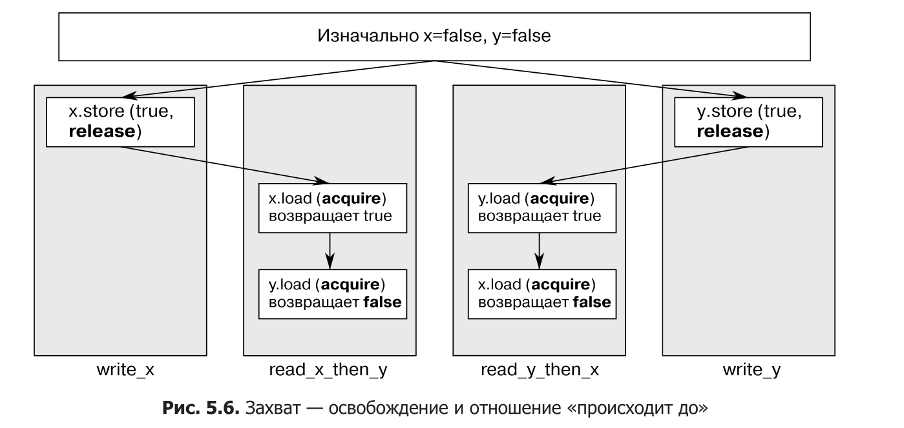
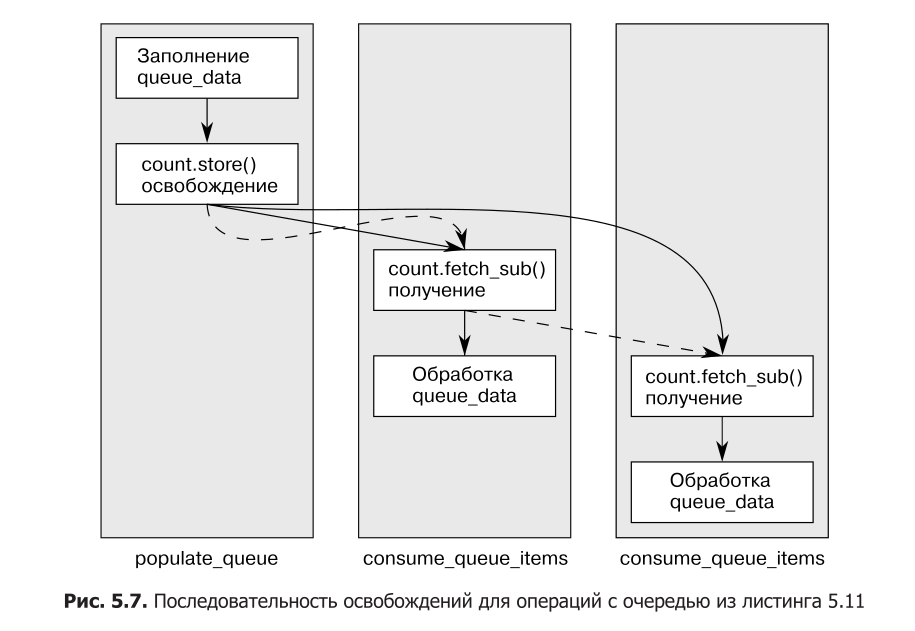

# Модуль 5. Модель памяти и атомарные операции

## Лекция

### Зачем это нужно

До сих пор мы синхронизировали потоки через «тяжёлую артиллерию»: мьютексы
(глава 3) и условные переменные с фьючерсами (глава 4). Эти средства работают,
потому что стандарт C++ гарантирует для них определённый порядок операций между
потоками. Но у самих этих средств есть внутреннее устройство: когда поток
блокирует мьютекс или ждёт условную переменную, процессор и компилятор должны
согласованно переставлять операции доступа к памяти. На чём держится эта
согласованность?

Ответ — на **модели памяти** (memory model). Это набор правил языка о том,
как потоки видят общие данные и в каком порядке. Без модели памяти нельзя было
бы полагаться ни на одно из ранее изученных средств: сами мьютексы внутри
построены на её правилах.

Когда же программисту нужны эти правила напрямую, без мьютексов? Тогда, когда
важна производительность и низкоуровневый контроль. Мьютекс — «дорогой» примитив: он
переводит поток в режим ожидания операционной системой, а это накладные расходы.
**Атомарные операции** (atomic) — это операции над разделяемыми данными, которые
выполняются неделимо и без блокировки (или почти без неё). Они позволяют
синхронизировать потоки с минимальными издержками и являются фундаментом для
структур данных без блокировок (глава 7).

Это не означает, что атомарные операции нужно использовать везде. Правило
здравого смысла такое:

- если данные можно защитить мьютексом и приложение не упирается в производительность — используй мьютекс, это проще и понятнее;
- атомарные операции оправданы, когда нужно писать низкоуровневый код
  (структуры без блокировок), или когда мьютекс оказывается узким местом,
  и профилирование это подтвердило.

Важно понимать и то, чего атомарность **не даёт**: атомарная операция устраняет
гонку за данные (data race), но не устраняет состояние гонки (race condition) —
она по-прежнему не определяет, какой поток первым добрался до данных. Просто
программа остаётся в области определённого поведения.

В этой главе мы изучим три вещи: основы модели памяти, атомарные типы
и операции, и, наконец, то, как с их помощью навязывать порядок операций между
потоками.

### Основы модели памяти

#### Объекты и области памяти

Вся память в программе на C++ состоит из **объектов**. Объект — это просто
область хранения, которой присвоены тип и время жизни. Переменная
встроенного типа `int` — объект, экземпляр класса — объект, элемент массива —
объект.

Объект хранится в одной или нескольких **областях памяти** (memory location).
Правила простые:

- каждая переменная — это объект (включая поля других объектов);
- каждый объект занимает как минимум одну область памяти;
- переменные встроенных типов (например, `int` или `char`) всегда занимают
  ровно одну область памяти, даже если стоят рядом или входят в массив;
- смежные битовые поля считаются одной областью памяти.



Например, у структуры с полями `int a; char b; bool flag;` каждое поле занимает
свою область памяти. А вот два смежных битовых поля делят одну область.

Зачем это важно? Потому что именно **область памяти** — единица, по которой
мы судим о гонках. Если два потока обращаются к разным областям памяти — проблем
нет. Проблемы начинаются, когда два потока обращаются к **одной и той же** области.

#### Объекты, области памяти и конкурентность

Если два потока обращаются к одной области памяти, нужно различать три случая:

1. **Ни один поток не пишет** — данные только читаются. Это безопасно,
   никакой синхронизации не нужно.
2. **Один поток пишет, другой читает (или оба пишут) — без принудительного
   порядка** — это **гонка за данными** (data race), и это **неопределённое
   поведение (UB)**. Программа может работать годами и сломаться в любой момент.
3. **Между обращениями установлен принудительный порядок** — безопасно.

Что значит «установить принудительный порядок»? Нужно гарантировать, что одно
обращение к области памяти «произошло до» другого. Способы:

- **мьютекс** (глава 3): и читатель, и писатель блокируют перед обращением
  один и тот же мьютекс, поэтому в каждый момент к области обращается только
  один поток — значит, одно обращение гарантированно происходит раньше другого;
- **атомарные операции** (эта глава): само обращение к спорной области делается
  атомарным (читается или пишется целиком), и все такие обращения выстраиваются
  в единый модификационный порядок. Кроме того, атомарная операция с подходящей
  меткой упорядочения связывает потоки отношением «синхронизируется с» — и тогда
  порядок наводится не только на саму атомарную переменную, но и на обычные
  (неатомарные) данные рядом с ней. Оба механизма разберём ниже.

Важное следствие: гонку за данными можно убрать, обращаясь к спорной области
памяти через атомарные операции. Это не решит, какой поток первый — но вернёт
программу в область определённого поведения. UB исчезает.

#### Очередность внесения изменений (modification order)

У каждого объекта есть **очередность внесения изменений** — полный порядок всех
записей в этот объект из всех потоков, начиная с его инициализации. В каждом
конкретном запуске программы все потоки должны согласовать этот порядок для
каждого атомарного объекта.

#### Что это даёт на практике

Представим, что один поток записал в атомарную переменную `counter` значения
`1`, затем `2`, затем `3`. Эти три записи и образуют её цепочку — и она одна
на всю программу: все потоки согласны с тем, в каком порядке записи идут друг
за другом.

Отсюда два простых следствия.

**Значение не идёт назад.** Если поток прочитал `counter == 2`, то следующее
чтение той же переменной не может внезапно вернуть `1`. Оно вернёт `2` или
что-то, стоящее позже в цепочке (`3`). Увиденные одним потоком значения могут
«застыть» на месте или пойти вперёд, но не назад.

**Запись встаёт после того, что поток уже видел.** Когда поток сам пишет
в переменную, его запись идёт в цепочке после всего, что этот поток уже
наблюдал. Поэтому сразу после своей записи он уже не увидит прежнее значение.

Именно это и имеют в виду, говоря, что значения одной переменной «не
откатываются назад».

Обрати внимание: потоки обязаны согласовывать модификационный порядок **каждой
отдельной переменной**, но **не обязаны** согласовывать относительный порядок
операций над **разными** переменными. Это ключевой момент, к которому мы вернёмся
в разделе про упорядочение доступа к памяти: без дополнительных ограничений
разные потоки могут видеть операции над разными переменными в разном порядке.

### Атомарные типы и операции

#### Что такое атомарная операция

**Атомарная операция** — это операция, которую нельзя прервать на середине.
С точки зрения остальных потоков она происходит мгновенно: либо уже целиком
случилась, либо ещё не начиналась. «Вклиниться» в неё и увидеть её недоделанной
нельзя.

Почему это не то же самое, что обычная операция? Возьмём `++counter`. В машинном
коде это не один шаг, а несколько: прочитать `counter`, прибавить единицу,
записать результат обратно. Между этими шагами поток может быть вытеснен, и тогда
второй поток, делающий то же самое, прочитает то же старое значение — один из
инкрементов потеряется. Такая операция составная: её части по отдельности видны
другим потокам. У атомарного типа `++counter` выполняется как **один неделимый
шаг** — другой поток, читающий `counter`, увидит либо значение до увеличения,
либо после, но никогда «середину».

То же касается чтения. Если весь объект читается и записывается атомарно,
поток получит **целиком** одно из записанных значений — а не «полузаписанную
смесь», которой никто не писал. Что это за смесь, покажем на примере.

```cpp
struct Point { int x; int y; };
Point p{0, 0};
```

Поток A заменяет точку на `{1, 2}`. Для обычной (неатомарной) структуры это
**две отдельные записи**: сначала `p.x = 1`, затем `p.y = 2`. Если поток B
прочитает `p` ровно между ними, он увидит `{1, 0}` — новый `x` и старый `y`.
Такое значение не записывал никто: сложилась смесь старого и нового. Атомарный
доступ к `p` устроен так, что этой «середины» не существует: B увидит либо
`{0, 0}`, либо `{1, 2}`.

Именно из-за таких смесей несинхронизированный доступ к неатомарной переменной
из нескольких потоков — это гонка за данными.

Для получения атомарных операций в C++ используются **атомарные типы**
из заголовка `<atomic>`.

#### Стандартные атомарные типы

Все операции над типами из `<atomic>` атомарны по определению. Но вот важный
нюанс: атомарность может обеспечиваться либо аппаратно (специальными
инструкциями процессора), либо **внутренним мьютексом** библиотеки. Второй
случай — когда тип не «свободен от блокировок» (not lock-free).

Проверить это можно методом `is_lock_free()`: он возвращает `true`, если
операции над типом выполняются аппаратно, и `false`, если за кулисами
используется блокировка. Вот пример вызова:

```cpp
#include <atomic>
#include <iostream>

int main() {
    std::atomic<int> counter{0};
    std::atomic<bool> ready{false};

    std::cout << std::boolalpha
              << "atomic<int>:  " << counter.is_lock_free() << "\n"
              << "atomic<bool>: " << ready.is_lock_free() << "\n";
}
```

Для встроенных типов на обычном x86-64 обе строки выведут `true`. А для
крупного пользовательского типа результат может оказаться `false` — тогда
библиотека прячет внутри мьютекс.

Зачем это знать? Если атомарный тип внутри держит мьютекс, то ожидаемого
прироста производительности может не быть — тогда проще и безопаснее
использовать обычный `std::mutex` и не изобретать велосипед. Это особенно
важно для структур данных без блокировок (глава 7): там вся идея в том,
чтобы не блокироваться, и если атомарный тип сам блокируется — смысл теряется.

С C++17 появились статические константы `is_always_lock_free` — они показывают,
свободен ли тип от блокировок для **всего** поддерживаемого оборудования
(значение известно на этапе компиляции). А макросы вида `ATOMIC_INT_LOCK_FREE`
дают похожую информацию: `0` — всегда блокировка, `2` — никогда, `1` — зависит
от оборудования.

Самый простой атомарный тип — `std::atomic_flag`.

#### std::atomic_flag — самый простой атомарный тип

`std::atomic_flag` — это булев флаг с двумя состояниями: «установлен» и «сброшен».
Он намеренно максимально ограничен, потому что задуман как строительный блок.
У него всего три операции: инициализация, сброс и «установи и верни старое».

Инициализация — всегда через `ATOMIC_FLAG_INIT`, и флаг всегда стартует
в состоянии «сброшен»:

```cpp
std::atomic_flag f = ATOMIC_FLAG_INIT;   // всегда начинается со «сброшен»
```

После инициализации с флагом можно сделать только три вещи: уничтожить,
сбросить (`clear()`) или установить и получить прежнее значение
(`test_and_set()`). Никаких копирований, присваиваний и обычных «прочитай
значение» операций у него нет.

- `test_and_set()` — операция чтения-изменения-записи: атомарно устанавливает
  флаг в `true` и возвращает прежнее значение. Можно указать любой
  `memory_order`.
- `clear()` — операция сохранения: сбрасывает флаг в `false`. Не может иметь
  семантику `acquire` или `acq_rel` (это противоречило бы смыслу операции
  сохранения).
- По умолчанию обе используют `memory_order_seq_cst` — самый строгий порядок.

Почему нельзя копировать атомарные типы? Копирование и копирующее присваивание
включают чтение из одного объекта и запись в другой. Это **две разные операции
над двумя разными объектами**, и их комбинация не может быть атомарной. Поэтому
все атомарные типы некопируемы.

Из-за ограниченности `std::atomic_flag` из него удобно делать **спин-блокировку**
(spinlock) — простой мьютекс на активном ожидании:

#### Листинг 5.1. Реализация мьютекса со спин-блокировкой с помощью std::atomic_flag

```cpp
#include <atomic>

class spinlock_mutex {
    std::atomic_flag flag;
public:
    spinlock_mutex() : flag(ATOMIC_FLAG_INIT) {}

    void lock() {
        while (flag.test_and_set(std::memory_order_acquire)) {
            // крутимся, пока флаг уже установлен другим потоком
        }
    }

    void unlock() {
        flag.clear(std::memory_order_release);
    }
};
```

Как это работает. Изначально флаг сброшен — мьютекс свободен. Чтобы заблокировать,
вызываем `test_and_set()` в цикле: пока возвращается `true` (флаг уже был
установлен кем-то другим), крутимся; как только вернётся `false` (мы первые,
кто установил флаг) — мы завладели блокировкой и выходим из цикла. Разблокировка —
просто `clear()`, сброс флага.

Это самый простой мьютекс, и его достаточно для `std::lock_guard` (глава 3).
Но он держит процессор в активном ожидании в `lock()`, поэтому при серьёзной
конкуренции лучше использовать настоящий `std::mutex`. Взаимное исключение он
обеспечивает — а как именно, мы разберём в разделе про упорядочение
(там же объясним смысл `acquire`/`release` в `lock`/`unlock`).

Ограниченность `std::atomic_flag` делает его непригодным даже для простого
булева флага «есть данные»: в нём нет операции простого чтения без изменения.
Для этого есть `std::atomic<bool>`.

#### std::atomic<bool> — атомарный булев флаг

`std::atomic<bool>` — тот же булев флаг, но с более широким интерфейсом.
Как и `atomic_flag`, он некопируем, но его можно создать из обычного `bool`
и присвоить ему обычный `bool`:

```cpp
std::atomic<bool> b(true);
b = false;   // присваивание из bool; b.store(false)
```

Обрати внимание на особенность: операторы присваивания атомарных типов
возвращают **значение** (неатомарного типа), а не ссылку на объект. Это
сделано специально: если бы возвращалась ссылка на атомарную переменную,
коду пришлось бы потом явно загружать значение, и в этот момент другой поток
мог бы его изменить. Возврат значения гарантирует: ты получил ровно то, что
сохранил.

Основные операции:

- `store(x)` — атомарно записать значение (операция сохранения);
- `load()` — атомарно прочитать значение (операция загрузки), не меняя его;
- `exchange(x)` — атомарно записать новое значение и вернуть старое
  (операция чтения-изменения-записи);
- `compare_exchange_weak(expected, desired)` и
  `compare_exchange_strong(expected, desired)` — сравнение-обмен (CAS).

Пример:

```cpp
std::atomic<bool> b;
bool x = b.load(std::memory_order_acquire);   // загрузка
b.store(true);                                 // сохранение
x = b.exchange(false, std::memory_order_acq_rel);  // чтение-изменение-запись
```

Сравнение-обмен (CAS) — краеугольный камень атомарного программирования.
Разберём его подробно, потому что он сложнее остальных.

**Сравнение-обмен (compare_exchange).** Операция делает следующее: сравнивает
текущее значение атомарной переменной с **ожидаемым** (`expected`). Если они
равны — сохраняет **желаемое** (`desired`) значение и возвращает `true`
(операция успешна). Если не равны — обновляет `expected` текущим значением
переменной и возвращает `false` (операция неуспешна).

```cpp
bool expected = false;
// если b равно false, присвоим true и вернём true;
// если b уже true, запишем в expected значение true и вернём false
bool ok = b.compare_exchange_weak(expected, true);
```

В чём разница между `weak` и `strong`? `compare_exchange_weak()` может вернуть
`false`, **даже если** значения были равны, — из-за так называемого **ложного
сбоя** (spurious failure). Это случается на архитектурах, где нет единой
аппаратной инструкции CAS: процессор не смог гарантировать атомарность операции
(например, в середине последовательности инструкций произошло переключение
потока). Ложный сбой — это не ошибка данных, а фактор времени.

Поэтому `weak` обычно используют **в цикле**:

```cpp
bool expected = false;
while (!b.compare_exchange_weak(expected, true) && !expected) {
    // крутимся, пока не получим успех
}
```

Условие `!expected` важно: если CAS провалился из-за ложного сбоя, `expected`
остался `false` (атомарная переменная не менялась), и цикл продолжается.
Если же провал из-за того, что переменную уже кто-то изменил, `expected` стал
`true`, и цикл останавливается.

`compare_exchange_strong()` гарантированно возвращает `false` **только** если
значения действительно не равны. Если нужно точно знать, «успешно ли изменено»,
и цикл писать не хочется — используй `strong`.

Если нужно изменить переменную при любом её значении (новое значение зависит
от текущего), то `expected` перезагружается на каждом проходе цикла:

```cpp
int expected = counter.load();
while (!counter.compare_exchange_weak(expected, expected + 1)) {
    // expected уже обновлён неудачной попыткой; пробуем снова
}
```

Выбор между `weak` и `strong` зависит от стоимости вычисления `desired`:
если посчитать новое значение дёшево — удобнее `weak` (он позволяет избежать
двойного цикла на платформах с ложным сбоем); если вычисление дорогое —
лучше `strong`, чтобы не пересчитывать значение зря.

У CAS есть особенность: **два параметра упорядочения** — отдельно для случая
успеха и отдельно для случая неудачи. При неудаче сохранения не происходит,
поэтому нельзя указать `release` или `acq_rel` для неудачи (нет операции
освобождения). Ограничения:

- для неудачи нельзя задать более строгое упорядочение, чем для успеха;
- если хочешь `acquire`/`seq_cst` для неудачи — укажи их же и для успеха;
- если упорядочение для неудачи не указано, оно то же, что и для успеха,
  но без части «release»: `release` становится `relaxed`, `acq_rel` становится
  `acquire`;
- если ничего не указано — по умолчанию `seq_cst` для обоих случаев.

Примеры эквивалентны:

```cpp
b.compare_exchange_weak(expected, true,
                        memory_order_acq_rel, memory_order_acquire);
b.compare_exchange_weak(expected, true, memory_order_acq_rel);
```

В отличие от `atomic_flag`, `atomic<bool>` может быть не свободен от блокировок
(внутри может использоваться мьютекс). Проверить можно через `is_lock_free()`.

#### std::atomic<T*> — атомарные указатели

`std::atomic<T*>` — атомарный указатель на `T`. Интерфейс тот же, что
у `atomic<bool>`, но вместо `bool` — значения `T*`. Тоже некопируем, но можно
создать и присвоить подходящий указатель. Есть `load`, `store`, `exchange`,
`compare_exchange_weak/strong`.

Новое — **арифметика указателей**:

- `fetch_add(n)` / `fetch_sub(n)` — атомарно прибавить/вычесть `n` элементов
  и вернуть **прежнее** значение;
- операторы `+=`, `-=`, `++`, `--` — удобные обёртки, но возвращают **новое**
  значение;
- `fetch_add`/`fetch_sub` — операции чтения-изменения-записи, могут принимать
  `memory_order`.

```cpp
std::atomic<Foo*> p = arr;        // указывает на первый элемент массива
p += 3;                            // теперь указывает на 4-й элемент
Foo* old = p.fetch_add(3);         // вернул указатель на 4-й элемент
```

Операторы `+=` и т.д. всегда используют `seq_cst` (им нельзя передать
`memory_order`), поэтому для тонкой настройки используют `fetch_add` с явным
порядком: `p.fetch_add(3, std::memory_order_release)`.

#### Целочисленные атомарные типы

Целочисленные атомарные типы (`std::atomic<int>`, `std::atomic<unsigned long>`
и т.д.) помимо стандартного набора (`load`, `store`, `exchange`, CAS) имеют
полный набор арифметических операций:

- `fetch_add`, `fetch_sub`, `fetch_and`, `fetch_or`, `fetch_xor`;
- составное присваивание `+=`, `-=`, `&=`, `|=`, `^=`;
- инкремент/декремент `++x`, `x++`, `--x`, `x--`.

Именованные функции (`fetch_*`) возвращают **прежнее** значение, операторы
присваивания — **новое**. Инкремент/декремент работают как обычно: `++x`
возвращает новое значение, `x++` — прежнее.

Нет операций деления, умножения и сдвига — их легко сделать циклом через
`compare_exchange_weak`, а обычно они и не нужны: целочисленные атомарные
значения применяются как счётчики или битовые маски.

#### Обобщённый шаблон std::atomic<UDT>

Первичный шаблон `std::atomic<T>` позволяет сделать атомарным пользовательский
тип. Интерфейс — как у `std::atomic<bool>`: `load`, `store`, `exchange`,
`compare_exchange_weak/strong`, присваивание из `T` и преобразование в `T`.

Но не любой тип можно обернуть. Требования к `T`:

- тривиальный оператор копирующего присваивания (компилятор генерирует его сам;
  нет виртуальных функций и виртуальных баз);
- у всех базовых классов и полей тоже тривиальный копирующий оператор
  присваивания.

Причина: компилятор должен иметь возможность скопировать объект как набор байтов
(через `memcpy`-подобную операцию), не вызывая пользовательский код. К тому же
CAS использует **побитовое сравнение** (как `memcmp`), а не пользовательский
оператор сравнения. Поэтому, если у типа есть свои операторы сравнения
с другой семантикой или биты заполнения, не участвующие в обычных сравнениях,
CAS может сработать неожиданно — «равные» по смыслу значения могут не совпасть
побитово.

Эти ограничения существуют и по другой причине (напоминание из главы 3):
нельзя вызывать пользовательский код, держа блокировку над защищёнными данными.
Если бы `atomic<UDT>` позволял пользовательские операторы присваивания/сравнения,
библиотеке пришлось бы вызывать их под внутренним мьютексом — это риск
взаимной блокировки и долгого удержания блокировки.

Поэтому, например, нельзя сделать `std::atomic<std::vector<int>>` (там
нетривиальный конструктор копирования), но можно — атомарный вариант класса
с простыми полями (счётчиками, флагами, указателями). Впрочем, чем сложнее
структура данных, тем реже над ней нужны операции «просто присвоить/сравнить» —
и тем уместнее обычный `std::mutex`.

Замечание про `std::atomic<float>` / `std::atomic<double>`: они допустимы
(встроенные типы с плавающей точкой подходят под `memcpy`/`memcmp`), но
`compare_exchange_strong` может сработать неожиданно — у чисел с плавающей
точкой бывает разное внутреннее представление для «равных» значений
(например, `-0.0` и `0.0`). Атомарных арифметических операций для плавающей
точки нет.

Если размер `UDT` не превышает размера `int` или `void*`, на большинстве
платформ можно сгенерировать полностью lock-free код. На некоторых платформах
это возможно и для типа вдвое большего размера (через инструкцию сравнения
и обмена двойных слов — DWCAS). Это пригодится в главе 7.

#### Свободные функции для атомарных операций

У всех атомарных операций есть эквивалентные **свободные функции** с префиксом
`atomic_` (например, `std::atomic_load`). Они создавались для совместимости
с языком C, поэтому работают с **указателями**, а не ссылками:

- без тега упорядочения: `std::atomic_load(&a)`, `std::atomic_store(&a, v)`;
- с тегом: суффикс `_explicit` и дополнительный параметр `memory_order`:
  `std::atomic_load_explicit(&a, std::memory_order_acquire)`;
- `std::atomic_is_lock_free(&a)` — как `a.is_lock_free()`.

Для `std::atomic_flag` имена отличаются: `std::atomic_flag_test_and_set()`,
`std::atomic_flag_clear()` (и `_explicit`-варианты).

Есть и свободные функции для атомарного доступа к `std::shared_ptr`
(`std::atomic_load(&p)`, `std::atomic_store(&p, v)` и т.д.). Это исключение:
`std::shared_ptr` — не атомарный тип, но комитет посчитал такие функции полезными.
Обращение к одному `shared_ptr` из нескольких потоков без этих функций (или
другой внешней синхронизации) — гонка за данными.

### Синхронизация операций и принудительное упорядочение

Теперь переходим к сути главы: как атомарные операции синхронизируют потоки
и навязывают порядок. Начнём с классического сценария.

#### Листинг 5.2. Чтение и запись переменных из разных потоков

```cpp
#include <atomic>
#include <vector>
#include <thread>
#include <iostream>
#include <chrono>

std::vector<int> data;
std::atomic<bool> data_ready(false);

void reader_thread() {
    while (!data_ready.load()) {
        std::this_thread::sleep_for(std::chrono::milliseconds(1));  // пауза в опросе
    }
    std::cout << "The answer=" << data[0] << "\n";   // читаем данные
}

void writer_thread() {
    data.push_back(42);          // пишем данные
    data_ready = true;           // затем выставляем флаг готовности
}

int main() {
    std::thread a(writer_thread);
    std::thread b(reader_thread);
    a.join();
    b.join();
}
```

*(Обрати внимание: `sleep_for` здесь — демонстрационная пауза в цикле опроса,
чтобы не жечь процессор. В реальном коде предпочитают условные переменные
из главы 4.)*

Здесь два потока обмениваются данными через неатомарный `std::vector<int> data`
и атомарный флаг `data_ready`. Писатель сначала кладёт данные, потом ставит флаг.
Читатель крутится, пока флаг не станет `true`, и только потом читает данные.
Такой код корректен, потому что между записью данных и чтением данных
устанавливается **принудительный порядок**. На каком основании? На двух
отношениях модели памяти: **«синхронизируется с»** и **«происходит до»**.

#### Отношение «синхронизируется с»

Отношение «синхронизируется с» (synchronizes-with) возникает между операциями
над атомарными типами. В общем виде: если один поток выполняет атомарную запись
W в переменную x, а другой поток выполняет атомарное чтение из x, которое
видит значение, записанное W (или более поздней записью того же потока,
или значением из цепочки операций чтения-изменения-записи над x), то запись W
**синхронизируется с** чтением.

В листинге 5.2 запись `data_ready = true` синхронизируется с чтением
`data_ready.load()`, когда то увидит `true`. Это и есть «мост» между потоками.

Детали о том, какие именно метки упорядочения создают это отношение, —
в разделе про упорядочение доступа к памяти. Пока важно: «синхронизируется с» —
отношение между атомарными операциями в разных потоках.

#### Отношение «происходит до» (happens-before)

Отношение «происходит до» — главный строительный блок порядка операций. Оно
определяет, каким операциям видны результаты других.

Внутри одного потока всё просто: если операция А идёт в коде раньше операции Б,
то А «происходит до» Б. Это интуитивно понятное правило однопоточной
последовательности.

Между потоками появляется новое отношение — «происходит до среди потоков»
(inter-thread happens-before). Его базовое правило: если А синхронизируется с Б,
то А происходит до Б. И, что очень важно, это отношение **транзитивно**: если А
происходит до Б, а Б происходит до В, то А происходит до В.

Транзитивность — вот что делает листинг 5.2 корректным:

- запись в `data` происходит до записи в `data_ready` (один поток, порядок в коде);
- запись в `data_ready` синхронизируется с чтением `data_ready.load() == true`
  (между потоками);
- чтение `data_ready == true` происходит до чтения `data` (один поток).

Значит, запись в `data` происходит до чтения `data` — принудительный порядок
установлен, гонки за данные нет.

Отношение «происходит до» сочетается и с порядком в коде: если А идёт в коде
до Б, а Б синхронизируется с В (в другом потоке), то А происходит до В.

Важный вывод: чтобы серия изменений в одном потоке стала видима операциям
в другом потоке, достаточно **одного** отношения «синхронизируется с». Именно
поэтому в листинге 5.2 одного флага достаточно для передачи всего вектора.



#### Листинг 5.3. Порядок вычисления аргументов вызова функции не определён

Есть и ограничение: операции **в одной инструкции** обычно не упорядочены.
Классика:

```cpp
#include <iostream>

void foo(int a, int b) {
    std::cout << a << "," << b << "\n";
}

int get_num() {
    static int i = 0;
    return ++i;
}

int main() {
    foo(get_num(), get_num());
}
```

Здесь порядок вычисления двух аргументов `get_num()` не определён: программа
напечатает либо `1,2`, либо `2,1`, но гарантировать нельзя. Между операциями
в одной инструкции нет отношения «происходит до», если они не связаны (например,
результат одного выражения — аргумент другого). Все операции в одной инструкции
происходят до всех операций в следующей инструкции, но внутри инструкции —
как повезёт.

#### Три модели упорядочения доступа к памяти

У каждой атомарной операции есть необязательный аргумент — тег упорядочения
`std::memory_order`. Их шесть: `relaxed`, `consume`, `acquire`, `release`,
`acq_rel`, `seq_cst`. По умолчанию используется `seq_cst` — самый строгий.

Все шесть сводятся к **трём моделям**:

1. **последовательно согласованная** — `memory_order_seq_cst`;
2. **захват-освобождение** — `memory_order_acquire`, `memory_order_release`,
   `memory_order_acq_rel`, и особый случай `memory_order_consume`;
3. **нестрогая** — `memory_order_relaxed`.

На разных архитектурах модели стоят по-разному. Например, на x86/x86-64
захват-освобождение не требует дополнительных инструкций сверх атомарности,
а последовательная согласованность для загрузок — тоже (небольшие издержки
только для сохранений). На слабоупорядоченных архитектурах разница заметнее.

Выбор модели — это баланс: `seq_cst` проще всего понять, но дороже; `relaxed`
дешевле всего, но даёт минимум гарантий. Разберём каждую.

#### Последовательно согласованное упорядочение (seq_cst)

Упорядочение по умолчанию называется **последовательно согласованным**, потому
что поведение программы согласуется с простой последовательной картиной мира.
Если все операции над атомарными типами последовательно согласованы,
многопоточная программа ведёт себя так, будто все эти операции выполняются
в некоторой конкретной последовательности в одном потоке.

Ключевое свойство: **все потоки видят один и тот же порядок** атомарных
операций. Это очень удобно для рассуждений: можно выписать все возможные
последовательности операций из разных потоков, отбросить несогласованные
и проверить, что остальное ведёт себя ожидаемо. Операции нельзя переупорядочить:
если в одном потоке операция А идёт раньше Б, этот порядок видят все остальные.

С точки зрения синхронизации, последовательно согласованное сохранение
синхронизируется с последовательно согласованной загрузкой той же переменной,
которая прочитала сохранённое значение. Но последовательная согласованность
умеет больше: любые последовательно согласованные операции, выполненные после
этой загрузки, должны появляться после сохранения в поле зрения других потоков.
Это накладывает **общий порядок** сразу на несколько потоков.

Плата — производительность: на многопроцессорных системах поддержка общего
порядка требует интенсивного обмена между процессорами. На x86 издержки
относительно низкие, но на слабоупорядоченных архитектурах — заметные.

#### Листинг 5.4. Последовательная согласованность, подразумевающая полную упорядоченность

```cpp
#include <atomic>
#include <thread>
#include <cassert>

std::atomic<bool> x, y;
std::atomic<int> z;

void write_x() { x.store(true, std::memory_order_seq_cst); }
void write_y() { y.store(true, std::memory_order_seq_cst); }

void read_x_then_y() {
    while (!x.load(std::memory_order_seq_cst)) { /* ждём x */ }
    if (y.load(std::memory_order_seq_cst)) ++z;
}

void read_y_then_x() {
    while (!y.load(std::memory_order_seq_cst)) { /* ждём y */ }
    if (x.load(std::memory_order_seq_cst)) ++z;
}

int main() {
    x = false; y = false; z = 0;
    std::thread a(write_x);
    std::thread b(write_y);
    std::thread c(read_x_then_y);
    std::thread d(read_y_then_x);
    a.join(); b.join(); c.join(); d.join();
    assert(z.load() != 0);   // никогда не сработает
}
```

Почему `assert` никогда не срабатывает? Первым в общем порядке должно случиться
либо сохранение `x`, либо сохранение `y`. Рассмотрим случай: поток `read_x_then_y`
видит `x == true`, затем читает `y` и получает `false`. Значит, в общем порядке
сохранение `x` произошло до сохранения `y`. Тогда поток `read_y_then_x` после
`while (y)` (он ждёт `y == true`) обязан прочитать `x == true` — потому что
сохранение `x` уже было. В итоге `z` не может остаться нулём. Симметрично —
и для обратного порядка. Оба потока могут прочитать `true` — тогда `z == 2`,
но нуля не будет никогда.

Вот оно, преимущество последовательной согласованности: единый глобальный
порядок гарантирует такой вывод.




#### Нестрогое упорядочение (relaxed)

Противоположность — нестрогое упорядочение `memory_order_relaxed`. Операции
`relaxed` не вводят отношения «синхронизируется с» и не накладывают почти
никаких ограничений на порядок относительно других потоков.

Единственное требование: операции над **одной и той же переменной в одном
и том же потоке** нельзя переупорядочить — если поток уже увидел конкретное
значение атомарной переменной, последующее чтение в том же потоке не может
вернуть более старое значение. Модификационный порядок каждой переменной
соблюдается, но относительный порядок операций над разными переменными —
никак не гарантирован.

Продемонстрируем, насколько «нестрогими» могут быть нестрогие операции.

#### Листинг 5.5. К нестрогим операциям предъявляется минимум требований упорядочения

```cpp
#include <atomic>
#include <thread>
#include <cassert>

std::atomic<bool> x, y;
std::atomic<int> z;

void write_x_then_y() {
    x.store(true, std::memory_order_relaxed);
    y.store(true, std::memory_order_relaxed);
}

void read_y_then_x() {
    while (!y.load(std::memory_order_relaxed)) { /* ждём y */ }
    if (x.load(std::memory_order_relaxed)) ++z;
}

int main() {
    x = false; y = false; z = 0;
    std::thread a(write_x_then_y);
    std::thread b(read_y_then_x);
    a.join(); b.join();
    assert(z.load() != 0);   // МОЖЕТ сработать!
}
```

Здесь `assert` **может** сработать: загрузка `x` может вернуть `false`, даже
если загрузка `y` вернула `true`, а сохранение `x` в коде стояло **до**
сохранения `y`. `x` и `y` — разные переменные, и никаких гарантий упорядочения
между ними нет. Потоки не обязаны согласовывать порядок операций над разными
переменными.

Ещё более наглядный пример — три переменные и пять потоков.

#### Листинг 5.6. Нестрогие операции в нескольких потоках

```cpp
#include <thread>
#include <atomic>
#include <iostream>

std::atomic<int> x(0), y(0), z(0);
std::atomic<bool> go(false);
unsigned const loop_count = 10;

struct read_values { int x, y, z; };

read_values values1[loop_count], values2[loop_count], values3[loop_count],
             values4[loop_count], values5[loop_count];

void increment(std::atomic<int>* var_to_inc, read_values* values) {
    while (!go) std::this_thread::yield();
    for (unsigned i = 0; i < loop_count; ++i) {
        values[i].x = x.load(std::memory_order_relaxed);
        values[i].y = y.load(std::memory_order_relaxed);
        values[i].z = z.load(std::memory_order_relaxed);
        var_to_inc->store(i + 1, std::memory_order_relaxed);
        std::this_thread::yield();
    }
}

void read_vals(read_values* values) {
    while (!go) std::this_thread::yield();
    for (unsigned i = 0; i < loop_count; ++i) {
        values[i].x = x.load(std::memory_order_relaxed);
        values[i].y = y.load(std::memory_order_relaxed);
        values[i].z = z.load(std::memory_order_relaxed);
        std::this_thread::yield();
    }
}

void print(read_values* v) {
    for (unsigned i = 0; i < loop_count; ++i) {
        if (i) std::cout << ",";
        std::cout << "(" << v[i].x << "," << v[i].y << "," << v[i].z << ")";
    }
    std::cout << "\n";
}

int main() {
    std::thread t1(increment, &x, values1);
    std::thread t2(increment, &y, values2);
    std::thread t3(increment, &z, values3);
    std::thread t4(read_vals, values4);
    std::thread t5(read_vals, values5);
    go = true;
    t5.join(); t4.join(); t3.join(); t2.join(); t1.join();
    print(values1); print(values2); print(values3); print(values4); print(values5);
}
```

Здесь три потока увеличивают свои переменные (`x`, `y`, `z`) с `0` до `10`,
а два потока читают все три переменные в цикле. Вывод может быть очень разным.
Возможный вариант:

```
(0,0,0),(1,0,0),(2,0,0),(3,0,0),(4,0,0),(5,7,0),(6,7,8),(7,9,8),(8,9,8),(9,9,10)
(0,0,0),(0,1,0),(0,2,0),(1,3,5),(8,4,5),(8,5,5),(8,6,6),(8,7,9),(10,8,9),(10,9,10)
(0,0,0),(0,0,1),(0,0,2),(0,0,3),(0,0,4),(0,0,5),(0,0,6),(0,0,7),(0,0,8),(0,0,9)
(1,3,0),(2,3,0),(2,4,1),(3,6,4),(3,9,5),(5,10,6),(5,10,8),(5,10,10),(9,10,10),(10,10,10)
(0,0,0),(0,0,0),(0,0,0),(6,3,7),(6,5,7),(7,7,7),(7,8,7),(8,8,7),(8,8,9),(8,8,9)
```

Обрати внимание: в одном из потоков-читателей переменная `x` сначала видна как
`6`, хотя другие потоки уже видели `7` и `8`. Разные потоки видят **разные
представления** одного и того же набора операций. Это нормально для `relaxed`:
единственное требование — модификационный порядок каждой отдельной переменной.



**Как это понять интуитивно.** Представь каждую переменную как человека
в кабинке с блокнотом, где список значений. Можно позвонить и попросить назвать
текущее значение или записать новое в конец списка. При нестрогом упорядочении
у каждого «человека» свой независимый блокнот: поток может прочитать «старое»
значение одной переменной и «новое» — другой, не спрашивая, как они соотносятся.
Никто не гарантирует согласованность между кабинками.




Вывод: `relaxed` годится для **независимых** счётчиков, где важен только сам факт
увеличения, но не порядок относительно других данных. Для передачи данных между
потоками `relaxed` недостаточно — нужны acquire/release.

#### Упорядочение захват-освобождение (acquire/release)

Упорядочение **захват-освобождение** (acquire-release) — расширение нестрогого,
при котором по-прежнему нет единого глобального порядка, но появляются
**элементы синхронизации**:

- атомарные **загрузки** — операции **захвата** (`memory_order_acquire`);
- атомарные **сохранения** — операции **освобождения** (`memory_order_release`);
- операции **чтения-изменения-записи** (`fetch_add`, `exchange` и т.д.) могут
  быть захватом, освобождением или тем и другим (`memory_order_acq_rel`).

Синхронизируются два потока: тот, что выполняет освобождение, и тот, что
выполняет захват. Операция освобождения «синхронизируется с» операцией захвата,
**которая прочитала записанное значение**.

Это значит: разные потоки всё ещё могут видеть разный порядок, но он ограничен.
Если загрузка-захват видит значение, записанное сохранением-освобождением,
устанавливается связь, через которую «просачиваются» и другие операции.

Посмотрим, как это меняет листинг 5.4.

#### Листинг 5.7. Семантика захват-освобождение не подразумевает полной упорядоченности

```cpp
#include <atomic>
#include <thread>
#include <cassert>

std::atomic<bool> x, y;
std::atomic<int> z;

void write_x() { x.store(true, std::memory_order_release); }
void write_y() { y.store(true, std::memory_order_release); }

void read_x_then_y() {
    while (!x.load(std::memory_order_acquire)) { /* ждём x */ }
    if (y.load(std::memory_order_acquire)) ++z;
}

void read_y_then_x() {
    while (!y.load(std::memory_order_acquire)) { /* ждём y */ }
    if (x.load(std::memory_order_acquire)) ++z;
}

int main() {
    x = false; y = false; z = 0;
    std::thread a(write_x);
    std::thread b(write_y);
    std::thread c(read_x_then_y);
    std::thread d(read_y_then_x);
    a.join(); b.join(); c.join(); d.join();
    assert(z.load() != 0);   // МОЖЕТ сработать
}
```

Здесь `assert` может сработать, в отличие от версии с `seq_cst`. Почему? Потому
что записи `x` и `y` происходят в **разных** потоках, и между ними нет
отношения «синхронизируется с». Захват-освобождение не даёт глобального порядка:
один поток может увидеть `x == true` и `y == false`, другой — наоборот.

Зато acquire/release отлично работают для двух операций **в одном потоке**.

#### Листинг 5.8. Захват-освобождение накладывает упорядочение на нестрогие операции

```cpp
#include <atomic>
#include <thread>
#include <cassert>

std::atomic<bool> x, y;
std::atomic<int> z;

void write_x_then_y() {
    x.store(true, std::memory_order_relaxed);   // нестрогая запись x
    y.store(true, std::memory_order_release);   // освобождение y
}

void read_y_then_x() {
    while (!y.load(std::memory_order_acquire)) { /* ждём y */ }  // захват y
    if (x.load(std::memory_order_relaxed)) ++z;  // нестрогое чтение x
}

int main() {
    x = false; y = false; z = 0;
    std::thread a(write_x_then_y);
    std::thread b(read_y_then_x);
    a.join(); b.join();
    assert(z.load() != 0);   // никогда не сработает
}
```

Здесь `assert` никогда не сработает. Почему? Сохранение `x` происходит до
сохранения `y` в одном потоке (порядок в коде). Загрузка `y` (захват) видит
значение, записанное сохранением `y` (освобождение), — значит, сохранение `y`
синхронизируется с загрузкой `y`. По транзитивности сохранение `x` происходит
до загрузки `x`, поэтому загрузка `x` обязана прочитать `true`.

Ключевой момент: **операции захвата и освобождения должны выполняться попарно
над одной и той же переменной**. Если бы сохранение `y` или загрузка `y` были
нестрогими — никакого упорядочения `x` не было бы.

Вернёмся к спин-блокировке из листинга 5.1. Теперь понятно, почему там
`acquire`/`release`: `lock()` — захват, `unlock()` — освобождение. Когда первый
поток меняет защищённые данные, а потом разблокирует мьютекс (освобождение),
это синхронизируется с `lock()` второго потока (захватом), и второй поток видит
изменения, сделанные первым. Именно так работают и настоящие мьютексы: блокировка —
захват, разблокировка — освобождение.

**Аналогия с пакетами обновлений.** Представь снова «людей в кабинках».
При освобождении сохранение помечается как «последнее в пакете» от потока.
При захвате загрузка спрашивает не только значение, но и то, «последнее ли оно
в пакете», и сообщает известные ей пакеты. Тогда захват, увидев «последнее
значение пакета от потока A», может потребовать у кабинки другой переменной
все значения из этого пакета. Так захват-освобождение «протаскивает» данные
через пару операций.



#### Транзитивная синхронизация

Свойство транзитивности отношения «происходит до» позволяет синхронизировать
данные между **тремя** потоками через цепочку, даже если промежуточный поток
не касался самих данных.

#### Листинг 5.9. Транзитивная синхронизация с помощью упорядочения захват-освобождение

```cpp
#include <atomic>
#include <thread>
#include <cassert>

std::atomic<int> data[5];
std::atomic<bool> sync1(false), sync2(false);

void thread_1() {
    data[0].store(42, std::memory_order_relaxed);
    data[1].store(97, std::memory_order_relaxed);
    data[2].store(17, std::memory_order_relaxed);
    data[3].store(-141, std::memory_order_relaxed);
    data[4].store(2003, std::memory_order_relaxed);
    sync1.store(true, std::memory_order_release);   // освобождение
}

void thread_2() {
    while (!sync1.load(std::memory_order_acquire)) { /* ждём */ }  // захват sync1
    sync2.store(true, std::memory_order_release);   // освобождение sync2
}

void thread_3() {
    while (!sync2.load(std::memory_order_acquire)) { /* ждём */ }  // захват sync2
    assert(data[0].load(std::memory_order_relaxed) == 42);
    assert(data[1].load(std::memory_order_relaxed) == 97);
    assert(data[2].load(std::memory_order_relaxed) == 17);
    assert(data[3].load(std::memory_order_relaxed) == -141);
    assert(data[4].load(std::memory_order_relaxed) == 2003);
}

int main() {
    std::thread t1(thread_1);
    std::thread t2(thread_2);
    std::thread t3(thread_3);
    t1.join(); t2.join(); t3.join();
}
```

Здесь `thread_2` обращается только к `sync1` и `sync2`, но этого достаточно,
чтобы `thread_3` увидел данные, записанные `thread_1`. Цепочка:

- сохранения `data` происходят до сохранения `sync1` (один поток);
- сохранение `sync1` (освобождение) синхронизируется с загрузкой `sync1`
  (захват) в `thread_2`;
- эта загрузка происходит до сохранения `sync2` (один поток);
- сохранение `sync2` (освобождение) синхронизируется с загрузкой `sync2`
  (захват) в `thread_3`;
- эта загрузка происходит до загрузок `data`.

Всё вместе — сохранения `data` происходят до загрузок `data`. `assert` не сработает.

`sync1` и `sync2` можно слить в одну переменную, используя в `thread_2`
операцию чтения-изменения-записи с семантикой `acq_rel` (например,
`compare_exchange_strong`), которая одновременно и захват, и освобождение:

```cpp
std::atomic<int> sync(0);

void thread_1() {
    // пишем data...
    sync.store(1, std::memory_order_release);
}

void thread_2() {
    int expected = 1;
    while (!sync.compare_exchange_strong(expected, 2,
                                         std::memory_order_acq_rel)) {
        expected = 1;
    }
}

void thread_3() {
    while (sync.load(std::memory_order_acquire) < 2) { /* ждём */ }
    // читаем data...
}
```

Здесь `thread_2` «передаёт эстафету» от `thread_1` к `thread_3` одной операцией
`acq_rel`, которая и захват (принимает значение 1 от `thread_1`), и освобождение
(передаёт 2 дальше).

Важно про выбор семантики чтения-изменения-записи:

- `fetch_sub` с `acquire` — **не** освобождение, не может быть синхронизирована
  с предшествующим сохранением;
- `fetch_or` с `release` — чтение не захват, не синхронизируется с последующей
  загрузкой;
- `acq_rel` — и захват, и освобождение, работает в обе стороны.

Смешение с `seq_cst`: последовательно согласованные загрузки ведут себя как
захват, сохранения — как освобождение, чтение-изменение-запись — как `acq_rel`.
Нестрогие операции остаются нестрогими, но ограничиваются дополнительными
отношениями «синхронизируется с».

Ещё раз про аналогию с мьютексом: чтобы получить упорядочение, операции захвата
и освобождения должны выполняться **над одной и той же переменной** — как
блокировка и разблокировка одного мьютекса. При этом с точки зрения кода,
который использует блокировку на acquire/release, поведение выглядит как
последовательно согласованное — даже если внутренние операции иные.

#### memory_order_consume

`memory_order_consume` — особый случай захвата, целиком завязанный
на **зависимость от данных**. Отношение «синхронизируется с» в этом случае
ограничивается прямыми зависимостями: освобождение «выполняется по зависимости
до» загрузки с `consume`, если та потребляет результат чтения, и эта зависимость
«переносится» дальше по цепочке операций, зависящих от значения.

#### Листинг 5.10. Использование std::memory_order_consume для синхронизации доступа к данным

```cpp
#include <string>
#include <thread>
#include <atomic>
#include <cassert>

struct X {
    int i;
    std::string s;
};

std::atomic<X*> p;
std::atomic<int> a;

void create_x() {
    X* x = new X;
    x->i = 42;
    x->s = "hello";
    a.store(99, std::memory_order_relaxed);
    p.store(x, std::memory_order_release);   // освобождение указателя
}

void use_x() {
    X* x;
    while (!(x = p.load(std::memory_order_consume))) {  // загрузка consume
        std::this_thread::sleep_for(std::chrono::microseconds(1));
    }
    assert(x->i == 42);       // гарантировано (зависит от p)
    assert(x->s == "hello");  // гарантировано (зависит от p)
    assert(a.load(std::memory_order_relaxed) == 99);  // может не выполниться!
}

int main() {
    std::thread t1(create_x);
    std::thread t2(use_x);
    t1.join(); t2.join();
}
```

Здесь загрузка `p` с `consume` даёт упорядочение только для операций, **зависящих
от значения `p`** (доступ к `x->i` и `x->s` через указатель `x`). А вот значение
независимой переменной `a` не упорядочено — assert про `a` может не выполниться.

**Главный практический совет:** в C++17 стандарт настоятельно рекомендует
**не использовать** `memory_order_consume`. На практике почти всегда достаточно
`memory_order_acquire`, которое проще и переносимее. Поэтому в курсе мы `consume`
не применяем — это материал для полноты картины.

#### Последовательности освобождений (release sequences)

Вернёмся к отношению «синхронизируется с». Оно может установиться, даже если
между сохранением и загрузкой прошла **цепочка операций чтения-изменения-записи**
над той же переменной. Такая цепочка называется **последовательностью
освобождений** (release sequence).

Правило: если сохранение помечено `release`/`acq_rel`/`seq_cst`, загрузка —
`consume`/`acquire`/`seq_cst`, и каждая операция в цепочке читает значение,
записанное предыдущей, то начальное сохранение синхронизируется с финальной
загрузкой. При этом операции чтения-изменения-записи в цепочке могут иметь
любые теги, даже `relaxed`.

Зачем это нужно? Классика — атомарный счётчик в очереди.

#### Листинг 5.11. Чтение значений из очереди с помощью атомарных операций

```cpp
#include <atomic>
#include <thread>
#include <vector>

std::vector<int> queue_data;
std::atomic<int> count;

void populate_queue() {
    unsigned const number_of_items = 20;
    queue_data.clear();
    for (unsigned i = 0; i < number_of_items; ++i) {
        queue_data.push_back(i);
    }
    count.store(number_of_items, std::memory_order_release);
}

void consume_queue_items() {
    while (true) {
        int item_index;
        if ((item_index = count.fetch_sub(1, std::memory_order_acquire)) <= 0) {
            // очередь пуста — ждём новые элементы (пропустим детали)
            continue;
        }
        process(queue_data[item_index - 1]);
    }
}
```

Один поток наполняет буфер и выставляет счётчик через `release`-сохранение.
Потоки-потребители вызывают `count.fetch_sub(1, acquire)`, чтобы забрать элемент,
и читают буфер.

Если потребитель один — всё просто: `fetch_sub` (захват) видит значение,
записанное `store` (освобождение), сохранение синхронизируется с загрузкой.

Если потребителей два — второй `fetch_sub` увидит значение, записанное **первым**
`fetch_sub`, а не самим `store`. Без правила о последовательности освобождений
у второго потребителя не было бы отношения «происходит до» с писателем,
и чтение буфера было бы небезопасным (гонка за данные). Пришлось бы делать
каждый `fetch_sub` ещё и `release` — но это ввело бы ненужную синхронизацию между
потребителями.

Благодаря правилу о последовательностях освобождений цепочка
`store(release) → fetch_sub(acquire) → fetch_sub(acquire)` работает: начальное
сохранение синхронизируется со **вторым** `fetch_sub`. Цепочка может быть любой
длины, лишь бы все звенья были операциями чтения-изменения-записи над той же
переменной.



#### Барьеры (fences)

**Барьер** (fence) — операция, которая накладывает ограничения на порядок
доступа к памяти, **не изменяя никаких данных**. Барьеры применяются вместе
с атомарными операциями, обычно `relaxed`, чтобы принудительно упорядочить их.
Их называют ещё «барьерами памяти», потому что они ставят в коде линию, за которую
не могут «перешагнуть» определённые операции.

Вспомним листинг 5.5 (где `assert` мог сработать из-за relaxed). Добавим барьеры.

#### Листинг 5.12. Нестрогие операции можно упорядочить с помощью барьеров

```cpp
#include <atomic>
#include <thread>
#include <cassert>

std::atomic<bool> x, y;
std::atomic<int> z;

void write_x_then_y() {
    x.store(true, std::memory_order_relaxed);
    std::atomic_thread_fence(std::memory_order_release);   // барьер освобождения
    y.store(true, std::memory_order_relaxed);
}

void read_y_then_x() {
    while (!y.load(std::memory_order_relaxed)) { /* ждём y */ }
    std::atomic_thread_fence(std::memory_order_acquire);   // барьер захвата
    if (x.load(std::memory_order_relaxed)) ++z;
}

int main() {
    x = false; y = false; z = 0;
    std::thread a(write_x_then_y);
    std::thread b(read_y_then_x);
    a.join(); b.join();
    assert(z.load() != 0);   // никогда не сработает
}
```

Барьер освобождения в `write_x_then_y` синхронизируется с барьером захвата
в `read_y_then_x`, потому что загрузка `y` видит значение, сохранённое в `y`.
Значит, сохранение `x` происходит до загрузки `x`, и `assert` не сработает.
Это сильно отличается от листинга 5.5, где сохранение `x` и загрузка `x`
не были упорядочены.

Точка синхронизации — **сам барьер**, а не операции вокруг него. Важно, где
стоит барьер: если поставить его до обеих записей, упорядочения не будет.

```cpp
void write_x_then_y() {
    std::atomic_thread_fence(std::memory_order_release);
    x.store(true, std::memory_order_relaxed);   // вне барьера
    y.store(true, std::memory_order_relaxed);   // вне барьера
}
```

Здесь записи `x` и `y` не разделены барьером, значит, не упорядочены, и `assert`
может сработать. Барьер вводит упорядочение, только когда стоит **между**
сохраняемой и последующей операциями.

Общий смысл барьеров: если операции захвата видят результат сохранения,
происходящего после барьера освобождения, то барьер синхронизируется с захватом;
аналогично, если загрузка до барьера захвата видит результат освобождения,
то освобождение синхронизируется с барьером захвата. Барьеры могут быть с обеих
сторон — тогда они синхронизируются друг с другом.

#### Упорядочение неатомарных операций с помощью атомарных

До сих пор примеры были на атомарных переменных. Но главная польза атомарных
операций — навязать порядок **неатомарным** операциям и убрать гонку за данные.
Заменим `x` из листинга 5.12 на обычный неатомарный `bool`.

#### Листинг 5.13. Упорядочение, навязанное неатомарным операциям

```cpp
#include <atomic>
#include <thread>
#include <cassert>

bool x = false;                 // неатомарная переменная
std::atomic<bool> y;
std::atomic<int> z;

void write_x_then_y() {
    x = true;                                       // обычная запись
    std::atomic_thread_fence(std::memory_order_release);
    y.store(true, std::memory_order_relaxed);       // атомарный «сигнал»
}

void read_y_then_x() {
    while (!y.load(std::memory_order_relaxed)) { /* ждём y */ }
    std::atomic_thread_fence(std::memory_order_acquire);
    if (x) ++z;                                     // обычное чтение
}

int main() {
    x = false; y = false; z = 0;
    std::thread a(write_x_then_y);
    std::thread b(read_y_then_x);
    a.join(); b.join();
    assert(z.load() != 0);   // никогда не сработает
}
```

Барьеры навязывают упорядочение обычным операциям над `x`: запись `x` происходит
до чтения `x`, значит, гонки за `x` нет и `assert` не сработает. При этом `y`
должен остаться атомарным (иначе гонка за сам `y`), но барьеры защищают `x`.

Общее правило отношения «происходит до»: если неатомарная операция стоит
в коде до атомарной, а эта атомарная синхронизируется с операцией в другом
потоке, то неатомарная операция тоже происходит до той операции. Именно так
работает листинг 5.2 и именно так устроены мьютексы, условные переменные
и фьючерсы: `lock()` — захват, `unlock()` — освобождение, и через них данные
«просачиваются» между потоками.

#### Синхронизация высокоуровневых средств

Все средства глав 2–4 гарантируют упорядочение в терминах отношения
«синхронизируется с». Полезно знать эти гарантии:

- **std::thread**: завершение конструктора `std::thread` синхронизируется
  с началом функции в новом потоке; завершение потока синхронизируется
  с возвратом из успешного `join()`.
- **Мьютексы** (`std::mutex`, `std::timed_mutex`, `std::recursive_mutex`):
  все вызовы `lock`/`unlock` и успешные `try_lock*` образуют общий порядок
  блокировки; `unlock` синхронизируется с последующим `lock`/успешным `try_lock`.
  Неудачные `try_lock*` не участвуют в синхронизации.
- **`std::shared_mutex`**: то же для `lock`/`unlock`/`lock_shared`/`unlock_shared`;
  `unlock` синхронизируется с последующими `lock` или `lock_shared`.
- **`std::promise`/`std::future`**: успешный `set_value`/`set_exception`
  синхронизируется с успешным возвратом из `wait`/`get` (или `wait_for`/`wait_until`,
  вернувших `ready`); деструктор `promise`, сохраняющий `broken_promise`,
  тоже синхронизируется с таким ожиданием.
- **`std::packaged_task`/`std::future`**: завершение вызова `operator()`
  синхронизируется с готовностью связанного фьючерса.
- **`std::async`/`std::future`**: завершение потока задачи (при `launch::async`)
  или завершение отложенной задачи (при `launch::deferred`) синхронизируется
  с готовностью фьючерса.
- **Условные переменные** (`std::condition_variable`): сами по себе НЕ дают
  синхронизации — они лишь оптимизация циклов активного ожидания; вся
  синхронизация обеспечивается операциями над связанным мьютексом.

Понимание этих гарантий — фундамент: даже если ты никогда не пишешь
`memory_order` вручную, ты опираешься на модель памяти, которая стоит
за мьютексами и фьючерсами.

### Минимальные примеры

Самые короткие заготовки, которые можно собрать и запустить.

**Атомарный счётчик с `fetch_add`:**

```cpp
#include <atomic>
std::atomic<int> counter(0);
counter.fetch_add(1);            // атомарно +1, вернёт прежнее значение
int cur = counter.load();        // атомарно прочитать
```

**Флаг готовности с acquire/release (передача данных):**

```cpp
#include <atomic>
#include <thread>
#include <vector>

std::vector<int> payload;
std::atomic<bool> ready(false);

void writer() {
    payload.push_back(42);           // пишем данные
    ready.store(true, std::memory_order_release);   // освобождение
}

void reader() {
    while (!ready.load(std::memory_order_acquire)) { }  // захват
    int v = payload[0];              // безопасно: данные упорядочены
}
```

**CAS-цикл (инкремент без `fetch_add`):**

```cpp
#include <atomic>
std::atomic<int> counter(0);
int expected = counter.load();
while (!counter.compare_exchange_weak(expected, expected + 1)) {
    // expected уже обновлён; пробуем снова
}
```

### Типичные ошибки

**Использовал `relaxed` для передачи данных между потоками.** `relaxed`
не создаёт отношения «синхронизируется с». Если один поток пишет данные,
а другой ждёт через `relaxed`-флаг — это гонка за данные (UB). Для передачи
данных нужны acquire/release (или seq_cst).

**Забыл `acquire` на стороне читателя.** Синхронизация требует пары:
освобождение у писателя И захват у читателя. Если читатель читает `relaxed` —
упорядочения нет, даже если писатель использовал `release`.

**Надеялся на неатомарную переменную как на флаг.** Чтение/запись неатомарной
переменной из разных потоков без синхронизации — гонка за данные. Флаг
готовности обязан быть атомарным.

**Игнорировал, что операции в одной инструкции не упорядочены.** Порядок
вычисления аргументов функции не определён (листинг 5.3). Не полагайся на него.

**Думал, что `seq_cst` — единственный вариант, и не разобрался в стоимости.**
`seq_cst` прост, но на слабоупорядоченных архитектурах дорог. Там, где важно
только попарное упорядочение данных, используй acquire/release.

**Использовал `consume` без необходимости.** Стандарт C++17 рекомендует
не использовать `consume`; на практике хватает `acquire`.

**Перепутал `compare_exchange_weak` и `strong`.** `weak` может дать ложный сбой —
используй его в цикле; `strong` гарантированно возвращает `false` только при
реальном несовпадении. Неправильный выбор — потенциальный бесконечный цикл
или лишние пересчёты `desired`.

**Вызвал `get()` на фьючерсе дважды** (повторение из главы 4) — после первого
`get()` значения в фьючерсе нет. Для нескольких читателей — `shared_future`.

**Считал, что атомарные операции гарантируют порядок и для неатомарных данных
без пары acquire/release.** Атомарная операция упорядочивает другие данные,
только если установлено отношение «синхронизируется с» (пара захват-освобождение).

**Забыл, что `std::atomic_flag` всегда стартует со «сброшен» через
`ATOMIC_FLAG_INIT`.** Другой инициализации у него нет.

### Шпаргалка

| Что | Как | Смысл |
|-----|-----|-------|
| Простейший атомарный флаг | `std::atomic_flag f = ATOMIC_FLAG_INIT;` | всегда стартует «сброшен» |
| Установить и вернуть старое | `f.test_and_set()` | операция чтения-изменения-записи |
| Сбросить флаг | `f.clear()` | операция сохранения |
| Атомарный булев флаг | `std::atomic<bool>` | загрузка/сохранение/обмен/CAS |
| Записать | `a.store(v)` | атомарная запись |
| Прочитать | `a.load()` | атомарное чтение без изменения |
| Заменить и вернуть старое | `a.exchange(v)` | чтение-изменение-запись |
| Сравнение-обмен | `a.compare_exchange_weak/strong(e,d)` | CAS: при равенстве пишет, иначе обновляет `e` |
| Ложный сбой | `weak` может вернуть false при равенстве | используй `weak` в цикле |
| Счётчик | `a.fetch_add(n)` / `a += n` | атомарное сложение, `fetch_*` возвращает старое |
| Проверка на блокировки | `a.is_lock_free()` | true — аппаратно, false — внутренний мьютекс |
| Полный порядок | `memory_order_seq_cst` | по умолчанию; все потоки видят один порядок |
| Слабый порядок | `memory_order_relaxed` | минимум гарантий; для независимых счётчиков |
| Передача данных | `release` (писатель) + `acquire` (читатель) | пара «синхронизируется с» |
| И захват, и освобождение | `memory_order_acq_rel` | для чтения-изменения-записи |
| Зависимость от данных | `memory_order_consume` | не использовать (рекомендация C++17) |
| Барьер памяти | `std::atomic_thread_fence(order)` | упорядочивает relaxed-операции, не трогая данные |
| Модификационный порядок | у каждой переменной свой | поток не «откатывает» значения в одном потоке |

## Лаборатории модуля

| Лаба | Тип | Суть одной строкой |
|------|-----|--------------------|
| [5.1. Спин-блокировка на atomic_flag](labs/lab-05-01-spinlock/task.md) | допиши TODO | реализуй `lock`/`unlock` через `test_and_set`/`clear` и защити общий счётчик |
| [5.2. Почини relaxed-гонку](labs/lab-05-02-relaxed-ordering/task.md) | найди и почини | исправь нестрогое упорядочение, чтобы данные передавались корректно |
| [5.3. Атомарный счётчик через CAS](labs/lab-05-03-cas-counter/task.md) | напиши с нуля | реализуй атомарную структуру на `compare_exchange_weak` без `fetch_add` |
