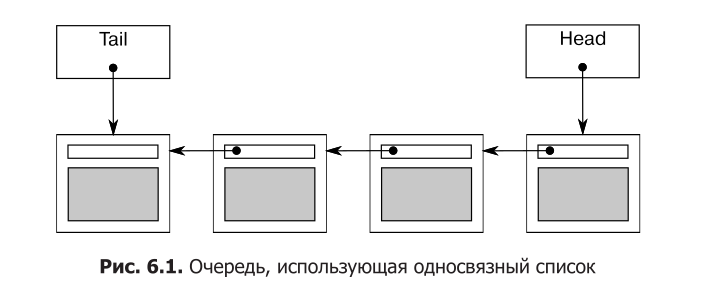

# Модуль 6. Конкурентные структуры данных с блокировками

## Лекция

### Зачем это нужно

В главе 5 мы спустились на самый низкий уровень — атомарные операции и модель
памяти. Теперь вернёмся на уровень структур данных. В реальных программах
потоки почти всегда обмениваются не просто флагами, а **данными**: очередями
задач, таблицами конфигурации, кэшами, списками подключений. Если к такой
структуре обращаются сразу несколько потоков, она обязана быть **потокобезопасной**:
ни один поток не должен увидеть нарушение её инвариантов, потерять или
повредить данные.

Наивный подход — взять `std::map`, `std::queue` или `std::list` и защитить его
отдельным мьютексом снаружи. Это работает, но плохо по двум причинам.

Во-первых, **интерфейсы стандартных контейнеров не рассчитаны на конкурентность**.
Раздельные `empty()`+`top()`+`pop()` у стека или `front()`+`pop()` у очереди —
это готовое состояние гонки: между вызовами другой поток может изменить
состояние структуры (мы подробно разбирали это в главе 3). Снаружи «прикрутить»
безопасность к такому интерфейсу невозможно — его надо перепроектировать.

Во-вторых, **единый мьютекс превращает любой доступ в сериализацию**: потоки
выстраиваются в очередь даже там, где могли бы работать параллельно (например,
несколько читателей или операции над разными частями структуры). Производительность
на многоядерной системе падает до «одного потока в момент времени».

Задача этой главы — научиться **проектировать** структуры данных, которые
безопасны для конкурентного доступа и при этом дают потокам реально работать
параллельно. Мы рассмотрим рекомендации, а затем применим их на практике
в порядке нарастания сложности: стек (один мьютекс), очередь с условной
переменной, очередь с подробной детализацией блокировок, поисковую таблицу
(мьютекс на каждый сегмент) и связанный список с эстафетной блокировкой по
узлам. В каждом случае мы будем оценивать, какие инварианты нужно защищать,
откуда берутся исключения и как устроена возможность конкурентного доступа.

Эта глава — прямое продолжение глав 3–4: там мы защищали «голые» данные,
здесь — целые структуры данных, и требования к проектированию интерфейса
становятся центральными.

### Что такое потокобезопасная структура данных

**Потокобезопасная** структура данных — такая, к которой несколько потоков
могут обращаться одновременно (выполняя одинаковые или разные операции),
и при этом:

- каждый поток видит непротиворечивое состояние структуры;
- данные не теряются и не повреждаются;
- все инварианты структуры поддерживаются;
- исключено состояние гонки за доступ к данным.

Важный нюанс: структура может быть безопасна **только для определённых видов**
доступа. Например, несколько потоков могут безопасно выполнять одну операцию,
а другая операция требует исключительного доступа. Или наоборот: конкурентный
доступ разных операций безопасен, а одинаковых — нет. Это надо осознанно
проектировать, а не предполагать «потокобезопасность вообще».

Ещё одно важное уточнение: **потокобезопасность ≠ гарантия правильности
логики**. Потокобезопасная структура гарантирует, что данные не повредятся
и инварианты не нарушатся, но она не решает, какая операция выполнится первой
при конкуренции. Порядок операций по-прежнему недетерминирован — это нормально
и неизбежно.

Разработка с учётом конкурентности — это не только про безопасность, но и про
**возможность конкурентного доступа**. Мьютекс по своей природе обеспечивает
взаимное исключение: в конкретный момент блокировку держит только один поток.
Это называется **сериализацией**: потоки обращаются к данным по очереди,
последовательно, а не одновременно. Чем больше «защищённая зона» — тем больше
операций сериализуется и тем хуже масштабируется структура. Идея проста:
**чем меньше защищённая область, тем выше возможность конкурентных обращений**.

Сериализация — не всегда зло. Если операции короткие, а потоков немного,
единый мьютекс может быть вполне адекватен. Проблемы начинаются, когда
конкуренция высокая или операции дорогие (выделение памяти, ввод-вывод):
тогда ожидание мьютекса съедает выигрыш от многопоточности, и стоит задуматься
о детализации блокировок или о структурах без блокировок (глава 7).

### Рекомендации по разработке конкурентных структур данных

При проектировании нужно следить за двумя аспектами: гарантия безопасности
и обеспечение настоящего конкурентного доступа. Из главы 3 мы знаем основы
потокобезопасности. Обобщим их в четыре правила.

1. **Гарантируй, что ни один поток не увидит нарушение инвариантов.**
   Инварианты — утверждения, верные в «спокойные» моменты (например, в стеке
   «каждый элемент доступен ровно из одного места»). Обновление структуры
   не должно быть видимо другим потокам в промежуточном виде.

2. **Не допускай состояний гонки, присущих интерфейсу.** Предоставляй функции
   **завершённых** операций, а не поэтапных. Классика — `empty()`+`top()`+`pop()`
   у стека: между вызовами другой поток может опустошить стек. Нужна единая
   операция «взять элемент».

3. **Обращай внимание на поведение при исключениях.** Если операция бросила
   исключение, структура должна остаться в корректном состоянии (инварианты
   соблюдены, данные не потеряны).

4. **Минимизируй вероятность взаимной блокировки.** Ограничивай область действия
   блокировок и по возможности исключай вложенные блокировки (правила главы 3).

Перед тем как проектировать, важно определить **ограничения на пользователя**:
если один поток обращается к структуре через конкретную функцию, какие функции
можно безопасно вызывать из других потоков одновременно? Как правило,
конструкторы и деструкторы требуют исключительного доступа — и это забота
пользователя. А вот операции вроде копирующего присваивания или `swap()` —
нетривиальны: разработчик должен решить, безопасны ли они при параллельном
вызове.

Второй вопрос — как добиться настоящей конкурентности. Конкретных рекомендаций
нет, есть перечень вопросов, на которые разработчик отвечает сам:

- можно ли ограничить область действия блокировок так, чтобы часть операции
  выполнялась за их пределами?
- можно ли защитить разные части структуры разными мьютексами?
- всем ли операциям нужен одинаковый уровень защиты?
- можно ли простым изменением структуры данных расширить конкурентность,
  не меняя семантику операций?

Все эти вопросы сводятся к одной идее: **свести к минимуму объём сериализации**.

### Потокобезопасный стек

Начнём с самого простого — потокобезопасного стека (одна структура данных,
один мьютекс).

#### Листинг 6.1. Определение класса для потокобезопасного стека

```cpp
#include <exception>
#include <stack>
#include <mutex>
#include <memory>

struct empty_stack : std::exception {
    const char* what() const noexcept override { return "empty stack"; }
};

template <typename T>
class threadsafe_stack {
    std::stack<T> data;
    mutable std::mutex m;
public:
    threadsafe_stack() {}
    threadsafe_stack(const threadsafe_stack& other) {
        std::lock_guard<std::mutex> lock(other.m);
        data = other.data;
    }
    threadsafe_stack& operator=(const threadsafe_stack&) = delete;

    void push(T new_value) {
        std::lock_guard<std::mutex> lock(m);
        data.push(std::move(new_value));
    }

    std::shared_ptr<T> pop() {
        std::lock_guard<std::mutex> lock(m);
        if (data.empty()) throw empty_stack();
        std::shared_ptr<T> const res(
            std::make_shared<T>(std::move(data.top())));
        data.pop();
        return res;
    }

    void pop(T& value) {
        std::lock_guard<std::mutex> lock(m);
        if (data.empty()) throw empty_stack();
        value = std::move(data.top());
        data.pop();
    }

    bool empty() const {
        std::lock_guard<std::mutex> lock(m);
        return data.empty();
    }
};
```

Оценим его по рекомендациям.

**Потокобезопасность.** Каждая компонентная функция защищена `lock_guard`.
В конкретный момент к данным обращается один поток. Если каждая функция
поддерживает инварианты, ни один поток не увидит их нарушение.

**Гонка интерфейса.** Между `empty()` и `pop()` есть потенциальная гонка
(другой поток может опустошить стек), но `pop()` сам проверяет пустоту под
блокировкой, поэтому гонка не приводит к проблеме. Возврат элемента прямо
из `pop()` — единая операция «взял и удалил», без раздельных `top()`+`pop()`.

**Исключения.** Разберём все источники.

- Блокировка мьютекса может бросить исключение (крайне редко, обычно это
  проблема системных ресурсов). Это первая операция в каждой функции, данных
  она не меняет — опасности нет.
- Разблокировка не может бросить, а `lock_guard` гарантирует, что мьютекс
  никогда не останется заблокированным.
- `data.push()` может бросить при копировании/перемещении значения или при
  нехватке памяти. `std::stack` гарантирует безопасность — стек не изменится.
- `pop()`: `empty_stack` бросает сам код до изменений — безопасно. `make_shared`
  может бросить при нехватке памяти — но стек ещё не изменён. Копирование
  значения в `res` тоже может бросить — опять же, до `data.pop()` стек не тронут.
- Второй `pop(T&)`: бросить может оператор присваивания копированием/перемещением
  в `value`. И снова до `data.pop()` изменений нет.
- `empty()` данных не меняет — безопасна.

**Deadlock.** Потенциальный источник — вызов пользовательского кода под
блокировкой: конструктор/присваивание элемента (в `push` и `pop`). Если этот
код вызовет функцию стека или попробует захватить другую блокировку, удерживая
нашу — возможна взаимная блокировка. Но ответственность разумно возложить
на пользователя: добавление/извлечение элемента не может обойтись без его
копирования.

**Возможность конкурентности.** Любые компонентные функции безопасно вызывать
из многих потоков (кроме конструктора/деструктора — они должны быть
эксклюзивными). Но в конкретный момент работает один поток — сильная
сериализация. Плюс стек не умеет ждать элемент: если потоку нужно дождаться
появления элемента, он вынужден крутиться в `empty()` или ловить `empty_stack`.
Для ожидания появления данных лучше подходит очередь с условной переменной.

### Потокобезопасная очередь с условными переменными

Очередь — более востребованная структура: это основа «производитель —
потребитель». Её интерфейс, как и у стека, отличается от `std::queue<>`:
раздельные `front()`+`pop()` заменяются единой операцией извлечения.

#### Листинг 6.2. Полное определение класса для потокобезопасной очереди с использованием условных переменных

```cpp
#include <queue>
#include <mutex>
#include <condition_variable>
#include <memory>

template <typename T>
class threadsafe_queue {
    mutable std::mutex mut;
    std::queue<T> data_queue;
    std::condition_variable data_cond;
public:
    threadsafe_queue() {}

    void push(T new_value) {
        std::lock_guard<std::mutex> lk(mut);
        data_queue.push(std::move(new_value));
        data_cond.notify_one();
    }

    void wait_and_pop(T& value) {
        std::unique_lock<std::mutex> lk(mut);
        data_cond.wait(lk, [this] { return !data_queue.empty(); });
        value = std::move(data_queue.front());
        data_queue.pop();
    }

    std::shared_ptr<T> wait_and_pop() {
        std::unique_lock<std::mutex> lk(mut);
        data_cond.wait(lk, [this] { return !data_queue.empty(); });
        std::shared_ptr<T> res(
            std::make_shared<T>(std::move(data_queue.front())));
        data_queue.pop();
        return res;
    }

    bool try_pop(T& value) {
        std::lock_guard<std::mutex> lk(mut);
        if (data_queue.empty()) return false;
        value = std::move(data_queue.front());
        data_queue.pop();
        return true;
    }

    std::shared_ptr<T> try_pop() {
        std::lock_guard<std::mutex> lk(mut);
        if (data_queue.empty()) return std::shared_ptr<T>();
        std::shared_ptr<T> res(
            std::make_shared<T>(std::move(data_queue.front())));
        data_queue.pop();
        return res;
    }

    bool empty() const {
        std::lock_guard<std::mutex> lk(mut);
        return data_queue.empty();
    }
};
```

От стека очередь отличается двумя вещами: `notify_one()` в `push()` и функциями
`wait_and_pop()`. Два `try_pop()` почти повторяют `pop()` стека, но вместо
исключения при пустой очереди возвращают `false` (или пустой `shared_ptr`).

**Новые `wait_and_pop()`** решают проблему ожидания появления элемента, которая
была у стека: вместо периодического опроса `empty()` поток вызывает
`wait_and_pop()`, и очередь сама ждёт через условную переменную. Пока очередь
пуста, `data_cond.wait()` не вернётся; когда элемент появится, ожидающий
проснётся, и данные по-прежнему будут защищены мьютексом. Новых гонок и deadlock
это не добавляет.

**Нюанс безопасности исключений.** Есть неприятный момент: если в ожидании
находится несколько потоков, `notify_one()` разбудит только один. Если этот поток
затем бросит исключение в `wait_and_pop()` (например, при `make_shared` из-за
нехватки памяти), остальные потоки разбужены не будут. Варианты решения:

- заменить `notify_one()` на `notify_all()` (разбудит всех, но большинство
  тут же уснёт снова, обнаружив пустую очередь);
- добавить `notify_one()` в `wait_and_pop()` на случай исключения;
- переместить создание `shared_ptr` в `push()` и хранить в очереди уже
  `std::shared_ptr<T>` — тогда копирование `shared_ptr` не бросает и
  `wait_and_pop()` становится безопасной.

Последний вариант показан в листинге 6.3.

#### Листинг 6.3. Потокобезопасная очередь, содержащая экземпляры std::shared_ptr

```cpp
template <typename T>
class threadsafe_queue {
    mutable std::mutex mut;
    std::queue<std::shared_ptr<T>> data_queue;
    std::condition_variable data_cond;
public:
    threadsafe_queue() {}

    void push(T new_value) {
        std::shared_ptr<T> data(
            std::make_shared<T>(std::move(new_value)));
        std::lock_guard<std::mutex> lk(mut);
        data_queue.push(data);
        data_cond.notify_one();
    }

    void wait_and_pop(T& value) {
        std::unique_lock<std::mutex> lk(mut);
        data_cond.wait(lk, [this] { return !data_queue.empty(); });
        value = std::move(*data_queue.front());
        data_queue.pop();
    }

    bool try_pop(T& value) {
        std::lock_guard<std::mutex> lk(mut);
        if (data_queue.empty()) return false;
        value = std::move(*data_queue.front());
        data_queue.pop();
        return true;
    }

    std::shared_ptr<T> wait_and_pop() {
        std::unique_lock<std::mutex> lk(mut);
        data_cond.wait(lk, [this] { return !data_queue.empty(); });
        std::shared_ptr<T> res = data_queue.front();
        data_queue.pop();
        return res;
    }

    std::shared_ptr<T> try_pop() {
        std::lock_guard<std::mutex> lk(mut);
        if (data_queue.empty()) return std::shared_ptr<T>();
        std::shared_ptr<T> res = data_queue.front();
        data_queue.pop();
        return res;
    }

    bool empty() const {
        std::lock_guard<std::mutex> lk(mut);
        return data_queue.empty();
    }
};
```

Теперь `pop`-функции, принимающие ссылку, разыменовывают указатель
(`*data_queue.front()`), а возвращающие `shared_ptr` — просто забирают его.
Плюс важное преимущество: распределение памяти под новый элемент происходит
**вне блокировки** в `push()`, а не под блокировкой в `pop()`, как было
в листинге 6.2. Распределение памяти — дорогая операция, и её вынос из-под
блокировки сокращает время удержания мьютекса.

Но и эта очередь по-прежнему защищена **одним** мьютексом на всю структуру
(`std::queue<>` — единый элемент данных, который либо защищён, либо нет).
В конкретный момент работает один поток. Чтобы поднять конкурентность, нужно
взять под контроль внутреннюю структуру данных.

### Очередь с подробной детализацией блокировок

Чтобы использовать несколько мьютексов, нужно «проникнуть внутрь» структуры
и связать отдельный мьютекс с каждой частью. Самая простая структура для
очереди — односвязный список.



Очередь состоит из указателя `head` на первый узел; каждый узел указывает на
следующий. Элементы удаляются из головы (заменой `head` на `head->next`),
а добавляются в хвост: у очереди есть указатель `tail` на последний узел,
новые узлы добавляются через `tail->next` с последующим обновлением `tail`.

#### Листинг 6.4. Простая реализация однопоточной очереди

```cpp
template <typename T>
class queue {
    struct node {
        T data;
        std::unique_ptr<node> next;
        node(T data_) : data(std::move(data_)) {}
    };
    std::unique_ptr<node> head;
    node* tail;
public:
    queue() : tail(nullptr) {}
    queue(const queue& other) = delete;
    queue& operator=(const queue& other) = delete;

    std::shared_ptr<T> try_pop() {
        if (!head) return std::shared_ptr<T>();
        std::shared_ptr<T> const res(
            std::make_shared<T>(std::move(head->data)));
        std::unique_ptr<node> const old_head = std::move(head);
        head = std::move(old_head->next);
        if (!head) tail = nullptr;
        return res;
    }

    void push(T new_value) {
        std::unique_ptr<node> p(new node(std::move(new_value)));
        node* const new_tail = p.get();
        if (tail) {
            tail->next = std::move(p);
        } else {
            head = std::move(p);
        }
        tail = new_tail;
    }
};
```

Обрати внимание: узлы управляются через `std::unique_ptr<node>`, поэтому они
(и данные) удаляются автоматически, без явного `delete`. Владение идёт от `head`,
а `tail` — просто сырой указатель на последний узел (он уже принадлежит `head`).

Попытка защитить `head` и `tail` двумя разными мьютексами выявит две проблемы:

1. **`push()` меняет и `head`, и `tail`** (при добавлении первого узла),
   значит, ему пришлось бы блокировать оба мьютекса.
2. **Главная проблема:** и `push()`, и `try_pop()` обращаются к полю `next`
   одного узла: `push()` пишет `tail->next`, `try_pop()` читает `head->next`.
   Если в очереди один элемент, то `head == tail`, и `head->next` и `tail->next` —
   один и тот же объект, нуждающийся в защите. Не прочитав `head` и `tail`,
   понять, что это один узел, невозможно. Значит, нужен один и тот же мьютекс
   в обеих функциях — никакого выигрыша.

**Решение — фиктивный узел (dummy node).** Заранее разместим в очереди пустой
узел, чтобы в ней всегда был хотя бы один узел. Тогда узел, к которому обращается
`head`, всегда отличен от узла, к которому обращается `tail` (при пустой очереди
`head == tail` указывают на фиктивный узел, но `try_pop()` в этом случае ничего
не читает из `head->next`). Как только добавляется первый настоящий узел,
`head` и `tail` указывают на разные узлы — гонки за `next` больше нет.

#### Листинг 6.5. Простая очередь с фиктивным узлом

```cpp
template <typename T>
class queue {
    struct node {
        std::shared_ptr<T> data;
        std::unique_ptr<node> next;
    };
    std::unique_ptr<node> head;
    node* tail;
public:
    queue() : head(new node), tail(head.get()) {}
    queue(const queue& other) = delete;
    queue& operator=(const queue& other) = delete;

    std::shared_ptr<T> try_pop() {
        if (head.get() == tail) return std::shared_ptr<T>();
        std::shared_ptr<T> const res(head->data);
        std::unique_ptr<node> const old_head = std::move(head);
        head = std::move(old_head->next);
        return res;
    }

    void push(T new_value) {
        std::shared_ptr<T> new_data(
            std::make_shared<T>(std::move(new_value)));
        std::unique_ptr<node> p(new node);
        tail->data = new_data;
        node* const new_tail = p.get();
        tail->next = std::move(p);
        tail = new_tail;
    }
};
```

Что изменилось:

- `try_pop()` сравнивает `head.get() == tail` (а не с `nullptr`), потому что
  `head` никогда не пуст — это фиктивный узел.
- В узле хранится указатель `data`, а не само значение — данные извлекаются
  напрямую (`head->data`), без создания нового `T`.
- `push()` сильно изменилась: сначала создаётся новый элемент в `shared_ptr`
  и новый (пустой) узел — новый будущий фиктивный узел. Затем старому
  фиктивному узлу (текущему `tail`) присваиваются данные, `tail->next` указывает
  на новый узел, и `tail` обновляется.
- Фиктивный узел создаётся в конструкторе.

Выигрыш: `push()` теперь обращается **только к `tail`**, а не к `head`.
`try_pop()` обращается и к `head`, и к `tail`, но `tail` нужен лишь для начального
сравнения. Главное — при наличии фиктивного узла `try_pop()` и `push()` никогда
не работают с одним и тем же узлом. Значит, можно использовать **два мьютекса**:
один для `head`, один для `tail`.

#### Листинг 6.6. Потокобезопасная очередь с более подробной детализацией блокировок

```cpp
#include <memory>
#include <mutex>

template <typename T>
class threadsafe_queue {
    struct node {
        std::shared_ptr<T> data;
        std::unique_ptr<node> next;
    };
    std::mutex head_mutex;
    std::unique_ptr<node> head;
    std::mutex tail_mutex;
    node* tail;

    node* get_tail() {
        std::lock_guard<std::mutex> tail_lock(tail_mutex);
        return tail;
    }

    std::unique_ptr<node> pop_head() {
        std::lock_guard<std::mutex> head_lock(head_mutex);
        if (head.get() == get_tail()) {
            return nullptr;
        }
        std::unique_ptr<node> const old_head = std::move(head);
        head = std::move(old_head->next);
        return old_head;
    }

public:
    threadsafe_queue() : head(new node), tail(head.get()) {}
    threadsafe_queue(const threadsafe_queue& other) = delete;
    threadsafe_queue& operator=(const threadsafe_queue& other) = delete;

    std::shared_ptr<T> try_pop() {
        std::unique_ptr<node> old_head = pop_head();
        return old_head ? old_head->data : std::shared_ptr<T>();
    }

    void push(T new_value) {
        std::shared_ptr<T> new_data(
            std::make_shared<T>(std::move(new_value)));
        std::unique_ptr<node> p(new node);
        node* const new_tail = p.get();
        std::lock_guard<std::mutex> tail_lock(tail_mutex);
        tail->data = new_data;
        tail->next = std::move(p);
        tail = new_tail;
    }
};
```

Куда ставятся блокировки? Цель — минимизировать время удержания.

- **`push()`:** мьютекс блокируется после распределения памяти (вне блокировки
  создаются `new_data` и узел `p`) и до присваивания данных текущему хвостовому
  узлу. Удерживается до конца функции.
- **`try_pop()`:** сначала блокируется `head_mutex` (он определяет, какой поток
  извлекает). После обновления `head` мьютекс можно снять. Для чтения `tail`
  нужен `tail_mutex`, но только на время чтения — это выносится в `get_tail()`.
  А поскольку код, которому нужен `head_mutex`, — часть логики, он тоже выносится
  в функцию `pop_head()`.

Проверим по инвариантам очереди:

- `tail->next == nullptr`;
- `tail->data == nullptr` (фиктивный узел пуст);
- `head == tail` означает пустую очередь;
- у списка с одним элементом `head->next == tail`;
- для каждого узла `x != tail`: `x->data` указывает на элемент, `x->next` — на
  следующий узел;
- следуя по `next` от `head`, рано или поздно попадёшь в `tail`.

**`push()` проста:** `tail_mutex` защищает изменения структуры, инвариант
сохраняется — новый хвост пуст, а старый хвостовой узел (теперь последний
настоящий) получил правильные `data` и `next`.

**`try_pop()` — самое интересное.** Оказывается, `tail_mutex` нужен не только
для защиты чтения `tail`, но и для того, чтобы не возникла гонка при чтении
данных из `head`. Без него `try_pop()` (в одном потоке) и `push()` (в другом)
могут одновременно обращаться к одним и тем же данным (все данные в очередь
попадают через `push`), не определяя порядок, — а это гонка за данные (UB,
глава 5). Блокировка `tail_mutex` в `get_tail()` решает проблему: `get_tail()`
блокирует тот же мьютекс, что и `push()`, значит, между ними определяется
порядок — `get_tail()` видит либо старое, либо новое значение `tail`, но никогда
не «промежуточное».

**Почему `get_tail()` обязан вызываться под `head_mutex`.** Если бы `get_tail()`
выполнялся вне блокировки `head_mutex`, поток мог бы «застрять» между вызовом
`get_tail()` и блокировкой `head_mutex`: другие потоки успели бы изменить
и `head`, и `tail`. Возвращённый узел перестал бы быть хвостовым и даже мог бы
выпасть из списка. Тогда сравнение `head` со старым `tail` дало бы ложный
результат, и при обновлении `head` можно «увести» его за `tail` и разрушить
структуру. Поэтому `get_tail()` вызывается под `head_mutex`: никакой другой
поток не может изменить `head`, а `tail` только продвигается вперёд по мере
добавления узлов. `head` никогда не перескочит за значение, возвращённое
`get_tail()`.

**Исключения.** В `try_pop()` исключения могут дать только блокировки, и данные
не меняются, пока блокировки не установлены. В `push()` распределение памяти
может бросить, но объекты сразу присваиваются умным указателям — при исключении
память освободится. После установки блокировки никакие операции в `push()`
бросить не могут. Обе функции безопасны.

**Deadlock.** Единственное место двух блокировок — `pop_head()`, которая всегда
блокирует `head_mutex`, а затем `tail_mutex`, всегда в этом порядке. Взаимная
блокировка невозможна.

**Конкурентность.** Существенно выше, чем у версии с одним мьютексом:
распределение памяти в `push()` идёт параллельно; `try_pop()` держит `tail_mutex`
только на время чтения `tail`; дорогой `delete` узла происходит вне блокировки.
Несколько потоков могут одновременно удалять свои старые узлы и возвращать
данные.

Разберём, почему удаление старого узла безопасно выполнять вне блокировки.
`pop_head()` возвращает `old_head` — `std::unique_ptr`, владеющий удаляемым узлом.
Владелец узла ровно один: узел был извлечён из списка (`head` переехал на
`old_head->next`), и никто другой не может до него добраться — все новые
операции начинают с нового `head`. Поэтому когда `old_head` разрушается
(в `try_pop()` после возврата из `pop_head()`), деструктор `unique_ptr` удаляет
узел без каких-либо блокировок — это не создаёт гонку. Именно это позволяет
держать `head_mutex` минимальное время.

Заметь также, что сами данные (`std::shared_ptr<T>` в узле) копируются в
`try_pop()` тоже вне блокировки: `pop_head()` вернул `old_head`, и чтение
`old_head->data` уже безопасно — никто не может изменить этот узел. Так
детализация блокировок «размазывает» работу за пределы критической секции.

**Ожидание появления элемента.** Добавим `wait_and_pop()` и в эту очередь.
С `push()` всё просто: в конце добавить `data_cond.notify_one()`. Но есть нюанс:
если держать мьютекс во время `notify_one()`, разбуженный поток будет ждать
снятия блокировки. Лучше снять блокировку до `notify_one()` (мы это обсуждали
в главе 4).

#### Листинг 6.7. Потокобезопасная очередь с блокировками и ожиданием: внутренний код и интерфейс

```cpp
template <typename T>
class threadsafe_queue {
private:
    struct node {
        std::shared_ptr<T> data;
        std::unique_ptr<node> next;
    };
    std::mutex head_mutex;
    std::unique_ptr<node> head;
    std::mutex tail_mutex;
    node* tail;
    std::condition_variable data_cond;
public:
    threadsafe_queue() : head(new node), tail(head.get()) {}
    threadsafe_queue(const threadsafe_queue& other) = delete;
    threadsafe_queue& operator=(const threadsafe_queue& other) = delete;

    std::shared_ptr<T> try_pop();
    bool try_pop(T& value);
    std::shared_ptr<T> wait_and_pop();
    void wait_and_pop(T& value);
    void push(T new_value);
    bool empty();
};
```

#### Листинг 6.8. Потокобезопасная очередь с блокировками и ожиданием: помещение в очередь новых значений

```cpp
template <typename T>
void threadsafe_queue<T>::push(T new_value) {
    std::shared_ptr<T> new_data(
        std::make_shared<T>(std::move(new_value)));
    std::unique_ptr<node> p(new node);
    {
        std::lock_guard<std::mutex> tail_lock(tail_mutex);
        tail->data = new_data;
        node* const new_tail = p.get();
        tail->next = std::move(p);
        tail = new_tail;
    }
    data_cond.notify_one();
}
```

С `wait_and_pop()` сложнее: надо решить, где ожидание и какой мьютекс
блокировать. Условие «очередь не пуста» в терминах списка — `head != tail`.
Но блокировать оба мьютекса для сравнения не нужно: можно выразить условие
как `head != get_tail()`, и тогда достаточно удержания `head_mutex`, который
и передаётся в `data_cond.wait()`.

#### Листинг 6.9. Потокобезопасная очередь с блокировками и ожиданием: wait_and_pop()

```cpp
template <typename T>
std::unique_lock<std::mutex> threadsafe_queue<T>::wait_for_data() {
    std::unique_lock<std::mutex> head_lock(head_mutex);
    data_cond.wait(head_lock, [&] { return head.get() != get_tail(); });
    return std::move(head_lock);
}

template <typename T>
std::unique_ptr<node> threadsafe_queue<T>::wait_pop_head() {
    std::unique_lock<std::mutex> head_lock(wait_for_data());
    return pop_head();
}

template <typename T>
std::unique_ptr<node> threadsafe_queue<T>::wait_pop_head(T& value) {
    std::unique_lock<std::mutex> head_lock(wait_for_data());
    value = std::move(*head->data);
    return pop_head();
}

template <typename T>
std::shared_ptr<T> threadsafe_queue<T>::wait_and_pop() {
    std::unique_ptr<node> const old_head = wait_pop_head();
    return old_head->data;
}

template <typename T>
void threadsafe_queue<T>::wait_and_pop(T& value) {
    std::unique_ptr<node> const old_head = wait_pop_head(value);
}
```

`wait_for_data()` заслуживает внимания: она не только ждёт на условной
переменной с предикатом, но и **возвращает блокировку вызывающему**.
Это гарантирует, что при изменении данных соответствующим `wait_pop_head()`
удерживается та же самая блокировка `head_mutex`.

Обрати внимание на нюанс с `wait_pop_head(T& value)`: чтобы не потерять элемент
при исключении, присваивание значения параметру должно происходить **под
блокировкой, до удаления узла** (`value = std::move(*head->data)` до
`pop_head()`). Если же сначала удалить узел, а потом присваивать, и присваивание
бросит исключение — элемент будет потерян (вернуть его в очередь нельзя).

#### Листинг 6.10. Потокобезопасная очередь с блокировками и ожиданием: try_pop() и empty()

```cpp
template <typename T>
std::unique_ptr<node> threadsafe_queue<T>::try_pop_head() {
    std::lock_guard<std::mutex> head_lock(head_mutex);
    if (head.get() == get_tail()) {
        return std::unique_ptr<node>();
    }
    return pop_head();
}

template <typename T>
std::unique_ptr<node> threadsafe_queue<T>::try_pop_head(T& value) {
    std::lock_guard<std::mutex> head_lock(head_mutex);
    if (head.get() == get_tail()) {
        return std::unique_ptr<node>();
    }
    value = std::move(*head->data);
    return pop_head();
}

template <typename T>
std::shared_ptr<T> threadsafe_queue<T>::try_pop() {
    std::unique_ptr<node> const old_head = try_pop_head();
    return old_head ? old_head->data : std::shared_ptr<T>();
}

template <typename T>
bool threadsafe_queue<T>::try_pop(T& value) {
    std::unique_ptr<node> const old_head = try_pop_head(value);
    return old_head ? true : false;
}

template <typename T>
bool threadsafe_queue<T>::empty() {
    std::lock_guard<std::mutex> head_lock(head_mutex);
    return head.get() == get_tail();
}
```

Это финальная версия очереди — неограниченная: потоки могут добавлять значения,
пока есть память. Существует и ограниченная очередь с фиксированной максимальной
длиной: когда она заполнена, попытки добавить либо сбой, либо блокируются, пока
не освободится место (это делается ожиданием на условной переменной в `push()`).
Ограниченные очереди пригодятся для распределения работы между потоками
(глава 8).

Зачем нужна ограниченная очередь? Представь «производителя» и «потребителя»
с сильно разной скоростью. Если очередь неограниченна, быстрый производитель
может заполнить память задачами, пока медленный потребитель их разбирает —
очередь растёт без предела, а вместе с ней и задержка обработки «свежих» задач.
Ограниченная очередь не даёт производителю сильно опережать потребителя: когда
место кончилось, производитель ждёт (или получает отказ), и система
саморегулируется. Это классический приём балансировки нагрузки.

Технически ограниченную очередь получают из нашей неограниченной почти даром:
в `push()` вместо ожидания появления элемента в очереди ждут, когда число
элементов станет меньше максимального, и лишь потом добавляют. Нужен отдельный
счётчик или проверка длины под блокировкой. Дальнейшие детали выходят за рамки
этой главы, но сам приём стоит держать в голове: условные переменные умеют ждать
и «полноту», а не только «пустоту».

### Потокобезопасная поисковая таблица

Стеки и очереди просты: интерфейс узкий, предназначение ясное. У большинства
структур данных операции шире, и защита сложнее. Рассмотрим **поисковую таблицу**
(словарь): значения одного типа (ключевого) связаны со значениями другого типа
(отображаемого). В стандартной библиотеке это `std::map`, `std::multimap`,
`std::unordered_map` и т.д.

Принцип использования другой, чем у стека или очереди: там почти каждая операция
что-то меняет, а поисковая таблица может меняться **крайне редко** (например,
кэш DNS). Но интерфейсы стандартных контейнеров снова не подходят: им присущи
состояния гонки (итераторы, раздельные проверки), поэтому их нужно пересматривать.

**Проблема итераторов.** Для `std::map<>` с точки зрения конкурентности самая
серьёзная проблема — итераторы. Сделать итератор, безопасный при параллельных
изменениях контейнера, очень сложно: другой поток может удалить элемент,
на который ссылается итератор. Поэтому в интерфейсе потокобезопасной поисковой
таблицы итераторов нет.

**Необходимые операции:**

- добавить новую пару «ключ — значение»;
- изменить значение, связанное с ключом;
- удалить ключ и значение;
- получить значение по ключу (если оно есть).

Плюс полезные операции над всем контейнером: проверка на пустоту, получение
копии всех пар.

Если просто накладывать единый мьютекс на каждую функцию — безопасно, но нет
конкурентности чтения. Вариант получше — `std::shared_mutex`: много читателей
или один писатель. Но хочется большего — конкурентных изменений в разных частях.

**Детализация блокировок.** Реализовать ассоциативный контейнер можно тремя
способами:

- бинарное дерево (красно-чёрное): каждые поиск и изменение начинаются с корня,
  который нужно блокировать, — почти как единая блокировка;
- отсортированный массив: заранее неизвестно, где данные, — нужна единая
  блокировка;
- **хеш-таблица**: при фиксированном числе сегментов принадлежность ключа
  сегменту — свойство ключа и хеш-функции. Значит, можно блокировать **каждый
  сегмент отдельно**. С `shared_mutex` на сегмент конкурентность возрастает
  в N раз (N — число сегментов).

Требуется хорошая хеш-функция; стандартный `std::hash<>` подходит для встроенных
типов и `std::string`, а пользователь может адаптировать его для своих ключей.

#### Листинг 6.11. Потокобезопасная поисковая таблица

```cpp
#include <vector>
#include <memory>
#include <mutex>
#include <functional>
#include <list>
#include <utility>
#include <shared_mutex>

template <typename Key, typename Value,
          typename Hash = std::hash<Key>>
class threadsafe_lookup_table {
    class bucket_type {
        using bucket_value = std::pair<Key, Value>;
        using bucket_data = std::list<bucket_value>;
        using bucket_iterator = typename bucket_data::iterator;

        bucket_data data;
        mutable std::shared_mutex mutex;

        bucket_iterator find_entry_for(Key const& key) const {
            return std::find_if(data.begin(), data.end(),
                [&](bucket_value const& item) {
                    return item.first == key;
                });
        }
    public:
        Value value_for(Key const& key,
                        Value const& default_value) const {
            std::shared_lock<std::shared_mutex> lock(mutex);
            bucket_iterator const found_entry = find_entry_for(key);
            return (found_entry == data.end())
                       ? default_value
                       : found_entry->second;
        }

        void add_or_update_mapping(Key const& key,
                                   Value const& value) {
            std::unique_lock<std::shared_mutex> lock(mutex);
            bucket_iterator const found_entry = find_entry_for(key);
            if (found_entry == data.end()) {
                data.push_back(bucket_value(key, value));
            } else {
                found_entry->second = value;
            }
        }

        void remove_mapping(Key const& key) {
            std::unique_lock<std::shared_mutex> lock(mutex);
            bucket_iterator const found_entry = find_entry_for(key);
            if (found_entry != data.end()) {
                data.erase(found_entry);
            }
        }
    };

    std::vector<std::unique_ptr<bucket_type>> buckets;
    Hash hasher;

    bucket_type& get_bucket(Key const& key) const {
        std::size_t const bucket_index = hasher(key) % buckets.size();
        return *buckets[bucket_index];
    }

public:
    using key_type = Key;
    using mapped_type = Value;
    using hash_type = Hash;

    threadsafe_lookup_table(
        unsigned num_buckets = 19, Hash const& hasher_ = Hash())
        : buckets(num_buckets), hasher(hasher_) {
        for (unsigned i = 0; i < num_buckets; ++i) {
            buckets[i].reset(new bucket_type);
        }
    }

    threadsafe_lookup_table(threadsafe_lookup_table const& other) = delete;
    threadsafe_lookup_table& operator=(
        threadsafe_lookup_table const& other) = delete;

    Value value_for(Key const& key,
                    Value const& default_value = Value()) const {
        return get_bucket(key).value_for(key, default_value);
    }

    void add_or_update_mapping(Key const& key, Value const& value) {
        get_bucket(key).add_or_update_mapping(key, value);
    }

    void remove_mapping(Key const& key) {
        get_bucket(key).remove_mapping(key);
    }
};
```

Разберём устройство.

- Сегменты хранятся в `std::vector<std::unique_ptr<bucket_type>>`; число сегментов
  задаётся в конструкторе (по умолчанию 19 — простое число; с простыми числами
  хеш-таблицы работают лучше).
- Каждый сегмент защищён `std::shared_mutex`: множество конкурентных чтений или
  единственная операция записи.
- Поскольку число сегментов фиксировано, `get_bucket()` вызывается **без
  блокировок** (хеш и взятие остатка не требуют синхронизации), а затем мьютекс
  конкретного сегмента блокируется для чтения (`shared_lock`) или записи
  (`unique_lock`).
- Внутри сегмента — список пар «ключ — значение» (`std::list`), поиск — через
  `find_entry_for()`.

**Семантика «если ключ есть».** При получении значения нужно решить, что вернуть,
если ключа нет. Варианты: значение по умолчанию (`default_value`),
`std::pair<mapped_type, bool>` (флаг наличия) или умный указатель (пустой — если
нет). В листинге используется значение по умолчанию. У каждого варианта свои
плюсы и минусы:

- **значение по умолчанию** — простое, но не отличает «ключ отсутствует»
  от «значение совпадает с умолчанием»;
- **пара с флагом** — честно сообщает о наличии, но чуть громоздка в использовании;
- **умный указатель** — пустой указатель однозначно означает отсутствие ключа,
  и значение не копируется лишний раз; но требует выделения памяти под результат.

Выбор зависит от задачи. Важно другое: какой бы вариант ни был выбран, операция
обязана быть **завершённой под одной блокировкой** — проверка наличия и чтение
значения не должны разделяться (иначе другой поток успеет удалить запись между
ними).

**Исключения.** `value_for` данные не меняет — безопасна. `remove_mapping`
использует `erase`, который не бросает, — безопасна. `add_or_update_mapping`
может бросить в двух ветках: `push_back` безопасен (при исключении список
не изменится), а вот присваивание существующему значению (`found_entry->second
= value`) может бросить, если бросает пользовательский оператор присваивания.
Это не повредит структуру в целом — ответственность на типе пользователя.

**Полный снимок таблицы.** Чтобы получить копию всего содержимого
(`std::map`), нужно заблокировать **все сегменты**. Это единственная операция,
которая блокирует больше одного сегмента, поэтому блокировка всех сегментов
в одном и том же порядке (по возрастанию индекса) делает взаимную блокировку
невозможной.

#### Листинг 6.12. Получение содержимого threadsafe_lookup_table в виде std::map

```cpp
std::map<Key, Value> threadsafe_lookup_table::get_map() const {
    std::vector<std::unique_lock<std::shared_mutex>> locks;
    for (unsigned i = 0; i < buckets.size(); ++i) {
        locks.push_back(
            std::unique_lock<std::shared_mutex>(buckets[i].mutex));
    }
    std::map<Key, Value> res;
    for (unsigned i = 0; i < buckets.size(); ++i) {
        for (auto it = buckets[i]->data.begin();
             it != buckets[i]->data.end(); ++it) {
            res.insert(*it);
        }
    }
    return res;
}
```

Блокировки собираются в вектор, чтобы гарантировать, что все они будут сняты
(при выходе из функции). Блокировка в порядке возрастания индекса исключает
deadlock. Возвращается копия — наружу не выходит ни одной ссылки на внутренние
данные.

### Потокобезопасный список с эстафетной блокировкой

Список — одна из самых востребованных структур. Вопрос — какие операции нужны
и как организовать итерацию. Итераторы STL-стиля здесь невозможны: итератор
хранит ссылку на внутреннюю структуру, и при параллельном изменении контейнера
эта ссылка должна оставаться действительной — потребовалось бы удерживать
итератором блокировку на часть структуры. А время жизни итератора контейнер
не контролирует. Поэтому итераторы заменяются **функциями итерации внутри
контейнера**: `for_each`, `find_first_if`, `remove_if`.

Недостаток такого подхода: функция итерации вызывает пользовательский код,
удерживая внутреннюю блокировку, и передаёт ему ссылку на элемент. Это значит,
что ответственность за отсутствие взаимных блокировок и гонок перекладывается
на пользователя (как в главе 3 — не вызывай пользовательский код под
блокировкой).

**Замысел детализации:** мьютекс на **каждый узел**. Операции удерживают
блокировки только тех узлов, которые их интересуют, и снимают блокировку узла
по мере перемещения к следующему — это **эстафетная блокировка**
(hand-over-hand locking).

#### Листинг 6.13. Потокобезопасный список с поддержкой итерации

```cpp
#include <memory>
#include <mutex>

template <typename T>
class threadsafe_list {
    struct node {
        std::mutex m;
        std::shared_ptr<T> data;
        std::unique_ptr<node> next;
        node() : next() {}
        node(T const& value) : data(std::make_shared<T>(value)) {}
    };

    node head;

public:
    threadsafe_list() {}
    ~threadsafe_list() { remove_if([](T const&) { return true; }); }
    threadsafe_list(threadsafe_list const& other) = delete;
    threadsafe_list& operator=(threadsafe_list const& other) = delete;

    void push_front(T const& value) {
        std::unique_ptr<node> new_node(new node(value));
        std::lock_guard<std::mutex> lk(head.m);
        new_node->next = std::move(head.next);
        head.next = std::move(new_node);
    }

    template <typename Function>
    void for_each(Function f) {
        node* current = &head;
        std::unique_lock<std::mutex> lk(head.m);
        while (node* const next = current->next.get()) {
            std::unique_lock<std::mutex> next_lk(next->m);
            lk.unlock();
            f(*next->data);
            current = next;
            lk = std::move(next_lk);
        }
    }

    template <typename Predicate>
    std::shared_ptr<T> find_first_if(Predicate p) {
        node* current = &head;
        std::unique_lock<std::mutex> lk(head.m);
        while (node* const next = current->next.get()) {
            std::unique_lock<std::mutex> next_lk(next->m);
            lk.unlock();
            if (p(*next->data)) {
                return next->data;
            }
            current = next;
            lk = std::move(next_lk);
        }
        return std::shared_ptr<T>();
    }

    template <typename Predicate>
    void remove_if(Predicate p) {
        node* current = &head;
        std::unique_lock<std::mutex> lk(head.m);
        while (node* const next = current->next.get()) {
            std::unique_lock<std::mutex> next_lk(next->m);
            if (p(*next->data)) {
                std::unique_ptr<node> old_next = std::move(current->next);
                current->next = std::move(next->next);
                next_lk.unlock();
            } else {
                lk.unlock();
                current = next;
                lk = std::move(next_lk);
            }
        }
    }
};
```

Это односвязный список; голова `head` — узел, созданный по умолчанию,
с `next == nullptr`. Новые узлы добавляются через `push_front()`: узел создаётся
и данные размещаются **вне** блокировки, затем блокируется только мьютекс
головы для обновления двух указателей — риск deadlock отсутствует.

**`for_each()`** применяет функцию ко всем элементам. Здесь работает эстафетная
блокировка с перекрытием: сначала блокируется `head.m`; получив указатель
на следующий узел `next`, блокируем его мьютекс; теперь можно снять блокировку
предыдущего узла и вызвать функцию. По завершении `current` переходит
на обработанный узел, и владение блокировкой перемещается (`lk = std::move(next_lk)`).
Функция `f` получает элемент (`*next->data`) напрямую — под блокировкой его узла,
поэтому доступ безопасен.

**`find_first_if()`** похожа на `for_each`, но предикат возвращает `true`
при совпадении; тогда возвращаются данные узла (`next->data`), и поиск
прекращается.

**`remove_if()`** должна обновлять список, поэтому `for_each` не подходит.
Если предикат вернул `true` — узел удаляется обновлением `current->next`,
блокировка `next_lk` снимается, а узел уничтожается, когда `unique_ptr`
(в который он перемещён) выходит из области видимости. `current` не обновляется,
чтобы проверить новый узел `next`. Если предикат вернул `false` — обычное
продвижение.

**Безопасность.** При корректных предикатах/функциях deadlock и гонки
исключены: итерация всегда в одном направлении, всегда начинается с `head`
и всегда блокирует следующий мьютекс, прежде чем разблокировать текущий, —
иного порядка блокировок в других потоках быть не может. Единственный кандидат
на гонку — удаление узла в `remove_if()`, которое выполняется **после**
разблокировки мьютекса (уничтожение заблокированного мьютекса — UB). Но это
безопасно: на предыдущем узле (`current`) мьютекс всё ещё удерживается, поэтому
ни один новый поток не сможет захватить блокировку удаляемого узла.

**Конкурентность.** Разные потоки могут одновременно работать с разными узлами.
Но поскольку мьютексы блокируются по порядку, потоки не обгоняют друг друга:
если один поток долго обрабатывает конкретный узел, другим потокам, подошедшим
к этому узлу, придётся ждать.

**Сравнение с поисковой таблицей.** В таблице конкурентность достигалась за счёт
разделения на независимые сегменты: разные потоки работали с разными бакетами,
не мешая друг другу вообще. В списке конкурентность «по узлам» работает похоже,
но с оговоркой: операциям, которые идут по всему списку (`for_each`,
`find_first_if`, `remove_if`), всё равно приходится продвигаться по одному
направлению, эстафетно передавая блокировку. Поэтому параллельные обходы списка
не могут обгонять друг друга — они делят узлы последовательно. Это нормальная
плата за то, что итерация «встроена» в контейнер, а не реализована итераторами,
которые невозможно сделать безопасными при конкурентных изменениях.

**Границы применимости.** Список с мьютексом на узел хорош, когда операции
короткие и локализованные. Если же на каждом узле выполняется тяжёлая работа,
лучше подумать о структуре без блокировок (глава 7) или о пересмотре разбиения
данных. Впрочем, для большинства практических задач (очереди задач, кэши,
списки активных подключений) перечисленные в этой главе приёмы дают отличный
баланс простоты и производительности.

### Типичные ошибки

**Один глобальный мьютекс на структуру, когда можно детализировать.** Если
потоки только читают, а операции короткие — читатели сериализуются. Используй
`shared_mutex` (много читателей) или несколько мьютексов на части структуры.

**Интерфейс с раздельными операциями (`empty()`+`top()`+`pop()`).** Классическая
интерфейсная гонка. Проектируй единую операцию, которая делает всё под одной
блокировкой (например, `pop()` возвращает `shared_ptr`).

**Возврат ссылки/указателя на внутренние данные из «потокобезопасной» функции.**
Стоило функции вернуть ссылку на элемент — защита рушится: любой код со ссылкой
обращается к данным без блокировки. Возвращай копии или `shared_ptr`.

**Вызов пользовательского кода под блокировкой.** Если функция, вызванная под
блокировкой, попробует захватить ту же или другую блокировку — deadlock или
гонка. Это одна из главных причин, почему интерфейс `std::map<>` (итераторы)
непригоден для конкурентности.

**Два мьютекса, захваченные в разном порядке.** Взаимная блокировка. Захватывай
всегда в одном порядке (например, `head_mutex` → `tail_mutex`, или по индексу
сегмента).

**В очереди с детализацией — `get_tail()` вне блокировки `head_mutex`.**
`head` может «перескочить» за `tail` и разрушить структуру. Сравнивай `head`
с `tail` только под `head_mutex`.

**Удаление узла после снятия его блокировки.** Уничтожение заблокированного
мьютекса — UB. В `remove_if()` удаляемый узел защищён мьютексом предыдущего
узла, который ещё удерживается.

**Присваивание значения параметру `value` после удаления узла.** Если
присваивание бросит исключение, элемент потерян. Перемещай значение в параметр
**под блокировкой, до удаления узла**.

### Шпаргалка

| Структура | Примитив | Ключевые инварианты | Что даёт |
|-----------|----------|---------------------|----------|
| Потокобезопасный стек | один `std::mutex` | единая операция `pop()`, исключение `empty_stack` | простота; сериализация |
| Очередь с cv | один `std::mutex` + `condition_variable` | `wait_and_pop` ждёт непустоту | ожидание появления данных |
| Очередь с `shared_ptr` | один `std::mutex` + cv | выделение памяти вне блокировки | меньше времени блокировки |
| Очередь с детализацией | `head_mutex` + `tail_mutex` | фиктивный узел, `get_tail()` под `head_mutex` | параллельные push/pop |
| Поисковая таблица | `shared_mutex` на бакет | бакет фиксирован, блокировка по индексу | конкурентное чтение, параллельные записи в разные бакеты |
| Список с эстафетной блокировкой | `std::mutex` на узел | блокировка следующего до снятия текущего | параллельная работа с разными узлами |

## Лаборатории модуля

| Лаба | Тип | Суть одной строкой |
|------|-----|--------------------|
| [6.1. Почини гонку в очереди с детализацией](labs/lab-06-01-fine-grained-queue/task.md) | найди и почини | исправь `get_tail()` вне блокировки `head_mutex` — head «перескакивает» за tail |
| [6.2. Потокобезопасная поисковая таблица](labs/lab-06-02-threadsafe-lookup-table/task.md) | допиши TODO | допиши методы бакета `value_for`/`add_or_update_mapping`/`remove_mapping` на `shared_mutex` |
| [6.3. Список с эстафетной блокировкой](labs/lab-06-03-threadsafe-list/task.md) | напиши с нуля | реализуй `for_each`/`find_first_if`/`remove_if` с мьютексом на узел |