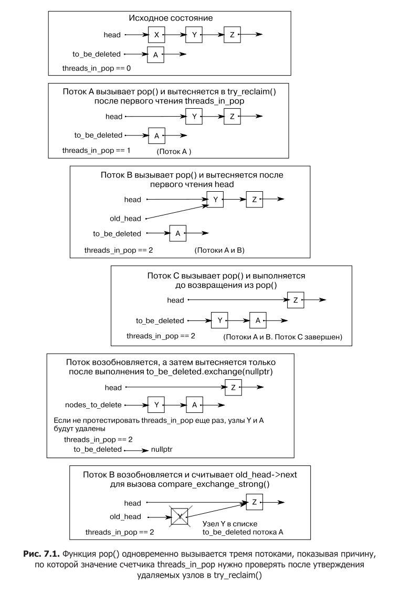

# Модуль 7. Конкурентные структуры данных без блокировок

## Лекция

### Зачем это нужно

В главе 6 мы строили потокобезопасные структуры на мьютексах: чем мельче
детализация блокировок, тем выше конкурентность, но полностью избавиться
от блокировок не удавалось. Мьютекс по своей природе означает ожидание:
пока один поток держит блокировку, остальные стоят. Это сериализация, и она
ограничивает масштабируемость.

А что, если убрать блокировки вовсе и синхронизироваться только атомарными
операциями (глава 5)? Такие структуры называются **свободными от блокировок**
(lock-free). У них два главных преимущества:

1. **Максимальная конкурентность.** Поток делает «подвижки» на каждом шаге,
   никого не блокируя. Пока один поток выполняет операцию, остальные могут
   работать параллельно.
2. **Надёжность.** Если поток умирает, не сняв мьютекс, заблокированная
   структура данных портится навсегда. В lock-free структуре при гибели потока
   теряются только его собственные незавершённые данные, а остальные потоки
   продолжают работу.

Почему мьютексы ограничивают? Представь очередь задач: несколько потоков-
потребителей ждут, пока продюсер положит работу. С мьютексом вся синхронизация —
сериализация: в конкретный момент к структуре обращается один поток. Даже
при аккуратной детализации блокировок (глава 6) остаются ситуации, когда поток
вынужден ждать. Ждать — значит терять время процессора и масштабируемость:
чем больше потоков, тем больше конкуренция за мьютекс и тем хуже они работают
параллельно.

Плата за это — сложность. Lock-free код осмыслить трудно, а ошибки в нём
проявляются редко и коварно: они зависят от тонких подробностей упорядочения
памяти и планировщика, поэтому тесты могут годами не показывать проблему.
Прежде чем писать такие структуры, нужно понимать, какие гарантии прогресса
они дают и какие есть альтернативы.

Ещё одно важное замечание: «lock-free» не означает «мгновенно». Атомарные
операции — не бесплатные. На многих процессорах атомарная инструкция в десятки
раз дороже неатомарной: процессору приходится синхронизировать кэши и запрещать
переупорядочение. В lock-free коде таких операций много, поэтому общая
производительность может оказаться даже ниже, чем у хорошо написанной версии
с мьютексами. Выбор между блокирующей и lock-free структурой — это инженерный
баланс, который подтверждается профилированием, а не догадками.

### Определения: типы неблокирующих структур данных

Структуры данных и алгоритмы, которые **не используют блокирующие библиотечные
функции** (мьютексы, условные переменные, фьючерсы), называются **неблокирующими**
(non-blocking). Но «неблокирующий» — слишком широкое понятие. Например,
спин-блокировка на `std::atomic_flag` (листинг 7.1) не вызывает блокирующих
функций, но это всё равно мьютекс: в конкретный момент его может захватить
только один поток. Поэтому различают более конкретные категории.

#### Листинг 7.1. Реализация мьютекса со спин-блокировкой, использующего std::atomic_flag

```cpp
#include <atomic>

class spinlock_mutex {
    std::atomic_flag flag;
public:
    spinlock_mutex() : flag(ATOMIC_FLAG_INIT) {}

    void lock() {
        while (flag.test_and_set(std::memory_order_acquire)) {
            // активное ожидание
        }
    }

    void unlock() {
        flag.clear(std::memory_order_release);
    }
};
```

Код не блокируется, но `lock()` может «крутиться» бесконечно, пока другой поток
не освободит мьютекс. Такой код неблокирующий, но **не** свободный от блокировок.

Три важные категории:

- **Свободный от помех (Obstruction-Free)** — если все остальные потоки
  приостановлены, рассматриваемый поток завершит свою операцию за ограниченное
  число шагов. Практически бесполезно: паузы в других потоках случаются редко,
  и никто не гарантирует, что поток когда-нибудь останется один. Эта категория
  интересна в основном как «низшая планка»: любой более сильный гарантий
  подразумевает и свободу от помех.
- **Свободный от блокировок (Lock-Free)** — если над структурой работают
  несколько потоков, то после ограниченного числа шагов **хотя бы один** из них
  завершит свою операцию. Гарантирован «прогресс системы», но конкретный поток
  может «голодать»: его операцию всё время опережают другие. Это классическая
  категория для CAS-циклов.
- **Свободный от ожиданий (Wait-Free)** — **каждый** поток завершит свою операцию
  за ограниченное число шагов, независимо от поведения других. Самая сильная
  гарантия и самая сложная реализация: нужно, чтобы шаги одного потока не могли
  «перебить» операцию другого. На практике wait-free структуры редки и сложны.

Почему CAS-циклы часто означают lock-free, но не wait-free? Операция
`compare_exchange_weak` в цикле может повторяться неограниченно, если другие
потоки постоянно «перебивают» её изменения. Система в целом прогрессирует
(какой-то поток успевает), но конкретный поток может крутиться долго — его
CAS каждый раз проваливается, потому что другой поток успел изменить `head`
до него. Поэтому большинство примеров этой главы — lock-free, но не wait-free.
Диспетчеризация операционной системы может дать одному потоку множество
попыток, а другим — почти ни одной, и всё равно гарантия lock-free
выполняется: пока хотя бы один поток продвигается, система в порядке.

### За и против структур без блокировок

**Почему lock-free:**

- **Конкурентность.** Поток всегда продвигается, никто не ждёт. Это особенно
  важно при высокой конкуренции.
- **Надёжность.** Смерть потока не портит структуру навсегда (в отличие
  от зависшего мьютекса).

**Почему не всегда:**

- **Сложность.** Нужно поддерживать инварианты без блокировок и аккуратно
  упорядочивать атомарные операции. Гонка за данные — UB; недостаточно просто
  использовать атомарные операции, нужно ещё обеспечить правильный порядок
  видимости. Кроме того, нельзя исключить потоки из доступа к структуре:
  если поток застрял на середине операции, остальные должны продолжать,
  — а значит, инварианты приходится формулировать так, чтобы они переживали
  «полусделанные» операции.
- **Производительность.** Атомарные операции дороже неатомарных (иногда
  в десятки раз), и в lock-free коде их много. Плюс кэш-эффекты: потоки,
  конкурирующие за одну атомарную переменную, заставляют процессоры
  синхронизировать кэш-линии. В главе 8 этот эффект («ложное совместное
  использование») будет разобран подробно. Итог: lock-free код может быть
  медленнее блокирующего при низкой конкуренции.
- **Динамические взаимные блокировки.** Обычных deadlock нет, но появляются
  «динамические»: два потока вечно повторяют CAS, мешая друг другу завершить
  операцию. Аналогия — два человека, пытающиеся одновременно пройти в узкий
  проход: каждый отступает и пробует снова, и никто не проходит. Обычно такие
  «блокировки» недолговечны (зависят от планировщика), но снижают
  производительность. Wait-free структуры от них застрахованы, но они сложнее
  и требуют больше шагов даже без конкуренции.

Вывод: lock-free оправдан, когда конкурентность действительно критична,
и только после профилирования. Иначе проще и надёжнее мьютекс. Замерять стоит
не только среднее время, но и максимальное ожидание, и общее время выполнения —
зависит от задачи.

### Lock-free стек

Стек — самая простая структура для начала. В нём и `push()`, и `pop()`
работают с одним узлом — `head`. Схема push проста:

1. создать новый узел;
2. установить его `next` в текущее значение `head`;
3. установить `head` на новый узел.

В многопоточной среде шаги 2–3 — гонка: два потока могут прочитать одно
и то же `head` и «перезаписать» изменения друг друга. Решение — на шаге 3
использовать CAS: операция сравнения-обмена гарантирует, что `head` не изменился
с момента чтения; если изменился — повторить.

#### Листинг 7.2. Реализация push() без блокировок

```cpp
#include <atomic>

template <typename T>
class lock_free_stack {
    struct node {
        T data;
        node* next;
        node(T const& data_) : data(data_) {}
    };
    std::atomic<node*> head;
public:
    void push(T const& data) {
        node* const new_node = new node(data);
        new_node->next = head.load();
        while (!head.compare_exchange_weak(new_node->next, new_node)) {
            // при неудаче new_node->next уже обновлён актуальным head
        }
    }
};
```

Ключевой приём: при неудачном CAS первый аргумент (`new_node->next`) обновляется
текущим значением `head`, поэтому перезагружать `head` вручную не нужно —
цикл просто повторяется с уже обновлённым `next`. Узел полностью готов
до публикации в `head`: после того как `head` укажет на него, менять его нельзя,
потому что его начнут читать другие потоки.

`push()` свободен от блокировок: если другие потоки приостановлены, CAS
успешен, и операция завершается.

Теперь `pop()`. Наивная схема:

1. прочитать `head`;
2. прочитать `head->next`;
3. установить `head` в `head->next`;
4. вернуть `data`;
5. удалить узел.

Проблемы:

- **Двойное извлечение.** Два потока могут прочитать одно и то же `head`
  и оба вернуть один узел — нарушается смысл стека. Решается CAS при обновлении
  `head`: успешен только у одного потока.
- **Висячий указатель.** Если поток А извлёк узел и удалил его (шаг 5),
  а поток Б ещё держит указатель на этот узел и читает `next` (шаг 2) — это
  разыменование висячего указателя, UB. Поэтому шаг 5 (удаление) — самая
  серьёзная проблема lock-free кода. В первой версии мы просто не удаляем узлы
  («утечка»), чтобы избежать UB.
- **Пустой стек.** `head == nullptr` — нужно проверять в цикле.

#### Листинг 7.3. Свободный от блокировок стек, допускающий утечку узлов

```cpp
#include <atomic>
#include <memory>

template <typename T>
class lock_free_stack {
    struct node {
        std::shared_ptr<T> data;
        node* next;
        node(T const& data_) : data(std::make_shared<T>(data_)) {}
    };
    std::atomic<node*> head;
public:
    void push(T const& data) {
        node* const new_node = new node(data);
        new_node->next = head.load();
        while (!head.compare_exchange_weak(new_node->next, new_node)) {}
    }

    std::shared_ptr<T> pop() {
        node* old_head = head.load();
        while (old_head &&
               !head.compare_exchange_weak(old_head, old_head->next)) {
            // при неудаче old_head обновлён актуальным head
        }
        return old_head ? old_head->data : std::shared_ptr<T>();
    }
};
```

Почему `shared_ptr<T>` для данных? В главе 6 мы видели: возврат значения
по ссылке небезопасен при исключении (копирование может бросить, и значение
потеряется). Здесь же узел уже извлечён, и копировать данные «назад» нельзя.
`shared_ptr<T>` в узле решает проблему: распределение памяти под данные
происходит в `push()` (там всё равно выделяется узел), а `pop()` просто
возвращает `shared_ptr` — без исключений и потерь.

Этот код корректен по логике, но **утекает узлы** (`new node` в `push()`
никогда не освобождается). Если есть сборщик мусора — можно остановиться.
В C++ его нет, поэтому утилизацией памяти нужно заниматься самостоятельно.

### Управление памятью: утечки и список отложенного удаления

Проблема: узел можно удалить, только когда никакой другой поток не держит
на него указатель. В push() другие потоки к уже добавленным узлам не обращаются,
а вот в pop() несколько потоков могут прочитать одно и то же `old_head`
до того, как один из них победит в CAS. Значит, нужно отслеживать, когда узел
безопасно удалять.

Первый подход — **подсчёт потоков в pop()**. Заведём атомарный счётчик
`threads_in_pop`: при входе в `pop()` увеличиваем, при выходе уменьшаем.
Если счётчик равен 1 — этот поток единственный, кто сейчас в pop(), значит,
можно удалять и извлечённый узел, и все узлы из списка отложенного удаления.
Если не равен 1 — узел отправляется в список отложенного удаления
(`to_be_deleted`), а удаление откладывается.

#### Листинг 7.4. Высвобождение памяти при отсутствии вызовов pop()

```cpp
#include <atomic>
#include <memory>

template <typename T>
class lock_free_stack {
    std::atomic<unsigned> threads_in_pop{0};
    void try_reclaim(node* old_head);
public:
    std::shared_ptr<T> pop() {
        ++threads_in_pop;                       // вошли в pop
        node* old_head = head.load();
        while (old_head &&
               !head.compare_exchange_weak(old_head, old_head->next)) {}
        std::shared_ptr<T> res;
        if (old_head) {
            res.swap(old_head->data);           // выгружаем данные из узла
        }
        try_reclaim(old_head);                  // пытаемся утилизировать
        return res;
    }
};
```

`res.swap(old_head->data)` выгружает данные из узла до его (отложенного)
удаления: если узел ещё жив, данные уже не удерживаются им.

Механизм утилизации `try_reclaim()` (листинг 7.5): если счётчик равен 1 —
мы единственные в pop(), можно удалить и текущий узел, и весь список
отложенного удаления; иначе узел добавляется в список отложенного удаления,
а счётчик уменьшается. Список формируется через CAS по голове `to_be_deleted`
(та же схема, что в push стека).

#### Листинг 7.5. Механизм утилизации памяти на основе подсчёта потоков

```cpp
template <typename T>
class lock_free_stack {
    std::atomic<node*> to_be_deleted;

    static void delete_nodes(node* nodes) {
        while (nodes) {
            node* next = nodes->next;
            delete nodes;
            nodes = next;
        }
    }

    void try_reclaim(node* old_head) {
        if (threads_in_pop == 1) {              // мы единственные в pop()
            node* nodes_to_delete = to_be_deleted.exchange(nullptr);
            if (!--threads_in_pop) {
                delete_nodes(nodes_to_delete);
            } else if (nodes_to_delete) {
                chain_pending_nodes(nodes_to_delete);
            }
            delete old_head;
        } else {
            chain_pending_node(old_head);
            --threads_in_pop;
        }
    }
    // chain_pending_nodes / chain_pending_node — добавление узлов
    // в список отложенного удаления через CAS по to_be_deleted
};
```

Почему счётчик нужно проверять **после** захвата списка `exchange`? На рисунке 7.1
показана коварная ситуация: пока поток А читает счётчик, поток B заходит
в `pop()` и добавляет узел в список отложенного удаления; поток C всё ещё держит
указатель на этот узел и собирается читать его `next`. Если А удалит список,
не убедившись, что никто больше не войдёт в `pop()` — поток C разыменует
удалённый узел, это UB.



Поэтому порядок в `try_reclaim()` строгий: сначала `to_be_deleted.exchange(nullptr)`
«забирает» весь список, потом счётчик уменьшается, и только если он стал нулевым —
список удаляется. Если между этими шагами в `pop()` вошёл другой поток
(счётчик снова вырос), список возвращается обратно через `chain_pending_nodes`.

Как формируется список отложенного удаления? Узлы связываются через их же поле
`next` (оно к этому моменту уже не используется для основной очереди/стека).
`chain_pending_nodes(first, last)` прикрепляет цепочку к голове `to_be_deleted`
через CAS: `last->next = to_be_deleted; while (!to_be_deleted.compare_exchange_weak(last->next, first)) {}`.
Если за это время другой поток изменил голову списка — CAS обновит `last->next`
и цикл повторится. Добавление одного узла — частный случай, когда первый узел
цепочки совпадает с последним.

У этого подхода есть слабость: в условиях высокой загруженности «затишья»
(момента, когда счётчик равен 1) может не быть, и список отложенного удаления
будет расти бесконечно. Нужен более точный механизм — например, указатели
опасности.

Ещё важный нюанс про **исключения в lock-free коде**. В главе 3 мы решили
проблему потери значения при исключении передачей результата по ссылке.
В lock-free это невозможно: узел уже извлечён, «вернуть» его нельзя. Поэтому
данные хранятся в `shared_ptr`, а `pop()` возвращает `shared_ptr` — операция
не бросает, и значение не теряется. Все места, где может быть исключение
(распределение памяти под узел и данные), выносятся в `push()`, где структура
ещё не изменена и исключение безопасно.

### Указатели опасности (hazard pointers)

Идея указателей опасности: поток, собирающийся обратиться к объекту, который
может быть удалён другим потоком, «объявляет» его **указателем опасности**
(если на узел есть указатель опасности — удалять его опасно). Поток, желающий
удалить объект, сначала проверяет все указатели опасности других потоков:
если на объект никто не ссылается — можно удалять, иначе — отложить.

Практическая реализация в C++:

- таблица указателей опасности: массив пар «id потока — указатель»;
- `get_hazard_pointer_for_current_thread()` возвращает указатель опасности
  текущего потока (через `thread_local` объект `hp_owner`, который при первом
  обращении находит свободную запись в таблице через CAS);
- `pop()` перед разыменованием `old_head` устанавливает указатель опасности
  на него, проверяя в цикле, что `head` не изменился (иначе узел мог быть удалён);
- после извлечения узла указатель опасности снимается, и если других указателей
  опасности на узел нет — узел удаляется, иначе — откладывается.

#### Листинг 7.6. Реализация pop(), применяющей указатели опасности

```cpp
std::shared_ptr<T> pop() {
    std::atomic<void*>& hp = get_hazard_pointer_for_current_thread();
    node* old_head = head.load();
    do {
        node* temp;
        do {
            temp = old_head;
            hp.store(old_head);              // объявляем узел опасным
            old_head = head.load();
        } while (old_head != temp);          // узел не удалён между чтениями
    }
    while (old_head &&
           !head.compare_exchange_strong(old_head, old_head->next));
    hp.store(nullptr);                       // узел извлечён, опасность снята
    std::shared_ptr<T> res;
    if (old_head) {
        res.swap(old_head->data);
        if (outstanding_hazard_pointers_for(old_head)) {
            reclaim_later(old_head);         // на узел ещё ссылаются — отложить
        } else {
            delete old_head;
        }
        delete_nodes_with_no_hazards();
    }
    return res;
}
```

Внутренний цикл гарантирует: узел, на который установлен указатель опасности,
не был удалён между чтением `head` и установкой указателя. `compare_exchange_strong`
используется вместо `weak`, потому что в цикле ложный сбой `weak` привёл бы
к ненужной переустановке указателя опасности.

Разберём вспомогательные механизмы.

**Где хранить указатели опасности?** Нужна таблица, видимая всем потокам:
массив пар «идентификатор потока — указатель». Каждый поток, обращающийся
к структуре, владеет ровно одной записью. Класс `hp_owner` при создании
проходит по массиву и через `compare_exchange_strong` «занимает» свободную
запись (сравнивает id с пустым `std::thread::id` и записывает свой id).
Если свободных записей нет — исключение (потоков больше, чем рассчитано).
В деструкторе указатель сбрасывается в `nullptr`, а id — в пустой, освобождая
запись для других.

```cpp
class hp_owner {
    hazard_pointer* hp;
public:
    hp_owner() : hp(nullptr) {
        for (unsigned i = 0; i < max_hazard_pointers; ++i) {
            std::thread::id old_id;
            if (hazard_pointers[i].id.compare_exchange_strong(
                    old_id, std::this_thread::get_id())) {
                hp = &hazard_pointers[i];
                break;
            }
        }
        if (!hp) throw std::runtime_error("No hazard pointers available");
    }
    std::atomic<void*>& get_pointer() { return hp->pointer; }
    ~hp_owner() {
        hp->pointer.store(nullptr);
        hp->id.store(std::thread::id());
    }
};

std::atomic<void*>& get_hazard_pointer_for_current_thread() {
    thread_local static hp_owner hazard;
    return hazard.get_pointer();
}
```

Ключевая деталь — `thread_local`: при первом обращении потока создаётся
`hp_owner`, таблица сканируется один раз, дальше указатель кэшируется, и повторное
сканирование не нужно. Уничтожение `thread_local` объекта при завершении потока
автоматически освобождает запись.

**Проверка ссылок на узел.** `outstanding_hazard_pointers_for(p)` сканирует
таблицу и возвращает `true`, если хоть одна запись содержит `p`. Записи без
владельца можно не проверять: у них нулевой указатель, сравнение всё равно
даст `false`.

**Утилизация отложенных узлов.** Поскольку указатели опасности — механизм общего
назначения, в списке отложенного удаления хранится `void*` и функция удаления.
Структура `data_to_reclaim` (шаблонный конструктор) сохраняет `void*` и
`std::function<void(void*)>` — безопасную обёртку функции `do_delete<T>`,
которая приводит `void*` к `T*` и вызывает `delete`. Деструктор `data_to_reclaim`
выполняет удаление. `reclaim_later(data)` создаёт такой объект и добавляет
его в список через CAS по голове (`add_to_reclaim_list`).

`delete_nodes_with_no_hazards()` «забирает» весь список через `exchange(nullptr)`,
затем проходит по узлам: если на узел нет указателей опасности — удаляет,
иначе возвращает в список для следующей попытки.

**Недостатки и оптимизации.** Сканирование таблицы при каждом `pop()` и для
каждого отложенного узла — дорого: атомарные операции очень неспешны, а тут
их много. Варианты улучшения:

- ждать, пока в списке утилизации не накопится больше `max_hazard_pointers`
  узлов, и только тогда пытаться утилизировать (гарантированно освободится
  минимум `max_hazard_pointers` узлов);
- держать локальный список утилизации на каждый поток — атомарные переменные
  для счётчика и доступа к списку не нужны вовсе (память тратится щедрее).

Отдельно стоит помнить: технология указателей опасности была запатентована
(IBM), что в ряде юрисдикций ограничивает её применение в коммерческом
программном обеспечении. Срок патента истёк, но перед использованием стоит
проверить.

### Подсчёт ссылок

Альтернатива указателям опасности — **подсчёт ссылок**: отслеживать не список
используемых узлов, а число потоков, обращающихся к каждому узлу.

Соблазнительно взять `std::shared_ptr`: это и есть указатель с подсчётом ссылок.
Но стандартные атомарные операции над `std::shared_ptr`
(`std::atomic_load`, `std::atomic_compare_exchange_weak`) не гарантируют
свободы от блокировок — внутри может быть мьютекс. Если `std::atomic_is_lock_free`
для вашей реализации возвращает `true` — можно использовать `std::shared_ptr<node>`
как атомарную голову (листинг 7.9). Иначе — писать подсчёт ссылок вручную.

#### Листинг 7.9. Свободный от блокировок стек с lock-free реализацией std::shared_ptr

```cpp
#include <memory>

template <typename T>
class lock_free_stack {
    struct node {
        std::shared_ptr<T> data;
        std::shared_ptr<node> next;
        node(T const& data_) : data(std::make_shared<T>(data_)) {}
    };
    std::shared_ptr<node> head;
public:
    void push(T const& data) {
        std::shared_ptr<node> const new_node = std::make_shared<node>(data);
        new_node->next = std::atomic_load(&head);
        while (!std::atomic_compare_exchange_weak(
                   &head, &new_node->next, new_node)) {}
    }
    std::shared_ptr<T> pop() {
        std::shared_ptr<node> old_head = std::atomic_load(&head);
        while (old_head && !std::atomic_compare_exchange_weak(
                   &head, &old_head,
                   std::atomic_load(&old_head->next))) {}
        if (old_head) {
            std::atomic_store(&old_head->next, std::shared_ptr<node>());
            return old_head->data;
        }
        return std::shared_ptr<T>();
    }
    ~lock_free_stack() { while (pop()) {} }
};
```

Важная деталь: после извлечения узла его `next` очищается
(`std::atomic_store(&old_head->next, ...)`) — иначе при уничтожении последнего
`shared_ptr` на узел цепочка узлов уничтожалась бы рекурсивно (глубокое
вложение → переполнение стека).

Когда `shared_ptr` не lock-free, приходится считать ссылки вручную. Приём —
**раздельные счётчики** для каждого узла:

- **внешний счётчик** (`external_count`) — хранится вместе с указателем на узел
  (в структуре `counted_node_ptr`, которую можно обернуть в `std::atomic<>`),
  увеличивается при каждом чтении указателя;
- **внутренний счётчик** (`internal_count`) — хранится в самом узле,
  уменьшается, когда поток завершил чтение узла.

Сумма счётчиков — общее число ссылок на узел. Когда внешняя пара «счётчик +
указатель» больше не нужна (узел извлечён из списка), внутренний счётчик
увеличивается на (внешний счётчик − 1), а внешний сбрасывается. Когда внутренний
счётчик обнуляется — ссылок нет, узел можно удалить.

#### Листинг 7.11. Помещение узла в lock-free стек с раздельными счётчиками ссылок

```cpp
#include <atomic>
#include <memory>

template <typename T>
class lock_free_stack {
    struct node;
    struct counted_node_ptr {
        int external_count;
        node* ptr;
    };
    struct node {
        std::shared_ptr<T> data;
        std::atomic<int> internal_count{0};
        counted_node_ptr next;
        node(T const& data_) : data(std::make_shared<T>(data_)) {}
    };
    std::atomic<counted_node_ptr> head;

public:
    void push(T const& data) {
        counted_node_ptr new_node;
        new_node.ptr = new node(data);
        new_node.external_count = 1;          // одна внешняя ссылка — head
        new_node.ptr->next = head.load();
        while (!head.compare_exchange_weak(new_node.ptr->next, new_node)) {}
    }
    // pop() — ниже
};
```

`counted_node_ptr` — простая структура, поэтому её можно использовать
с `std::atomic<>`. На платформах с операцией сравнения и обмена двойного слова
(DWCAS) `std::atomic<counted_node_ptr>` будет lock-free. Если нет — лучше
использовать вариант со `shared_ptr` из листинга 7.9, потому что иначе внутри
атомарного типа спрячется мьютекс, и «lock-free» станет фикцией.

Заметка про размер: в очереди (см. ниже) счётчиков становится больше, и их
упаковывают в битовые поля, чтобы вся структура помещалась в машинное слово
и оставалась lock-free на 32- и 64-битных машинах. Например, `internal_count`
занимает 30 бит, а `external_counters` — 2 бита, и всё вместе — 32-битное слово.
Это стандартный приём: атомарные операции над словом поддерживаются аппаратно,
а над большими структурами — нет.

В `pop()` сначала нужно **увеличить внешний счётчик** узла, считанного из `head`,
прежде чем разыменовывать его указатель: иначе другой поток может удалить узел
между чтением и обращением. Увеличение — через цикл CAS, меняющий всю структуру
`counted_node_ptr` целиком. Это приём `increase_head_count()`.

#### Листинг 7.12. Извлечение узла из lock-free стека с разделённым счётчиком ссылок

```cpp
template <typename T>
class lock_free_stack {
    void increase_head_count(counted_node_ptr& old_counter) {
        counted_node_ptr new_counter;
        do {
            new_counter = old_counter;
            ++new_counter.external_count;
        } while (!head.compare_exchange_strong(old_counter, new_counter));
        old_counter.external_count = new_counter.external_count;
    }

public:
    std::shared_ptr<T> pop() {
        counted_node_ptr old_head = head.load();
        for (;;) {
            increase_head_count(old_head);
            node* const ptr = old_head.ptr;
            if (!ptr) return std::shared_ptr<T>();

            if (head.compare_exchange_strong(old_head, ptr->next)) {
                std::shared_ptr<T> res;
                res.swap(ptr->data);          // выгружаем данные
                // складываем внешний и внутренний счётчики:
                int const count_increase = old_head.external_count - 2;
                if (ptr->internal_count.fetch_add(count_increase) ==
                    -count_increase) {
                    delete ptr;               // последняя ссылка — удаляем
                }
                return res;
            }
            else if (ptr->internal_count.fetch_sub(1) == 1) {
                delete ptr;                   // этот поток — последний
            }
        }
    }
};
```

Разбор ключевых деталей.

- **`increase_head_count`** увеличивает внешний счётчик на 1, показывая, что этот
  поток держит ссылку. Это гарантирует безопасность разыменования `ptr`.
- При успешном CAS по `head` узел извлечён. Внешний счётчик `old_head.external_count`
  уже увеличен на 1 этим потоком. Прибавляется `count_increase = external_count − 2`:
  единицу вычитаем за то, что узел ушёл из списка (головная ссылка исчезла),
  ещё одну — за то, что этот поток больше не ссылается на узел после извлечения.
  Если внутренний счётчик обнулился — удаляем.
- При неудаче CAS другой поток уже извлёк/изменил узел. Уменьшаем внутренний
  счётчик на 1 (поток больше не ссылается). Если было 1 — стал 0, удаляем.

`data` выгружается из узла через `swap`, чтобы данные не удерживались узлом
дольше, чем нужно.

### Применение модели памяти к lock-free стеку

По умолчанию все атомарные операции используют `seq_cst` — самый простой
для понимания, но дорогой. После того как логика отлажена, можно ослабить
упорядочение. Разберём, какие минимальные требования нужны.

В `push()` единственная атомарная операция, которая должна установить
отношение «происходит до» с `pop()` — это CAS по `head`. Чтобы данные узла
были видны читающему потоку, CAS должен быть операцией **освобождения**
(`memory_order_release`). При неудаче ничего не изменяется — достаточно `relaxed`:

```cpp
void push(T const& data) {
    counted_node_ptr new_node;
    new_node.ptr = new node(data);
    new_node.external_count = 1;
    new_node.ptr->next = head.load(std::memory_order_relaxed);
    while (!head.compare_exchange_weak(
               new_node.ptr->next, new_node,
               std::memory_order_release, std::memory_order_relaxed)) {}
}
```

В `pop()` прежде чем обращаться к полю `next` узла, нужна операция **захвата**
(`acquire`). Ею является успешный CAS в `increase_head_count()`. Неудачный CAS
просто повторяет цикл — `relaxed`:

```cpp
void increase_head_count(counted_node_ptr& old_counter) {
    counted_node_ptr new_counter;
    do {
        new_counter = old_counter;
        ++new_counter.external_count;
    } while (!head.compare_exchange_strong(
                 old_counter, new_counter,
                 std::memory_order_acquire, std::memory_order_relaxed));
    old_counter.external_count = new_counter.external_count;
}
```

Почему этого достаточно: сохранение в `push()` (release) синхронизируется
с успешным CAS в `increase_head_count()` (acquire) — отношение «происходит до»
устанавливается, и чтение `ptr->next` безопасно. Начальная `head.load(relaxed)`
не требует строгости.

Аналогично с освобождением узлов: только один поток выполняет `delete` (тот,
кто обнулил счётчик), поэтому нужен acquire только ему. Поскольку `fetch_add` —
операция чтения-изменения-записи, она участвует в последовательности
освобождений, и достаточно дополнительного `load(acquire)` в ветви, где узел
удаляется. В итоге финальная версия (листинг 7.13) использует relaxed/acquire/
release в нужных местах — код корректнее и быстрее, но на 37 строк вместо
восьми в версии с мьютексом из главы 6. Такова цена lock-free.

### Lock-free очередь

Очередь сложнее стека: `push()` и `pop()` работают с разными концами
(`head` и `tail`), и изменения одного конца должны быть видимы другому.
Начнём с простого варианта — один поставщик и один потребитель (SPSC).

#### Листинг 7.14. Свободная от блокировок очередь с одним поставщиком и одним потребителем

```cpp
#include <atomic>
#include <memory>

template <typename T>
class lock_free_queue {
    struct node {
        std::shared_ptr<T> data;
        node* next;
        node() : next(nullptr) {}
    };
    std::atomic<node*> head;
    std::atomic<node*> tail;

    node* pop_head() {
        node* const old_head = head.load();
        if (old_head == tail.load()) return nullptr;
        head.store(old_head->next);
        return old_head;
    }
public:
    lock_free_queue() : head(new node), tail(head.load()) {}
    ~lock_free_queue() {
        while (node* const old_head = head.load()) {
            head.store(old_head->next);
            delete old_head;
        }
    }

    std::shared_ptr<T> pop() {
        node* old_head = pop_head();
        if (!old_head) return std::shared_ptr<T>();
        std::shared_ptr<T> const res(old_head->data);
        delete old_head;
        return res;
    }

    void push(T new_value) {
        std::shared_ptr<T> new_data(std::make_shared<T>(new_value));
        node* p = new node;
        node* const old_tail = tail.load();
        old_tail->data.swap(new_data);
        old_tail->next = p;
        tail.store(p);
    }
};
```

Пока `push()` вызывается одним потоком, а `pop()` — одним, всё корректно:
сохранение в `tail` синхронизировано с загрузкой `tail` в `pop_head()`,
и данные видимы. Разберём цепочку «происходит до»: сохранение `data` в узле
происходит до сохранения в `tail` (один поток, порядок в коде); сохранение
в `tail` синхронизируется с загрузкой из `tail` (это атомарные операции,
сохранение — освобождение, загрузка — захват, значения совпадают); загрузка
из `tail` происходит до чтения `data` из узла (один поток, порядок в коде).
По транзитивности сохранение `data` происходит до чтения `data` — безопасно.

Но если `push()` вызывают несколько потоков — оба прочитают одно и то же `tail`,
оба будут писать в один узел — гонка за данные. Аналогично несколько `pop()`
дадут двойное извлечение. Нужно больше.

Для `pop()` применяются те же приёмы, что в стеке (увеличение внешнего счётчика
перед разыменованием, CAS при извлечении). Сложнее с `push()`: узел, на который
ссылается `tail`, имеет **два** внешних счётчика — из самого `tail` и из `next`
предыдущего узла. Поэтому в структуру `node` добавляется счётчик `external_counters`
(всего их может быть не больше двух — два бита), обновляемый вместе
с `internal_count` как единое целое через CAS (листинг 7.16). При инициализации
узла `external_counters = 2` — на новый узел ссылаются и `tail`, и `next`
предыдущего узла.

Почему «как единое целое»? Если обновлять счётчики отдельно, два потока могут
одновременно решить, что они «последние», и оба удалить узел — это UB.
Обновление всей структуры `count` одним CAS гарантирует, что решение об удалении
принимает ровно один поток.

`increase_external_count()` в очереди — та же идея, что `increase_head_count()`
в стеке, но параметризована: она получает ссылку на обновляемый атомарный
счётчик, а не использует только `head`. `free_external_counter()` освобождает
внешний счётчик: уменьшает `external_counters` на 1 и прибавляет значение
внешнего счётчика к `internal_count`; если оба обнулились — узел удаляется.
`release_ref()` освобождает одну ссылку на узел (уменьшает `internal_count`
через CAS по всей структуре `count`).

Дальше выясняется проблема производительности: после того как один поток
успешно установил `data` в хвостовом узле, остальные `push()` крутятся в CAS
(узел уже «занят»), пока первый не обновит `tail`. Это фактически активное
ожидание — блокировка, причём хуже обычной: ОС не может отдать приоритет потоку,
владеющему «невидимой» блокировкой, и ожидающие потоки впустую тратят
процессорное время. Чтобы снова стать lock-free, применяется приём
**помощи другому потоку**: ожидающий поток сам завершает незавершённые шаги
«застрявшего» потока — устанавливает `next` хвостового узла и обновляет `tail`.

Почему это корректно? Пустые узлы неразличимы: неважно, чей узел окажется
новым хвостом — лишь бы данные были установлены и `tail` продвинут. Поэтому
поток, который не смог установить свои данные (узел занят), берёт на себя
завершение чужой операции: обновляет `next` через CAS и переводит `tail`
на новый узел. После этого его собственная попытка повторяется с актуальным
`tail`. Для этого `next` становится атомарным, а `push()` — громоздким
(листинг 7.22): если `data` уже установлена — «помогаем» (обновляем `next`
и `tail`); если не установлена — пытаемся установить свою. Вспомогательная
функция `set_new_tail()` аккуратно обновляет `tail`, различая два исхода:
успешно обновлён (освободить старый внешний счётчик) или уже изменён другим
потоком (освободить свою ссылку).

При каждом проходе цикла выделяется память под узлы, поэтому распределитель
критичен для производительности: используются отдельные распределители
на поток и списки свободных узлов. Неудачный распределитель может полностью
разрушить масштабируемость такого контейнера — производительность lock-free
кода сильно зависит от того, как выделяется и освобождается память.

### Рекомендации по созданию структур без блокировок

Рекомендации из главы 6 (инварианты, интерфейс без гонок, исключения,
минимизация deadlock) остаются в силе. Но для lock-free кода их недостаточно.

**1. Для прототипа используй `memory_order_seq_cst`.** Разобраться в нём проще
всего: все операции выстраиваются в единый порядок, и рассуждать о корректности
можно как об обычной последовательной программе. Сначала доведи логику
до работоспособности на `seq_cst`, и только потом, понимая отношения «происходит
до», ослабляй до acquire/release/relaxed. Ослабление — оптимизация, и делать её
нужно осознанно, операция за операцией, каждый раз проверяя, какое отношение
«синхронизируется с» должно сохраниться.

Это особенно важно, потому что **тесты не доказывают корректность lock-free кода**:
код может работать при тестировании, но быть неверным — просто на вашем
оборудовании и при вашем планировщике гонка не проявилась. Модель памяти
допускает переупорядочения, которые тестовая машина не воспроизводит.
Инструменты вроде ThreadSanitizer помогают ловить гонки за данные, но не все
логические ошибки lock-free алгоритмов.

**2. Воспользуйся схемой утилизации памяти.** Управление памятью — главная
сложность lock-free кода. Важно не удалить объект, пока на него есть ссылки
из других потоков, но и не копить память бесконечно. Три метода этой главы:
   - дождаться отсутствия обращений (подсчёт потоков в pop);
   - указатели опасности;
   - подсчёт ссылок.
Все они сводятся к одному: отслеживать число потоков, обращающихся к объекту,
и удалять объект только когда ссылок нет. Есть и другие схемы: сборщик мусора
(сильно упрощает алгоритм, но в C++ редкость), повторное использование узлов
(free list) — но там возникает проблема ABA. Выбор схемы — инженерный компромисс
между сложностью, производительностью и потреблением памяти.

**3. Остерегайся проблемы ABA.** Это классическая ловушка CAS-алгоритмов.
Сценарий:

1. Поток 1 читает значение `x` — оно равно A.
2. Поток 1 выполняет операцию, основанную на A (например, разыменование).
3. Поток 1 приостанавливается.
4. Поток 2 меняет `x` на B.
5. Поток 2 меняет данные, связанные с A (например, освобождает память по этому
   указателю или переиспользует узел).
6. Поток 2 снова устанавливает `x` в A (например, переиспользованный узел
   с тем же адресом).
7. Поток 1 возобновляется, CAS видит A и успешно срабатывает — но это уже
   **другое** A (тот же адрес, другие данные). Результат — повреждение структуры.

От проблемы ABA не защищает «равенство значений»: CAS сравнивает значения,
а не «тот же ли это объект». Чаще всего защищаются счётчиком ABA: в атомарную
переменную включается счётчик, увеличивающийся при каждой замене; CAS выполняется
над объединённой структурой «указатель + счётчик», и даже если адрес вернулся —
счётчик другой, CAS провалится. Проблема ABA особенно характерна для алгоритмов
с переиспользованием узлов (free list), где освобождённый узел быстро возвращается
в оборот под тем же адресом.

**4. Выявляй циклы активного ожидания и организуй помощь другому потоку.**
Если поток в цикле ждёт завершения операции другого потока — это фактически
блокировка (спин-лок), только хуже: ОС не может дать приоритет «владельцу»
невидимой блокировки, и ожидающие потоки сжигают процессорное время впустую.
Решение — переделать алгоритм так, чтобы ожидающий поток сам выполнял
незавершённые шаги застрявшего потока. Мы видели это на очереди: ожидающий
`push()` помогает завершить установку `next` и обновление `tail`.

Как обнаружить скрытое активное ожидание? Ищи циклы, из которых поток
не выходит, пока другой поток не продвинется: бесконечный `while` вокруг CAS,
который «застревает» на занятом узле. Если цикл гарантированно завершается
только благодаря чужой операции — это ожидание. Правило простое: **поток,
которому досталось процессорное время, должен делать полезную работу**, а не
крутиться впустую. Помощь другому потоку превращает ожидание в прогресс:
любой поток, выполнивший хоть один шаг, приближает завершение чьей-то операции.

В более сложных структурах «помощь» может потребовать серьёзных изменений
алгоритма: превращения обычных полей в атомарные, добавления CAS в места,
где раньше были простые присваивания, и т.д. Но без этого структура не является
по-настоящему свободной от блокировок — она лишь притворяется ею.

**Как подойти к написанию lock-free структуры.** Соберём общий порядок действий
из рекомендаций:

1. Начни с `memory_order_seq_cst` — доведи логику до работоспособности.
2. Докажи себе инварианты: какие поля защищают структуру, какие отношения
   «происходит до» нужны между `push` и `pop`.
3. Реши проблему управления памятью: подсчёт потоков, указатели опасности
   или подсчёт ссылок.
4. Подумай о проблеме ABA (особенно при переиспользовании узлов).
5. Проверь, нет ли скрытых активных ожиданий; если есть — организуй помощь.
6. Только после этого ослабляй упорядочение, операция за операцией,
   каждый раз объясняя, какое отношение «синхронизируется с» сохраняется.

Каждый шаг проверяй инструментами: компиляция с санитайзерами
(`-fsanitize=thread`), стресс-тесты с большим числом потоков и итераций.
Помни: отсутствие ошибок в тестах не доказывает корректность lock-free кода —
ошибки проявляются только на «правильном» сочетании планировщика и архитектуры.

### Типичные ошибки

**CAS-цикл без перезагрузки `expected`.** Первый аргумент `compare_exchange_*`
обновляется при неудаче — используй обновлённое значение в новой попытке,
иначе бесконечный цикл.

**Публикация узла до его полной готовности.** После того как `head` укажет
на узел, менять его нельзя — другие потоки начнут его читать. Готовь узел
полностью до CAS.

**Двойное извлечение в pop.** Если `pop()` не использует CAS при обновлении
`head`, два потока вернут один узел. Всегда CAS.

**Раннее удаление узла.** Узел нельзя удалять, пока другой поток держит
на него указатель. Это UB (висячий указатель). Используй указатели опасности,
подсчёт ссылок или отложенное удаление.

**Проблема ABA при переиспользовании узлов.** Равное значение ≠ тот же объект.
Защищайся счётчиком ABA.

**Использование `shared_ptr` без lock-free атомарности.** Стандартные
`atomic_load`/`atomic_store` над `shared_ptr` могут внутри использовать мьютекс —
тогда структура не lock-free. Проверяй `is_lock_free`.

**seq_cst везде без необходимости.** Правильная отправная точка, но дорогая.
После отладки ослабляй до acquire/release/relaxed там, где это безопасно.

**Активное ожидание вместо помощи другому потоку.** Если поток крутится,
пока другой завершает операцию — это скрытая блокировка. Помогай другому потоку.

**Не проверил пустоту в `pop()`.** Если `head == nullptr`, разыменование
`old_head->next` в CAS-цикле — UB. Проверяй `old_head` в условии цикла.

**Выгружал данные после удаления узла.** Если узел уже удалён, обращение
к `old_head->data` — висячий указатель. Выгружай данные (`swap`) сразу после
успешного CAS, до утилизации узла.

**Использовал `weak` там, где нужен `strong` без цикла.** `compare_exchange_weak`
может ложно провалиться. Вне цикла (например, для установки указателя опасности)
`weak` приведёт к лишним повторам — используй `strong`.

**Перепутал порядок: увеличил счётчик после разыменования.** Внешний счётчик
узла нужно увеличивать **до** разыменования указателя, иначе узел может быть
удалён между чтением и обращением.

### Шпаргалка

| Приём | Где применяется | Что даёт |
|-------|-----------------|----------|
| CAS-цикл (`compare_exchange_*`) | push/pop любой lock-free структуры | атомарное «проверь и обнови», прогресс без блокировок |
| `shared_ptr<T>` в узле | данные стека/очереди | безопасность при исключении, удержание данных после извлечения |
| Подсчёт потоков в pop | отложенное удаление узлов | удаление в «затишье», когда никто не в pop |
| Указатели опасности | утилизация памяти | точное знание, что узел не используется |
| Раздельные счётчики ссылок | утилизация памяти | ссылка безопасна до её явного освобождения |
| Освобождение (release) в push | видимость данных | «происходит до» между push и pop |
| Захват (acquire) в pop | чтение узла | синхронизация с публикацией узла |
| Счётчик ABA | защита от ABA | CAS не срабатывает на «старое» значение |
| Помощь другому потоку | MPSC-очередь | устранение активного ожидания, lock-free push |

## Лаборатории модуля

| Лаба | Тип | Суть одной строкой |
|------|-----|--------------------|
| [7.1. Lock-free стек через CAS](labs/lab-07-01-lock-free-stack/task.md) | напиши с нуля | реализуй `push`/`pop` стека на CAS с `shared_ptr<T>` (утечка узлов допустима) |
| [7.2. Почини публикацию узла до готовности](labs/lab-07-02-publish-before-ready/task.md) | найди и почини | исправь `push`, который публикует узел в `head` до заполнения данных — гонка |
| [7.3. Проблема ABA](labs/lab-07-03-aba-problem/task.md) | предскажи вывод | объясни сценарий ABA в стеке с переиспользованием узлов и защиту счётчиком |