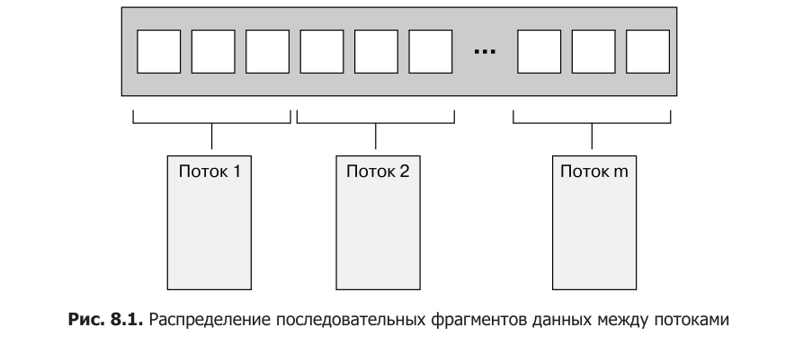
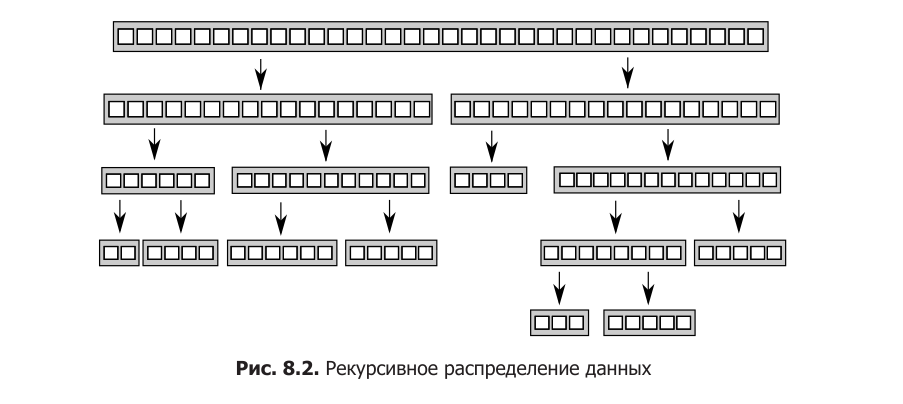
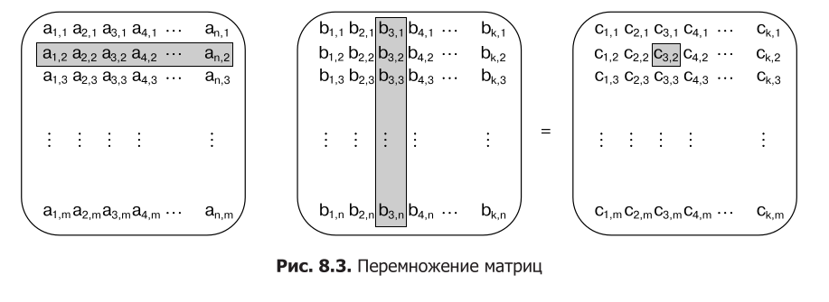

# Модуль 8. Разработка конкурентного кода

## Лекция

### Зачем это нужно

Писать конкурентный код — не значит только расставлять мьютексы и атомарные
операции. Прежде чем открыть редактор, нужно ответить на три вопроса: сколько
потоков задействовать, какие задачи поручить каждому из них и как убедиться,
что параллельная версия действительно быстрее, а не просто сложнее.

Наивный подход «запустим для каждой задачи свой поток» быстро упирается в
ограничения: потоки стоят дорого, их слишком много — и приложение начинает
тормозить из-за переключений. А плохо выбранный способ деления работы может
свести на нет весь выигрыш от многопоточности, даже если каждый поток делает
правильные вещи. В этой главе разберём, как распределять работу, что
происходит с производительностью на уровне кэш-памяти и как писать
параллельные алгоритмы, которые не «разваливаются» при исключении и
масштабируются на большое число ядер.

### Способы распределения работы между потоками

Есть три принципиально разных способа разделить работу между потоками:
раздать данные заранее, распределять рекурсивно в процессе обработки или
раздать потокам разные по типу задачи. Выбор зависит от структуры данных и
алгоритма.

#### Распределение данных до начала обработки

Самый простой случай — алгоритм вроде `std::for_each`, который применяет
одну и ту же операцию к каждому элементу диапазона. Такую работу легко
разделить заранее: берём диапазон, режем его на блоки и назначаем каждый блок
своему потоку. Простейшая схема — последовательные фрагменты: первые N
элементов одному потоку, следующие N — другому и так далее.



Независимо от способа нарезки, каждый поток обрабатывает только свои
элементы и не взаимодействует с остальными до финальной стадии сведения.
Сведение (reduction) — это сборка частичных результатов в итоговый. Для
`accumulate` сведение — это суммирование; для `for_each` финального этапа нет
вовсе, потому что сводить нечего. Сведение тоже можно распараллелить: вместо
того чтобы последовательно складывать результаты, можно рекурсивно повторять
тот же алгоритм, пока количество потоков не превысит минимальный размер
блока.

При всей простоте этот приём не универсален. Иногда данные нельзя аккуратно
разделить заранее, потому что состав каждой части становится известен только
в процессе обработки. Классический пример — Quicksort: в какую «половину»
попадёт элемент, понятно только после разбиения. Для таких алгоритмов нужен
другой подход.

#### Рекурсивное распределение данных

У Quicksort два шага: разбить данные на две части относительно опорного
элемента и рекурсивно отсортировать обе части. Рекурсивные вызовы
независимы — они работают с разными наборами элементов, поэтому они и есть
главные кандидаты на параллельность.



В главе 4 мы видели, как то же самое делается через `std::async`: на каждом
шаге меньшая половина запускалась асинхронно, и библиотека сама решала,
запускать новый поток или выполнять сортировку синхронно при вызове `get()`.
Такой подход работает, пока задач немного. Но если запускать новый поток на
каждый рекурсивный вызов, при сортировке большого набора данных число потоков
начнёт расти лавинообразно. Слишком много потоков замедляет работу, а в
экстремальном случае их может просто не хватить.

Решение — ограничить число потоков значением `std::thread::hardware_concurrency()`
и вместо порождения потока на каждый вызов класть фрагмент, ожидающий
сортировки, в потокобезопасный стек. Поток, которому нечем заняться, берёт
фрагмент из стека и сортирует его. Такой подход — частный случай пула потоков,
который мы подробно разберём в следующем модуле. Реализация выглядит так
(адаптированный листинг 8.1):

**Листинг 8.1. Параллельный Quicksort на стеке фрагментов**

```cpp
template <typename T>
class sort_manager {
    struct pending_chunk {
        std::list<T> data;
        std::promise<std::list<T>> result;
    };

    thread_safe_stack<pending_chunk> chunks;
    std::vector<std::thread> workers;
    unsigned const max_workers;
    std::atomic<bool> end_of_data;

public:
    sort_manager()
        : max_workers(std::thread::hardware_concurrency() - 1),
          end_of_data(false) {}

    ~sort_manager() {
        end_of_data = true;
        for (auto& w : workers) w.join();
    }

    std::list<T> sort(std::list<T>& input) {
        if (input.empty()) return input;
        std::list<T> result;
        result.splice(result.begin(), input, input.begin());
        T const& pivot = *result.begin();

        auto divide = std::partition(
            input.begin(), input.end(),
            [&](T const& v) { return v < pivot; });

        pending_chunk lower;
        lower.data.splice(lower.data.end(), input, input.begin(), divide);
        std::future<std::list<T>> lower_res = lower.result.get_future();
        chunks.push(std::move(lower));
        if (workers.size() < max_workers)
            workers.emplace_back(&sort_manager<T>::worker, this);

        std::list<T> higher = sort(input);
        result.splice(result.end(), higher);
        while (lower_res.wait_for(std::chrono::seconds(0)) !=
               std::future_status::ready) {
            try_sort_chunk();          // работаем вместо ожидания
        }
        result.splice(result.begin(), lower_res.get());
        return result;
    }

private:
    void try_sort_chunk() {
        auto chunk = chunks.pop();
        if (chunk) {
            chunk->result.set_value(sort(chunk->data));
        }
    }

    void worker() {
        while (!end_of_data) {
            try_sort_chunk();
            std::this_thread::yield();
        }
    }
};

template <typename T>
std::list<T> parallel_quick_sort(std::list<T> input) {
    if (input.empty()) return input;
    sort_manager<T> s;
    return s.sort(input);
}
```

Ключевая идея здесь — не ждать сложа руки. Когда потоку нужен результат
сортировки нижней половины, он не блокируется: пока фрагмент ещё не
отсортирован, он берёт из стека другие фрагменты и сортирует их. Если бы он
просто ждал, а свободных потоков не осталось, мы получили бы взаимную
блокировку — эта проблема (задача ждёт задачу) станет центральной в модуле 9.

Деструктор `sort_manager` играет роль сторожевого механизма: устанавливает
флаг `end_of_data` и присоединяет все рабочие потоки, гарантируя их завершение
до уничтожения объекта.

Плата за ограничение числа потоков — сложность: управление потоками и обмен
данными через общий стек сильно усложняют код. А ещё все потоки обращаются к
одному стеку: добавляют в него фрагменты и забирают их. Даже со свободным от
блокировок стеком это создаёт конкуренцию, которая может свести на нет
выигрыш — об этом мы поговорим в разделе про производительность.

#### Распределение работы по типам задач

Два предыдущих способа предполагают, что потоки делают с данными одно и то
же. Альтернатива — специализация: каждый поток выполняет отдельную по типу
задачу, как водопроводчик и электрик на стройке. Потоки могут работать с
одними и теми же данными, но с разными целями. Так реализуется разделение
ответственности: поток интерфейса реагирует на нажатия клавиш, фоновый поток
считает, третий — ждёт сетевых пакетов.

Преимущество очевидно: операционная система сама переключает потоки, и код
каждого из них остаётся простым — не нужно вручную «прерываться», сохранять
состояние и возвращаться в общий цикл. У этого подхода две опасности. Первая —
неправильно разделённые обязанности: если потоки слишком интенсивно
обмениваются данными или постоянно ждут друг друга, возможно, всю работу
лучше слить в один поток. Вторая — если между двумя потоками идёт интенсивный
обмен, а между остальными нет, эти два, скорее всего, должны быть одним.

Частный случай распределения по типам задач — **конвейер** (pipeline). Если к
многим независимым элементам данных применяется одна и та же
последовательность операций, можно отдать каждую операцию отдельному потоку.
Элемент проходит через серию потоков-этапов, как по конвейеру: закончив один
этап, он помещается в очередь, откуда его забирает следующий поток.

Конвейер выгоден, когда каждая операция требует много времени. Пример: 20
элементов, 4 операции по 3 секунды каждая, 4 ядра. Если распределить данные —
каждому потоку по 5 элементов, — за 12 секунд будет готово 4 элемента, все 20
за минуту. С конвейером первый элемент тоже пройдёт все четыре этапа за 12
секунд, но дальше готовый элемент будет выдаваться каждые 3 секунды: за 12
секунд — один, за 24 — четыре, а все 20 — за 75 секунд. В сумме дольше, но
поток результатов равномерный. Для декодирования видео, где важно выдавать
кадры в постоянном темпе (скажем, 25 кадров в секунду), ровный темп важнее
суммарной скорости: лучше небольшая задержка в начале, чем «рывками».

### Факторы, влияющие на производительность конкурентного кода

Если конкурентность нужна ради скорости, важно понимать, что реально
происходит на железе. Даже перестановка элементов, обрабатываемых каждым
потоком, может существенно изменить производительность — при том что весь
остальной код не меняется.

#### Сколько у нас процессоров?

Первый фактор — количество и структура процессоров. В первом приближении
один 16-ядерный процессор эквивалентен четырём четырёхъядерным или 16
одноядерным: одновременно может выполняться до 16 потоков. Чтобы этим
воспользоваться, нужно не меньше 16 потоков — иначе часть вычислительной
мощности простаивает. Но и больше 16 готовых к работе потоков не нужно: если
готовых потоков больше, чем процессоров, операционная система начинает
переключать задачи, тратя на это время, — это называется **переоценкой
вычислительных возможностей** (oversubscription).

`std::thread::hardware_concurrency()` возвращает число аппаратных потоков,
доступных для одновременного запуска. Ею удобно масштабировать количество
потоков, но использовать её нужно осторожно. Во-первых, функция не учитывает
потоки, запущенные другими частями вашего же приложения: если несколько
подсистем независимо решат «создам столько потоков, сколько ядер», получится
переоценка. `std::async` этой проблемы избегает, потому что библиотека
«знает» обо всех асинхронных задачах. Во-вторых, функция не учитывает другие
приложения, работающие в системе одновременно, — для этого нужны
специализированные механизмы платформы, которые в стандарт C++ не входят.

Ещё один нюанс: идеальный алгоритм может зависеть от масштаба задачи
относительно числа вычислительных единиц. На мощной параллельной системе
алгоритм, выполняющий в сумме больше операций, может закончить быстрее —
потому что каждый процессор делает всего несколько операций.

#### Конкуренция за данные и перебрасывание кэша

Если два потока на разных процессорах читают одни и те же данные — проблемы
нет: данные копируются в кэш каждого. Но если один поток изменяет данные,
изменение должно распространиться на кэш другого ядра. По меркам инструкций
процессора это очень медленно — сотни тактов.

Рассмотрим простой пример:

```cpp
std::atomic<unsigned long> counter(0);

void processing_loop() {
    while (counter.fetch_add(1, std::memory_order_relaxed) < 100'000'000) {
        do_something();
    }
}
```

Переменная `counter` глобальная, все потоки увеличивают одну и ту же
переменную. `fetch_add` — операция «чтение-изменение-запись», она обязана
получить самое последнее значение. Если другой поток на другом процессоре
делает то же самое, значение `counter` должно передаваться между кэшами
процессоров на каждом шаге: один готов обновить, но другой в этот момент
обновляет, и приходится ждать. Это называется **высокой конкуренцией**.
Многократная передача строки кэша между процессорами — **перебрасывание
данных в кэш-памяти**. Пока процессор ждёт переброски, он не может делать
ничего другого.

Кажется, что такого цикла у вас нет. Но блокировки мьютексов с позиции
обращения к памяти выглядят точно так же: чтобы заблокировать мьютекс, другой
поток должен перенести данные мьютекса в свой процессор и изменить их.
Дальше — хуже: даже если к данным обращается много читающих потоков и
используется `shared_mutex`, каждый из них всё равно изменяет сам мьютекс —
строка кэша с мьютексом курсирует между ядрами, и преимущество читателей
сводится на нет.

Главный вывод: нужно делать всё возможное, чтобы снизить вероятность
конкуренции двух потоков за один и тот же участок памяти. Но даже если к
конкретной ячейке памяти всегда обращается только один поток, перебрасывание
кэша всё равно возможно — из-за **ложного совместного использования**.

#### Ложное совместное использование памяти

Кэш-память работает не с отдельными байтами, а с блоками — **строками кэша**
(cache line), обычно 32 или 64 байта. Маленькие элементы данных, лежащие в
памяти рядом, попадают в одну строку кэша. Если к этим элементам обращаются
разные потоки и каждый только «свой» элемент обновляет, аппаратура всё равно
перебрасывает строку кэша целиком: строка используется совместно, хотя
отношения к совместным данным нет. Отсюда и название — ложное совместное
использование.

Типичный сценарий: массив `int`, каждый поток обновляет свой элемент. `int`
гораздо меньше строки кэша, поэтому несколько элементов лежат в одной строке.
Поток с индексом 0 обновляет свой элемент — и строка передаётся его
процессору; потом поток с индексом 1 обновляет свой — и строка уезжает обратно.
Выигрыша от параллельности нет, зато есть постоянное перебрасывание.

Лечится это структурированием данных: элементы, к которым обращается один
поток, должны лежать как можно ближе друг к другу (чтобы попасть в одну
строку кэша), а элементы разных потоков — как можно дальше (чтобы попасть в
разные строки). В C++17 в заголовке `<new>` есть константа
`std::hardware_destructive_interference_size` — максимальное число
последовательных байтов, которые могут подвергнуться ложному совместному
использованию. Если разнести данные как минимум на это количество байтов,
ложного совместного использования не будет.

#### Насколько близко расположены ваши данные?

Обратная проблема — данные, к которым обращается один и тот же поток,
разбросаны по памяти. Тогда они с высокой вероятностью попадают в разные
строки кэша, и в кэш приходится загружать больше строк. В экстремальном
случае в кэше окажется больше ненужных данных, чем нужных: драгоценное место
тратится впустую, и нужный элемент вытесняется. Особенно это важно при
переключении задач: если количество потоков превышает число ядер, каждое ядро
выполняет несколько потоков, и при переключении строки кэша приходится
переносить между ядрами. Для этого случая в C++17 определена константа
`std::hardware_constructive_interference_size` — максимальное число
последовательных байтов, гарантированно лежащих в одной строке кэша (при
приемлемом выравнивании). Если совместно востребуемые данные умещаются в это
число байтов — меньше промахов кэша.

#### Переоценка вычислительных возможностей

Превышение количества потоков над числом процессоров само по себе не всегда
плохо: потоки часто ждут ввода-вывода, мьютексов или условных переменных, и
дополнительные потоки позволяют занять простаивающие процессоры. Плохо, когда
готовых к запуску потоков больше, чем процессоров: операционная система
начинает интенсивно переключать задачи, растут издержки на переключение и
страдает кэш из-за недостаточной сближенности данных. Переоценка возникает,
например, когда задача систематически порождает новые потоки (рекурсивная
быстрая сортировка) или когда естественное число потоков по типам задач
превышает число процессоров, а нагрузка вычислительная, а не ввода-вывода.

С переоценкой, порождённой распределением данных, справляются ограничением
числа рабочих потоков (как в листинге 8.1). Если переоценка — следствие
самого распределения работы, остаётся менять способ распределения.

### Разработка структур данных для высокопроизводительных приложений

В главах 6 и 7 речь шла о структурах данных, безопасных при конкурентном
доступе. Теперь — о том, как расположение данных в памяти влияет на
производительность даже без конкуренции. Главные факторы: конкуренция за
данные, ложное совместное использование и сближенность данных.

#### Распределение элементов массива

Классический пример — перемножение больших квадратных матриц. Матрица обычно
хранится большим массивом, где за элементами первой строки следуют элементы
второй и так далее. Способов разделить работу между потоками несколько:
каждый поток вычисляет набор столбцов, набор строк или прямоугольную часть
результата.



Если поток вычисляет набор столбцов, он читает значения из первой матрицы
и из соответствующих столбцов второй, а пишет только в свои столбцы. Смежные
столбцы — смежные элементы каждой строки, вероятность ложного совместного
использования минимальна. Если поток вычисляет набор строк — он единственный
пишет в непрерывный блок памяти, это даже лучше: ложное совместное
использование возможно только на границах соседних блоков.

Третий вариант — прямоугольные блоки. У них та же вероятность ложного
совместного использования, что и у столбцов, но огромное преимущество при
чтении: для блока 100×100 нужно прочитать 100 строк первой матрицы (100·1000
элементов) и 100 столбцов второй (ещё 100 000), итого 200 000 элементов вместо
миллиона с лишним при вычислении целых строк. Чем меньше чтений — тем меньше
промахов кэша и выше производительность. Вывод: для больших блоков данных
стоит распределять результат на небольшие квадратные блоки, а не на полосы, —
и, как обычно, измерять на целевой архитектуре.

#### Схемы доступа в других структурах данных

Для других структур действуют те же принципы: смежные данные обрабатывает
один поток; объём данных, востребованный отдельным потоком, минимален; данные
разных потоков разнесены как минимум на
`std::hardware_destructive_interference_size` байтов.

Двоичные деревья распределять по поддеревьям сложно: узлы лежат в куче в
произвольных местах, а проход по дереву нужен нескольким потокам. Если узлы
содержат только указатели на данные, а не сами данные, — можно обойтись без
ложного совместного использования между структурой дерева и данными.

Ловушка — мьютекс рядом с данными, которые он защищает. Для потока,
держащего мьютекс, это идеально: данные уже в кэше. Но другой поток, пытаясь
заблокировать мьютекс, обращается к той же строке кэша (операция
«чтение-изменение-запись» внутри мьютекса), и данные владельца могут стать
неактуальными в его кэше. Чтобы проверить, есть ли проблема, добавляют огромные
блоки заполнения между данными, к которым конкурентно обращаются разные
потоки:

```cpp
struct my_data {
    data_item1 d1;
    data_item2 d2;
    char padding[std::hardware_destructive_interference_size];
};
my_data some_array[256];
```

Если производительность выросла — проблема была в ложном совместном
использовании, и заполнение можно оставить либо исключить его другим способом.

### Дополнительные факторы

#### Безопасность исключений в параллельных алгоритмах

Параллельные алгоритмы требуют к исключениям больше внимания, чем
последовательные. В последовательном алгоритме исключение распространяется
по стеку вызовов и может быть обработано вызывающим кодом. В параллельном
исключение возникает не в том стеке вызовов: если функция, выполняемая в
порождённом потоке, бросает исключение и оно не перехвачено, вызывается
`std::terminate` и приложение падает.

Разберём это на примере параллельной версии `accumulate` (листинг 8.2):

```cpp
template <typename Iterator, typename T>
T parallel_accumulate(Iterator first, Iterator last, T init) {
    unsigned long const length = std::distance(first, last);
    if (!length) return init;

    unsigned long const min_per_thread = 25;
    unsigned long const max_threads = (length + min_per_thread - 1) / min_per_thread;
    unsigned long const hardware = std::thread::hardware_concurrency();
    unsigned long const num_threads =
        std::min(hardware ? hardware : 2, max_threads);
    unsigned long const block_size = length / num_threads;

    std::vector<T> results(num_threads);
    std::vector<std::thread> threads(num_threads - 1);

    Iterator block_start = first;
    for (unsigned long i = 0; i < num_threads - 1; ++i) {
        Iterator block_end = block_start;
        std::advance(block_end, block_size);
        threads[i] = std::thread(accumulate_block<Iterator, T>(),
                                 block_start, block_end,
                                 std::ref(results[i]));
        block_start = block_end;
    }
    accumulate_block<Iterator, T>()(block_start, last, results[num_threads - 1]);

    std::for_each(threads.begin(), threads.end(),
                  std::mem_fn(&std::thread::join));
    return std::accumulate(results.begin(), results.end(), init);
}
```

Где здесь может возникнуть исключение? В начале — безопасно: до порождения
потоков всё происходит в вызывающем потоке, векторы `results` и `threads`
освободят память через свои деструкторы. Проблема начинается после создания
первого потока: если `accumulate_block` в основном потоке бросит исключение,
объекты `std::thread` уничтожатся, не дождавшись завершения потоков, — а это
`std::terminate`. Исключение в рабочем потоке — та же беда: оно не
перехвачено, и приложение падает.

Первая починка — заменить передачу результата по ссылке на `std::packaged_task`
и `std::future` (листинг 8.3). Исключение из рабочего потока перехватывается
задачей, сохраняется во фьючерсе и повторно выдаётся при вызове `get()`:

```cpp
template <typename Iterator, typename T>
struct accumulate_block {
    T operator()(Iterator first, Iterator last) {
        return std::accumulate(first, last, T());
    }
};

template <typename Iterator, typename T>
T parallel_accumulate(Iterator first, Iterator last, T init) {
    unsigned long const length = std::distance(first, last);
    if (!length) return init;

    unsigned long const min_per_thread = 25;
    unsigned long const max_threads = (length + min_per_thread - 1) / min_per_thread;
    unsigned long const hardware = std::thread::hardware_concurrency();
    unsigned long const num_threads =
        std::min(hardware ? hardware : 2, max_threads);
    unsigned long const block_size = length / num_threads;

    std::vector<std::future<T>> futures(num_threads - 1);
    std::vector<std::thread> threads(num_threads - 1);

    Iterator block_start = first;
    for (unsigned long i = 0; i < num_threads - 1; ++i) {
        Iterator block_end = block_start;
        std::advance(block_end, block_size);
        std::packaged_task<T(Iterator, Iterator)> task(
            accumulate_block<Iterator, T>());
        futures[i] = task.get_future();
        threads[i] = std::thread(std::move(task), block_start, block_end);
        block_start = block_end;
    }
    T last_result = accumulate_block<Iterator, T>()(block_start, last);

    std::for_each(threads.begin(), threads.end(),
                  std::mem_fn(&std::thread::join));

    T result = init;
    for (unsigned long i = 0; i < num_threads - 1; ++i)
        result += futures[i].get();
    result += last_result;
    return result;
}
```

Но остаётся вторая проблема: если исключение произойдёт между порождением
первого потока и объединением всех потоков, `std::terminate`. Самое чистое
решение — убрать явный join и поручить его RAII-обёртке, которая присоединяет
все потоки в деструкторе:

```cpp
class join_threads {
    std::vector<std::thread>& threads;
public:
    explicit join_threads(std::vector<std::thread>& t) : threads(t) {}
    ~join_threads() {
        for (auto& th : threads)
            if (th.joinable()) th.join();
    }
};
```

Это развитие `thread_guard` из модуля 2 на весь вектор потоков. С ним код
становится короче (цикл join исчезает) и безопаснее (листинг 8.4): независимо
от того, как завершится функция — нормально или по исключению, — все потоки
будут присоединены. В совокупности с `futures[i].get()` (который и так
блокирует до готовности) join в деструкторе лишь подстраховывает.

А что `std::async`? С ним вся забота об управлении потоками ложится на
библиотеку. Более того, `std::async` даёт элегантное решение проблемы «висящих»
потоков: если уничтожить фьючерс, не дождавшись готовности, деструктор
фьючерса дождётся завершения потока. Версия с `std::async` (листинг 8.5)
использует рекурсивное распределение и заметно проще:

```cpp
template <typename Iterator, typename T>
T parallel_accumulate(Iterator first, Iterator last, T init) {
    unsigned long const length = std::distance(first, last);
    unsigned long const max_chunk_size = 25;
    if (length <= max_chunk_size)
        return std::accumulate(first, last, init);

    Iterator mid = first;
    std::advance(mid, length / 2);
    std::future<T> first_half =
        std::async(parallel_accumulate<Iterator, T>, first, mid, init);
    T second_half = parallel_accumulate(mid, last, T());
    return first_half.get() + second_half;
}
```

Если исключение бросит прямой рекурсивный вызов — фьючерс уничтожится, его
деструктор дождётся завершения асинхронной задачи, «подвисшего» потока не
будет. Если исключение бросит асинхронный вызов — оно сохранится во фьючерсе
и будет повторно выдано в `get()`.

#### Масштабируемость и закон Амдала

**Масштабируемость** — способность приложения воспользоваться дополнительными
процессорами. Однопоточное приложение не масштабируется вовсе: добавьте 100
процессоров — производительность не изменится. Противоположная крайность —
проекты вроде SETI@Home, рассчитанные на тысячи процессоров.

Любую программу можно (упрощённо) разделить на последовательные части, где
полезную работу выполняет один поток, и параллельные, где работают все
процессоры. Параллельные части при добавлении процессоров ускоряются,
последовательные — нет. Если долю последовательной части обозначить как
**f**s, то ускорение P при N процессорах оценивается формулой:

```
P = 1 / (fs + (1 - fs) / N)
```

Это **закон Амдала**. Если всё распараллелено, fs = 0 и ускорение равно N.
Если последовательная часть составляет треть, даже при бесконечном числе
процессоров ускорение не превысит 3.

Реальная картина сложнее: задачи редко делятся до бесконечности, а потоки
часто ждут событий. Но вывод из закона Амдала прост: раз конкурентность
используется ради производительности, нужно смотреть на всю конструкцию и
максимально расширять параллельные части — сокращать последовательные участки,
снижать вероятность ожидания, давать системе больше работы для параллельных
частей.

Масштабировать можно по-разному: уменьшать время выполнения действия или
увеличивать объём данных, обработанных за время. Иногда одно вытекает из
другого, но не всегда — выбирать способ распределения стоит, понимая, какое
из этих свойств важнее.

#### Компенсация потерь на ожидание

Потоки не всегда загружены полезной работой. Они ждут ввода-вывода, мьютексов,
условных переменных, фьючерсов. Если число потоков не превышает числа
процессоров, любой заблокированный поток означает простаивающий процессор.
Поэтому если известно, что поток существенную часть времени ждёт, — имеет
смысл запустить дополнительные потоки, чтобы занять свободное время.

Пример — приложение-сканер вирусов. Один поток ищет файлы в файловой системе
(он ограничен вводом-выводом), остальные читают и сканируют файлы. Так как
поток-искатель почти не загружает процессор, выгодно запустить сканирующих
потоков по числу ядер (или даже больше, если они тоже читают с диска). Но в
какой-то момент потоков станет слишком много, и переключения съедят выигрыш —
опять переоценка вычислительных возможностей. Как всегда: измеряйте
производительность до и после изменения числа потоков.

Иногда свободное время можно занять без новых потоков: использовать
асинхронный ввод-вывод, выполнять самому работу, которую ждёшь (как в
листинге 8.1), или запускать ещё не запущенные задачи.

#### Повышение отзывчивости

Современные графические интерфейсы событийно-управляемые: приложение крутит
цикл событий — получить событие, обработать, снова ждать. Если в этом цикле
выполнять долгую задачу, интерфейс перестанет реагировать на пользователя.
Разделение обязанностей через потоки решает проблему: долгая задача живёт в
отдельном потоке, а GUI-поток занимается только событиями (листинг 8.6):

```cpp
std::thread task_thread;
std::atomic<bool> task_cancelled(false);

void task() {
    while (!task_complete() && !task_cancelled) {
        do_next_operation();
    }
    if (task_cancelled)
        perform_cleanup();
    else
        post_gui_event(task_complete);
}

void process(event_data const& event) {
    switch (event.type) {
    case start_task:
        task_cancelled = false;
        task_thread = std::thread(task);
        break;
    case stop_task:
        task_cancelled = true;
        task_thread.join();
        break;
    case task_complete:
        task_thread.join();
        display_results();
        break;
    default:
        break;
    }
}
```

Отзывчивость определяет, как пользователь воспринимает приложение: те
программы, которые полностью блокируются при выполнении операции, неудобны.
Флаг отмены `task_cancelled` — атомарный, потому что его читает рабочий поток,
а пишет GUI-поток.

### Разработка конкурентного кода на практике

Чтобы увидеть, как приёмы из разделов выше воплощаются в коде, реализуем
параллельные версии трёх алгоритмов стандартной библиотеки: `std::for_each`,
`std::find` и `std::partial_sum`.

#### Параллельный `std::for_each`

`std::for_each` вызывает функцию для каждого элемента диапазона. В параллельной
версии гарантий порядка нет — элементы могут обрабатываться одновременно.
Диапазон разбиваем на блоки заранее (число элементов известно), число потоков
берём из `hardware_concurrency()`, а блоки делаем смежными, чтобы избежать
ложного совместного использования. Результат рабочим потокам не нужен, но
исключения передавать надо — значит, снова `packaged_task` и `future`
(листинг 8.7):

```cpp
template <typename Iterator, typename Func>
void parallel_for_each(Iterator first, Iterator last, Func f) {
    unsigned long const length = std::distance(first, last);
    if (!length) return;

    unsigned long const min_per_thread = 25;
    unsigned long const max_threads = (length + min_per_thread - 1) / min_per_thread;
    unsigned long const hardware = std::thread::hardware_concurrency();
    unsigned long const num_threads =
        std::min(hardware ? hardware : 2, max_threads);
    unsigned long const block_size = length / num_threads;

    std::vector<std::future<void>> futures(num_threads - 1);
    std::vector<std::thread> threads(num_threads - 1);
    join_threads joiner(threads);

    Iterator block_start = first;
    for (unsigned long i = 0; i < num_threads - 1; ++i) {
        Iterator block_end = block_start;
        std::advance(block_end, block_size);
        std::packaged_task<void(void)> task(
            [=] { std::for_each(block_start, block_end, f); });
        futures[i] = task.get_future();
        threads[i] = std::thread(std::move(task));
        block_start = block_end;
    }
    std::for_each(block_start, last, f);
    for (unsigned long i = 0; i < num_threads - 1; ++i)
        futures[i].get();
}
```

Структура та же, что в `parallel_accumulate`. В `futures` хранятся
`std::future<void>`: значения рабочие потоки не возвращают, а `get()`
нужен только чтобы вытащить исключения. Версия на `std::async` (листинг 8.8)
снова проще за счёт рекурсивного деления пополам.

#### Параллельный `std::find`

`std::find` интересен тем, что может завершиться, не обработав каждый элемент:
если соответствие найдено первым же элементом, остальные проверять не нужно.
Если не остановить остальные потоки, последовательная версия может обогнать
параллельную: пусть искомый элемент лежит в первой четверти диапазона —
последовательный алгоритм вернёт управление, проверив лишь четверть, а
параллельный прочешет весь диапазон.

Способ остановки — общий флаг, который проверяется после каждого элемента.
Как только один поток нашёл соответствие, он устанавливает флаг, и остальные
прекращают работу. Цена — медленная загрузка атомарной переменной на каждом
шаге. Для передачи результата и исключений используем `std::promise`: он
позволяет остановиться на первом же результате (или первом исключении), что
точно соответствует поведению `std::find`. Реализация (листинг 8.9):

```cpp
template <typename Iterator, typename MatchType>
Iterator parallel_find(Iterator first, Iterator last, MatchType match) {
    struct find_element {
        void operator()(Iterator begin, Iterator end, MatchType match,
                        std::promise<Iterator>* result,
                        std::atomic<bool>* done_flag) {
            try {
                for (; begin != end && !done_flag->load(); ++begin) {
                    if (*begin == match) {
                        result->set_value(begin);
                        done_flag->store(true);
                        return;
                    }
                }
            } catch (...) {
                try {
                    result->set_exception(std::current_exception());
                    done_flag->store(true);
                } catch (...) {}
            }
        }
    };

    unsigned long const length = std::distance(first, last);
    if (!length) return last;

    unsigned long const min_per_thread = 25;
    unsigned long const max_threads = (length + min_per_thread - 1) / min_per_thread;
    unsigned long const hardware = std::thread::hardware_concurrency();
    unsigned long const num_threads =
        std::min(hardware ? hardware : 2, max_threads);
    unsigned long const block_size = length / num_threads;

    std::promise<Iterator> result;
    std::atomic<bool> done_flag(false);
    std::vector<std::thread> threads(num_threads - 1);
    {
        join_threads joiner(threads);

        Iterator block_start = first;
        for (unsigned long i = 0; i < num_threads - 1; ++i) {
            Iterator block_end = block_start;
            std::advance(block_end, block_size);
            threads[i] = std::thread(find_element(),
                                     block_start, block_end, match,
                                     &result, &done_flag);
            block_start = block_end;
        }
        find_element()(block_start, last, match, &result, &done_flag);
    }
    if (!done_flag.load()) return last;
    return result.get_future().get();
}
```

Внимание на важную деталь: если искомого элемента нет, `result` останется
пустым, и блокирующий вызов `get()` завис бы навсегда. Поэтому перед `get()`
мы проверяем флаг `done_flag`, и блок `{}` с `join_threads` гарантирует, что к
моменту проверки все потоки уже завершились. Если несколько потоков
одновременно найдут соответствие — гонка за `set_value` в промисе: первый
выиграет, остальные получат исключение `set_value` (которое мы сбрасываем),
результат останется корректным.

Важно помнить: в параллельном `find` нет гарантии, что вернётся самое раннее
совпадение. Если порядок важен, распараллеливать нельзя.

#### Параллельный `std::partial_sum`

`partial_sum` заменяет каждый элемент суммой его самого и всех предыдущих.
Просто разбить диапазон на блоки нельзя: исходное значение первого элемента
нужно прибавить ко всем остальным.

Первый подход — посчитать промежуточные суммы в каждом блоке отдельно, затем
прибавить сумму последнего элемента предыдущего блока ко всем элементам
следующего. Блоки обрабатываются потоками параллельно, но цепочка «первый
блок → второй → третий» остаётся последовательной: каждый поток ждёт
значение конца предыдущего блока. Такая схема хорошо работает, когда
элементов заметно больше ядер. Задача, ждущая результат другой задачи, — та
самая ситуация, которая в модуле 9 потребует пула с выполнением задач во
время ожидания.

Второй подход — попарные (инкрементные) обновления: сначала складываются
соседние элементы, затем эти суммы складываются со значениями через один, затем
через два, четыре и так далее. За log2(N) этапов (примерно N операций на
этап) получаем полный результат. Для девяти элементов: после первого этапа
правильны первые два элемента, после второго — первые четыре, после третьего —
первые восемь, после четвёртого — все. Плюс: каждый процессор на каждом этапе
обновляет одну запись, что идеально для систем, где процессоров почти столько
же, сколько элементов (или SIMD). Минус: суммарно O(N log N) операций против
O(N) в первом подходе. Для небольшого числа процессоров первый подход быстрее,
для очень больших систем — второй.

Попарный подход требует, чтобы потоки работали в слаженном ритме: ни один не
должен обгонять других, иначе он изменит данные, которые ещё используются.
Для этого нужен **барьер** — механизм, заставляющий потоки ждать, пока нужное
количество потоков не дойдёт до него; когда все пришли, барьер открывается и
перезапускается. В C++17 стандартного барьера нет, реализуем простой
спин-барьер на атомарных операциях (листинг 8.12):

```cpp
class barrier {
    unsigned const count;
    std::atomic<unsigned> spaces;
    std::atomic<unsigned> generation;
public:
    explicit barrier(unsigned count_)
        : count(count_), spaces(count), generation(0) {}

    void wait() {
        unsigned const my_generation = generation.load();
        if (--spaces == 0) {
            spaces = count;
            ++generation;
        } else {
            while (generation.load() == my_generation)
                std::this_thread::yield();
        }
    }
};
```

`spaces` — число свободных мест; когда оно доходит до нуля, `spaces` сбрасывается
обратно в `count`, а `generation` увеличивается, сигнализируя ожидающим, что
можно продолжать. Ожидающие крутятся в спин-цикле с `yield`, сравнивая
`generation`. Это простая реализация: спин-ожидание плохо для долгих пауз, а
если вызывающих `wait()` больше, чем `count`, — не работает. Для примера из
главы количество потоков равно числу элементов, поэтому каждый поток делает
ровно один элемент за этап; потоки, закончившие свои элементы раньше, не
крутятся до конца, а вызывают `done_waiting()` и уменьшают счётчик. Полная
реализация попарного `partial_sum` (листинг 8.13) читает и пишет попеременно
то в исходный диапазон, то в буфер, чтобы избежать гонки за данными, и
синхронизирует этапы барьером. Стоит отметить: эта версия не обеспечивает
безопасность исключений — при исключении в рабочем потоке приложение
завершается; исправить можно, сохраняя исключение через `std::promise`, как в
`parallel_find`.

### Типичные ошибки

**Неатомарный флаг остановки.** Общий флаг, который читают несколько потоков,
а пишет один (или несколько), обязан быть атомарным. Обычный `bool` — гонка
за данные и неопределённое поведение, которое TSan ловит.

**Порядок обработки элементов.** В параллельных алгоритмах нет гарантий
порядка. `parallel_find` может вернуть не самое раннее совпадение; если порядок
важен — распараллеливать нельзя.

**Задача ждёт задачу.** Если каждый поток ждёт результата задачи, которую не
запланировал никто (нет свободных потоков), — взаимная блокировка. Нужно
выполнять работу во время ожидания (как в листинге 8.1) — или пул потоков из
модуля 9.

**Утечка потоков при исключении.** Объекты `std::thread` без join в
деструкторе → `std::terminate`. Всегда RAII-обёртка (`join_threads`).

**Ложное совместное использование.** Соседние элементы, к которым обращаются
разные потоки, лежат в одной строке кэша → перебрасывание кэша. Разносить
данные по разным строкам.

**Слишком много потоков.** Больше готовых потоков, чем ядер, → переключения
съедают выигрыш. Ограничивать число потоков `hardware_concurrency()`.

**Игнорирование закона Амдала.** Если значительная часть работы
последовательная, параллельная версия не ускорит её. Смотреть на всю
конструкцию.

**Блокирующий `get()` без проверки.** В `parallel_find`, когда элемента нет,
`get()` на пустом промисе зависнет. Проверять флаг завершения до `get()`.

### Шпаргалка

| Приём | Где применяется | Что даёт |
|-------|-----------------|----------|
| Распределение данных заранее | `for_each`, `accumulate` | простая нарезка на блоки, когда данные известны |
| Рекурсивное распределение | Quicksort, `async`-версии | конкурентность для рекурсивных алгоритмов |
| Конвейер | цепочки операций над потоком данных | равномерный темп обработки |
| `hardware_concurrency()` | ограничение числа потоков | избегание переоценки вычислительных возможностей |
| `packaged_task` + `future` | передача результата/исключения из потока | безопасность исключений в рабочих потоках |
| `join_threads` (RAII) | гарантированный join всех потоков | никакой утечки потоков при исключении |
| `std::async` | автоматическое управление потоками | безопасность исключений «бесплатно» |
| Атомарный флаг остановки | `find`, отмена задачи | ранняя остановка, прерывание других потоков |
| `std::promise` для результата | `find` | первый найденный результат/исключение |
| Разнесение данных по строкам кэша | массивы, матрицы | борьба с ложным совместным использованием |
| `hardware_destructive_interference_size` | padding между данными потоков | исключение ложного совместного использования |
| Барьер (спин) | `partial_sum`, попарные обновления | синхронизация этапов, слаженный ритм потоков |
| Закон Амдала | оценка выигрыша | ожидания реалистичного ускорения |

## Лаборатории модуля

| Лаба | Тип | Суть одной строкой |
|------|-----|--------------------|
| [8.1. Параллельный for_each](labs/lab-08-01-parallel-for-each/task.md) | напиши с нуля | реализуй `parallel_for_each`: блоки, `packaged_task`, свой `join_threads` |
| [8.2. Неатомарный флаг остановки](labs/lab-08-02-find-done-flag/task.md) | найди и почини | почини гонку за флаг «найдено» в параллельном `find` |
| [8.3. Конкуренция за общий счётчик](labs/lab-08-03-shared-counter-contention/task.md) | нагрузочный вопрос | объясни и почини деградацию параллельного инкремента общего счётчика |